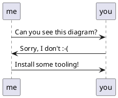

# hsadminNg Development

## Setting up the Development Environment

### PostgreSQL Server

So far the spike contains almost only PostgreSQL Code. 
All you need so far, is a PostgreSQL database, for now with full admin rights.
The easiest way to set it up is using docker.

(Find the mentioned aliases in `.aliases`.)

Initially, pull an image compatible to current PostgreSQL version of Hostsharing:

    docker pull postgres:13.7-bullseye

<big>**&#9888;**</big>
If we switch the version, please also amend the documentation as well as the aliases file. Thanks! 

Create and run a container with the given PostgreSQL version:

    docker run --name hsadmin-ng-postgres -e POSTGRES_PASSWORD=password -p 5432:5432 -d postgres:13.7-bullseye

    # or via alias: 
    pg-sql-run

To check if the PostgreSQL container is running, the following command should list a container with the name "hsadmin-ng-postgres": 

    docker container ls 

Stop the PostgreSQL container:
    
    docker stop hsadmin-ng-postgres
    # or via alias: pg-sql-stop

Start the PostgreSQL container again:

    docker container start hsadmin-ng-postgres
    # or via alias: pg-sql-start

Remove the PostgreSQL container:

    docker rm hsadmin-ng-postgres
    
    # or via alias:
    pg-sql-remove

To reset to a clean database, use:

    pg-sql-stop; pg-sql-remove; pg-sql-run

    # or via alias:
    pg-sql-reset

After the PostgreSQL container is removed, you need to create it again as shown in "Create and run ..." above.

Given the container is running, to create a backup in ~/backup, run:

    docker exec -i hsadmin-ng-postgres /usr/bin/pg_dump --clean --create -U postgres postgres | gzip -9 > ~/backup/hsadmin-ng-postgres.sql.gz

    # or via alias:
    pg-sql-backup >~/backup/hsadmin-ng-postgres.sql.gz


Again, given the container is running, to restore the backup from ~/backup, run:

    gunzip --stdout --keep ~/backup/hsadmin-ng-postgres.sql.gz | docker exec -i hsadmin-ng-postgres psql -U postgres -d postgres

    # or via alias:
    pg-sql-restore <~/backup/hsadmin-ng-postgres.sql.gz


### Markdown with PlantUML plugin

Can you see the following diagram?



If not, you need to install some tooling.

#### for IntelliJ IDEA (or derived products)

You just need the bundled Markdown plugin enabled and install and activate the PlantUML plugin in its settings:

jetbrains://idea/settings?name=Languages+%26+Frameworks--Markdown 

You might also need to install Graphviz on your operating system.
For Debian-based Linux systems this might work:

```sh
sudo apt install graphviz
```


#### Ubuntu Linux command line

```sh
sudo apt-get install pandoc texlive-latex-base texlive-fonts-recommended texlive-extra-utils texlive-latex-extra pandoc-plantuml-filter
```

```sh
pandoc --filter pandoc-plantuml rbac.md -o rbac.pdf
```

#### for other IDEs / operating systems

If you have figured out how it works, please add instructions above this section.


## Running the SQL files

### For RBAC

If you run the numbered SQL files from the `sql` folder in the defined order, a working RBAC system is built up in the database including test data and some simple tests.

To increase the amount of test data, simply increase the number of generated customers in `21-hs-customer.sql`.

If you already have data, e.g. for customers 0..999 (thus with reference numbers 10000..10999) and want to add another 1000 customers, amend the for loop to 1000...1999 and also uncomment and amend the `CONTINUE WHEN` or `WHERE` conditions in the other test data generators, using the first new customer reference number (in the example that's 11000).

### For Historization

You can explore the historization prototype as follows:

- start with an empty database
  (the example tables are currently not compatible with RBAC),
- then run `historization.sql,`
- finally run `examples.sql`.
