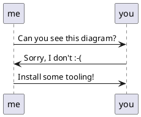
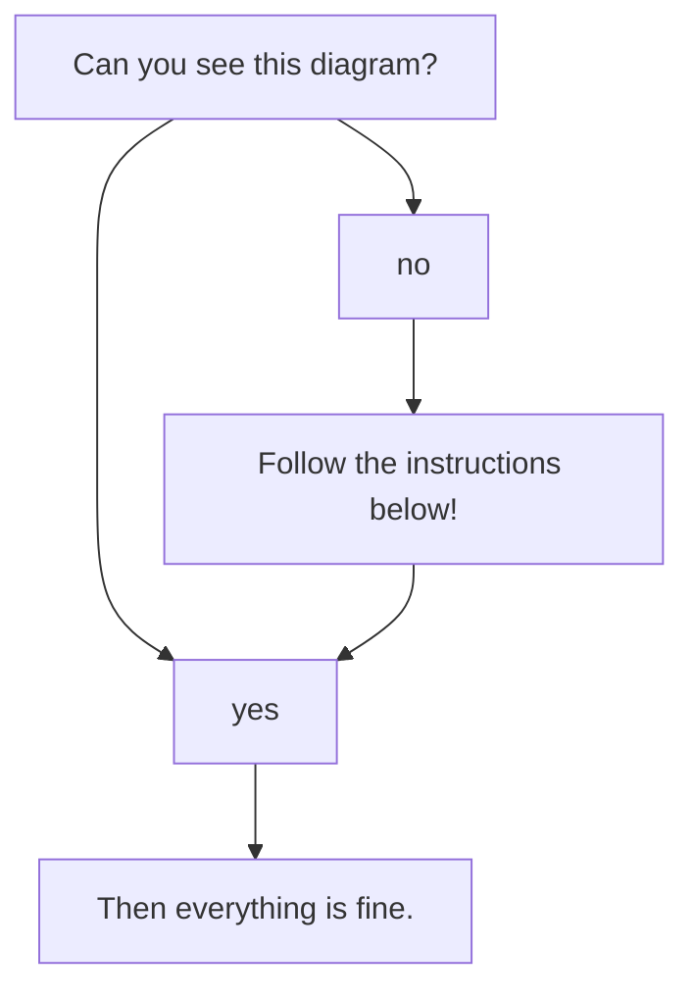
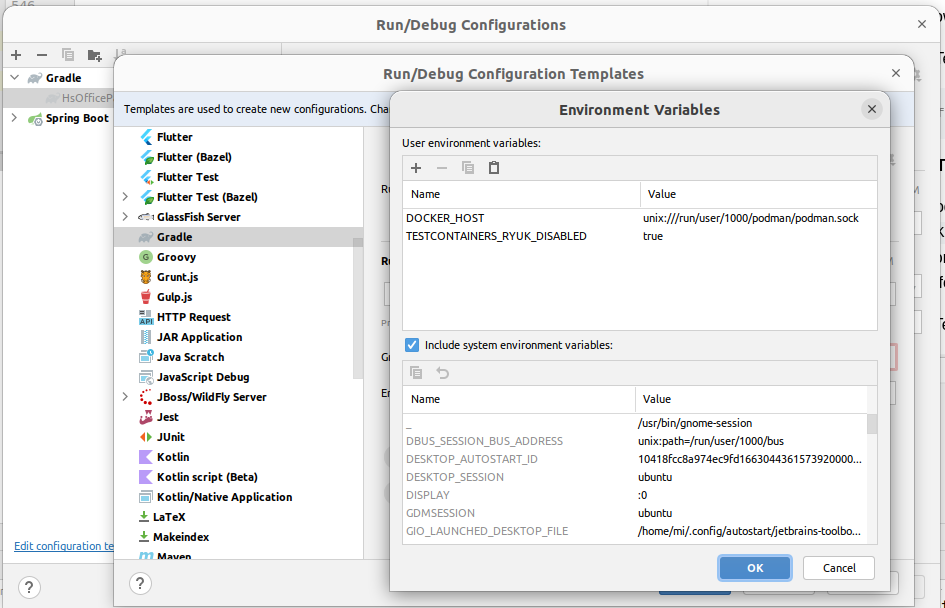
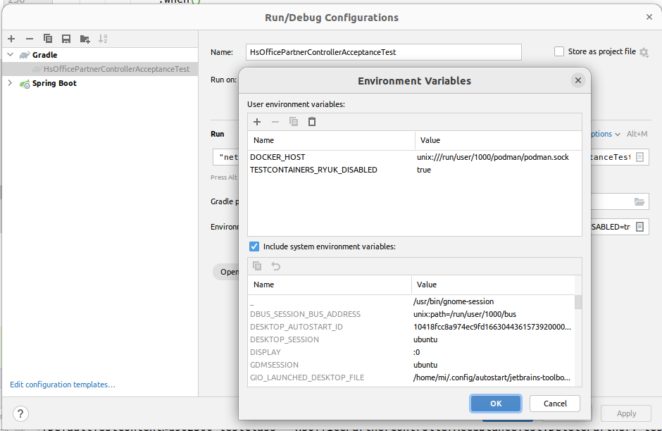

# hsadminNg Development

This documents gives an overview of the development environment and tools.
For architecture consider the files in the `doc` and `adr` folder.

<!-- generated TOC begin: -->
- [Setting up the Development Environment](#setting-up-the-development-environment)
  - [PostgreSQL Server](#postgresql-server)
  - [Markdown](#markdown)
    - [Render Markdown embedded PlantUML](#render-markdown-embedded-plantuml)
    - [Render Markdown Embedded Mermaid Diagrams](#render-markdown-embedded-mermaid-diagrams)
  - [IDE Specific Settings](#ide-specific-settings)
    - [IntelliJ IDEA](#intellij-idea)
  - [Other Tools](#other-tools)
- [Running the SQL files](#running-the-sql-files)
  - [For RBAC](#for-rbac)
  - [For Historization](#for-historization)
- [Coding Guidelines](#coding-guidelines)
  - [Directory and Package Structure](#directory-and-package-structure)
    - [General Directory Structure](#general-directory-structure)
    - [Source Code Package Structure](#source-code-package-structure)
  - [Run Tests from Command Line](#run-tests-from-command-line)
  - [Spotless Code Formatting](#spotless-code-formatting)
  - [JaCoCo Test Code Coverage Check](#jacoco-test-code-coverage-check)
  - [PiTest Mutation Testing](#pitest-mutation-testing)
    - [Remark](#remark)
  - [OWASP Security Vulnerability Check](#owasp-security-vulnerability-check)
  - [Dependency-License-Compatibility](#dependency-license-compatibility)
  - [Dependency Version Upgrade](#dependency-version-upgrade)
- [How To ...](#how-to-...)
  - [How to Configure .pgpass for the Default PostgreSQL Database?](#how-to-configure-.pgpass-for-the-default-postgresql-database?)
  - [How to Run the Tests Against a Local User-Space Podman Daemon?](#how-to-run-the-tests-against-a-local-user-space-podman-daemon?)
    - [Install and Run Podman](#install-and-run-podman)
    - [Use the Command Line to Run the Tests Against the Podman Daemon ](#use-the-command-line-to-run-the-tests-against-the-podman-daemon-)
    - [Use IntelliJ IDEA Run the Tests Against the Podman Daemon](#use-intellij-idea-run-the-tests-against-the-podman-daemon)
    - [~/.testcontainers.properties](#~/.testcontainers.properties)
  - [How to Run the Tests Against a Remote Podman or Docker Daemon?](#how-to-run-the-tests-against-a-remote-podman-or-docker-daemon?)
  - [How to Run the Application on a Different Port?](#how-to-run-the-application-on-a-different-port?)
  - [How to Use a Persistent Database for Integration Tests?](#how-to-use-a-persistent-database-for-integration-tests?)
  - [How to Amend Liquibase SQL Changesets?](#how-to-amend-liquibase-sql-changesets?)
  - [How to Re-Generate Spring-Controller-Interfaces from OpenAPI specs?](#how-to-re-generate-spring-controller-interfaces-from-openapi-specs?)
  - [How to Generate Database Table Diagrams?](#how-to-generate-database-table-diagrams?)
- [Further Documentation](#further-documentation)
<!-- generated TOC end. -->

## Setting up the Development Environment

All instructions assume that you're using a current _Linux_ or _MacOS_ operating system.
Everything is tested on _Ubuntu Linux 22.04_ and _MacOS Monterey (12.4)_.

To be able to build and run the Java Spring Boot application, you need the following tools:

- Docker 20.x (on MacOS you also need *Docker Desktop* or similar)
- optionally: PostgreSQL Server 15.5-bookworm 
  (see instructions below to install and run in Docker)
- The matching Java JDK at will be automatically installed by Gradle toolchain support.
- You also might need an IDE (e.g. *IntelliJ IDEA* or *Eclipse* or *VS Code* with *[STS](https://spring.io/tools)* and a GUI Frontend for *PostgreSQL* like *Postbird*.

If you have at least Docker, the Java JDK and Gradle installed in appropriate versions and in your `PATH`, then you can start like this:

    cd your-hsadmin-ng-directory
    
    source .aliases # creates some comfortable bash aliases, e.g. 'gw'='./gradlew'
    gw              # initially downloads the configured Gradle version into the project

    gw test         # compiles and runs unit- and integration-tests
    
    # if the container has not been built yet, run this:
    pg-sql-run      # downloads + runs PostgreSQL in a Docker container on localhost:5432
    # if the container has been built already, run this:
    pg-sql-start

    gw bootRun      # compiles and runs the application on localhost:8080

    # the following command should reply with "pong":
    curl http://localhost:8080/api/ping

    # the following command should return a JSON array with just all customers:
    curl \
        -H 'current-user: superuser-alex@hostsharing.net' \
        http://localhost:8080/api/test/customers

    # the following command should return a JSON array with just all packages visible for the admin of the customer yyy:
    curl \
        -H 'current-user: superuser-alex@hostsharing.net' -H 'assumed-roles: test_customer#yyy.admin' \
        http://localhost:8080/api/test/packages

    # add a new customer
    curl \
        -H 'current-user: superuser-alex@hostsharing.net' -H "Content-Type: application/json" \
        -d '{ "prefix":"ttt", "reference":80001, "adminUserName":"admin@ttt.example.com" }' \
        -X POST http://localhost:8080/api/test/customers

If you wonder who 'superuser-alex@hostsharing.net' and 'superuser-fran@hostsharing.net' are and where the data comes from:
Mike and Sven are just example global admin accounts as part of the example data which is automatically inserted in Testcontainers and Development environments.
Also try for example 'admin@xxx.example.com' or 'unknown@example.org'.

If you want a formatted JSON output, you can pipe the result to `jq` or similar.

And to see the full, currently implemented, API, open http://localhost:8080/swagger-ui/index.html.

If you still need to install some of these tools, find some hints in the next chapters. 


### PostgreSQL Server

You could use any PostgreSQL Server (version 15) installed on your machine.
You might amend the port and user settings in `src/main/resources/application.yml`, though.

But the easiest way to run PostgreSQL is via Docker.

Initially, pull an image compatible to current PostgreSQL version of Hostsharing:

    docker pull postgres:15.5-bookworm 

<big>**&#9888;**</big>
If we switch the version, please also amend the documentation as well as the aliases file. Thanks! 

Create and run a container with the given PostgreSQL version:

    docker run --name hsadmin-ng-postgres -e POSTGRES_PASSWORD=password -p 5432:5432 -d postgres:15.5-bookworm

    # or via alias: 
    pg-sql-run

To check if the PostgreSQL container is running, the following command should list a container with the name "hsadmin-ng-postgres": 

    docker container ls 

Stop the PostgreSQL container:
    
    docker stop hsadmin-ng-postgres
    # or via alias: pg-sql-stop

Start the PostgreSQL container again:

    docker container start hsadmin-ng-postgres
    # or via alias: pg-sql-start

Remove the PostgreSQL container:

    docker rm hsadmin-ng-postgres
    
    # or via alias:
    pg-sql-remove

To reset to a clean database, use:

    pg-sql-stop; pg-sql-remove; pg-sql-run

    # or via alias:
    pg-sql-reset

After the PostgreSQL container is removed, you need to create it again as shown in "Create and run ..." above.

Given the container is running, to create a backup in ~/backup, run:

    docker exec -i hsadmin-ng-postgres /usr/bin/pg_dump --clean --create -U postgres postgres | gzip -9 > ~/backup/hsadmin-ng-postgres.sql.gz

    # or via alias:
    pg-sql-backup >~/backup/hsadmin-ng-postgres.sql.gz


Again, given the container is running, to restore the backup from ~/backup, run:

    gunzip --stdout --keep ~/backup/hsadmin-ng-postgres.sql.gz | docker exec -i hsadmin-ng-postgres psql -U postgres -d postgres

    # or via alias:
    pg-sql-restore <~/backup/hsadmin-ng-postgres.sql.gz


### Markdown

To generate the TOC (Table of Contents), a little bash script from a
[Blog Article](https://medium.com/@acrodriguez/one-liner-to-generate-a-markdown-toc-f5292112fd14) was used.

Given this is in PATH as `md-toc`, use:

```shell
md-toc <README.md 2 4 | cut -c5-'
```

To render the Markdown files, especially to watch embedded PlantUML diagrams, you can use one of the following methods:

#### Render Markdown embedded PlantUML

Can you see the following diagram right in your IDE?
I mean a real graphic diagram, not just some markup code.



If not, you need to install some tooling.

##### for IntelliJ IDEA (or derived products)

You just need the bundled Markdown plugin enabled and install and activate the PlantUML plugin in its [settings](jetbrains://idea/settings?name=Languages+%26+Frameworks--Markdown). 

You might also need to install Graphviz on your operating system.
For Debian-based Linux systems this might work:

```sh
sudo apt install graphviz
```


##### Ubuntu Linux command line

1. Install Pandoc with some extra libraries:
```shell
sudo apt-get install pandoc texlive-latex-base texlive-fonts-recommended texlive-extra-utils texlive-latex-extra pandoc-plantuml-filter 
```

2. Install mermaid-filter, e.g. this way:
```shell
npm install -g mermaid-filter
```

3. Run Pandoc to generate a PDF from a Markdown file with PlantUML and Mermaid diagrams:
```shell
pandoc --filter mermaid-filter --filter pandoc-plantuml rbac.md -o rbac.pdf
```

##### for other IDEs / operating systems

If you have figured out how it works, please add instructions above this section.

#### Render Markdown Embedded Mermaid Diagrams

The source of RBAC role diagrams are much easier to read with Mermaid than with PlantUML or GraphViz, that's also the main reason Mermaid is used.

Can you see the following diagram right in your IDE?
I mean a real graphic diagram, not just some markup code.
@startuml
me -> you: Can you see this diagram?
you -> me: Sorry, I don't :-(
me -> you: Install some tooling!
@enduml



If not, you need to install some tooling.

##### for IntelliJ IDEA (or derived products)

1. Activate the bundled Jebrains Markdown PlantUML Extension via
    [File | Settings | Languages & Frameworks | Markdown](jetbrains://idea/settings?name=Languages+%26+Frameworks--Markdown)  
2. Install the Jetbrains Mermaid plugin: https://plugins.jetbrains.com/plugin/20146-mermaid, it also works embedded in Markdown files.

Now the above diagram should be rendered.

##### for other IDEs / command-line / operating systems

If you have figured out how it works, please add instructions above this section.

### IDE Specific Settings

#### IntelliJ IDEA

##### Build Settings

Go to [Gradle Settings}(jetbrains://idea/settings?name=Build%2C+Execution%2C+Deployment--Build+Tools--Gradle) and select "Build and run using" and "Run tests using" both to "gradle".
Otherwise, settings from `build.gradle`, like compiler arguments, are not applied when compiling through *IntelliJ IDEA*.

##### Annotation Processor

Go to [Annotations Processors](jetbrains://idea/settings?name=Build%2C+Execution%2C+Deployment--Compiler--Annotation+Processors) and activate annotation processing.
Otherwise, *IntelliJ IDEA* can't see *Lombok* generated classes 
and will show false errors (missing identifiers).


##### Suggested Plugins

- [Jetbrains Mermaid Integration](https://plugins.jetbrains.com/plugin/20146-mermaid)
- [Vojtěch Krása PlantUML Integration](https://plugins.jetbrains.com/plugin/7017-plantuml-integration)

### Other Tools

**jq**: a JSON formatter. 
On _Debian_'oid systems you can install it with `sudo apt-get install jq`.
On _MacOS_ you can install it with `brew install jq`, given you have _brew_ installed.

## Running the SQL files

### For RBAC

The Schema is automatically created via *Liquibase*, a database migration library.
Currently, also some test data is automatically created.

To increase the amount of test data, increase the number of generated customers in `2022-07-28-051-hs-customer.sql` and run that

If you already have data, e.g. for customers 0..999 (thus with reference numbers 10000..10999) and want to add another 1000 customers, amend the for loop to 1000...1999 and also uncomment and amend the `CONTINUE WHEN` or `WHERE` conditions in the other test data generators, using the first new customer reference number (in the example that's 11000).

### For Historization

The historization is not yet integrated into the *Liquibase*-scripts.
You can explore the prototype as follows:

- start with an empty database
  (the example tables are currently not compatible with RBAC),
- then run `historization.sql` in the database,
- finally run `examples.sql` in the database.

## Coding Guidelines

### Directory and Package Structure

#### General Directory Structure

`.aliases`
    Shell-aliases for common tasks.

`build/`
    Output directory for gradle build results. Ignored by git.

`build.gradle`
    Gradle build-file. Contains dependencies and build configurations.

`doc/`
    Contains project documentation.

`.editorconfig`
    Rules for indentation etc. considered by many code editors.

`etc/`
    Miscellaneous configurations, as long as these don't need to be in the rood directory. 

`.git/`
    Git repository. Do not temper with this!

`.gitattributes`
    Git configurations regarding text file format conversion between operating systems. 

`.gitignore`
    Git configuration regarding which files and directories should be ignored (not checked in).

`.gradle/`
    Config files created by `gradle wrapper`. Ignored by git.

`gradle/`
    The gradle distribution downloaded by `gradle wrapper`. Ignored by git.

`gradlew` and `gradlew.bat` use these batches to run gradle for builds etc. 

`.idea/` (optional)
    Config and cache files created by *IntelliJ IDEA*. Ignore by git.

`LICENSE.md`
    Contains the license used for this software.

`out/` (optional)
    Build output created by *IntelliJ IDEA". Ignored by git. 

`README.md`
    Contains an overview about how to build the project and the used tools. 

`.run/` (optional)
    Created by *IntelliJ IDEA* to contain run and debug configurations.

`settings.gradle`
    Configuration file for gradle.

`sql/`
    Contains SQL scripts for experiments and useful tasks.
    Most of this will sooner or later be moved to Liquibase-scripts.

`src/`
    The actual source-code, see [Source Code Package Structure](#source-code-package-structure) for details.

`TODO.md`
    Requirements of initial project. Do not touch!

`TODO-progress.png`
    Generated diagram image of the project progress.

`tools/`
    Some shell-scripts to useful tasks.


#### Source Code Package Structure

For the source code itself, the general standard Java directory structure is used, where productive and test code are separated like this:

```
src
    main/
        java/
            net.hostsharing.hasadminng/
        resources/
        
    test/
        java/
            net.hostsharing.hasadminng/
        resources/
```

The Java package structure below contains:

- config and global (utility) packages,
  these should not access any other packages within the project
- rbac, containing all packages related to the RBAC subsystem
- hs, containing Hostsharing business object related packages

Underneath of rbac and hs, the structure is business oriented, NOT technical / layer -oriented.

Some of these rules are checked with *ArchUnit* unit tests.


### Run Tests from Command Line

Run all tests which have not yet been passed with the current source code:

```shell
gw test 
```

Force running all tests:

```shell
gw cleanTest test 
```


### Spotless Code Formatting

Code formatting for Java is checked via *spotless*.
The formatting style can be checked with this command:

```shell
gw spotlessCheck
```

This task is also included in `gw build` and `gw check`.

To apply formatting rules, use:

```shell
gw spotlessApply
```

### JaCoCo Test Code Coverage Check

This project uses the JaCoCo test code coverage report with limit checks.
It can be executed with:

```shell
gw jacocoTestReport
```

This task is also automatically run after `gw test`.
It is configured in [build.gradle](build.gradle).

A report is generated under [build/reports/jacoco/tests/test/index.html](./build/reports/jacoco/test/html/index.html).

Additionally, quality limits are checked via:

```shell
gw jacocoTestCoverageVerification
```

This task is also executed as part of `gw check`.


### PiTest Mutation Testing

PiTest mutation testing is configured for unit tests.
It can be executed with:

```shell
gw pitest
```

Classes to be scanned, tests to be executed and thresholds are configured in [build.gradle](build.gradle).

A report is generated under [build/reports/pitest/index.html](./build/reports/pitest/index.html).
A link to the report is also printed after the `pitest` run.

This task is also executed as part of `gw check`.

#### Remark

In this project, there is little business logic in *Java* code;
most business code is in *plsql* 
and *Java* ist mostly used for mapping REST calls to database queries.
This mapping ist mostly done through *Spring* annotations and other implicit code.

Therefore, there are only few unit tests and thus mutation testing has limited value.
We'll see if this changes when the project progresses and more validations are added.


### OWASP Security Vulnerability Check

An OWASP security vulnerability is configured and can be utilized by running:

```shell
gw dependencyCheckAnalyze
```

This task is also included in `gw build` and `gw check`.
It is configured in [build.gradle](build.gradle).

Often vulnerability reports don't apply to our use cases.
Therefore, reports can be [suppressed](./etc/owasp-dependency-check-suppression.xml).
In case of suppression, a note must be added to explain why it does not apply to us.

See also: https://jeremylong.github.io/DependencyCheck/dependency-check-gradle/index.html.

### Dependency-License-Compatibility

The `gw check` phase depends on a dependency-license-compatibility check.
If any dependency violates the configured [list of allowed licenses](etc/allowed-licenses.json), the build will fail.
New licenses can be added to that list after a legal investigation.

<big>**&#9888;**</big>
*GPL* (*GNU General Public License*) is only allowed with classpath exception.
Do <u>not</u> use any dependencies under *GPL* without this exception,
except if these offer an alternative license which is allowed.
*LGPL* (*GNU <u>Library</u> General Public License*) is also allowed.

To run just the dependency-license-compatibility check, use:

```shell
gw checkLicense
```

If the check fails, a report can be found here: The generated license can be found under [dependencies-without-allowed-license.json](/build/reports/dependency-license/dependencies-without-allowed-license.json).

And to generate a report, use:

```shell
gw generateLicenseReport
```

The generated license can be found here: [index.html](build/reports/dependency-license/index.html).

More information can be found on the [project's website](https://github.com/jk1/Gradle-License-Report).

### Dependency Version Upgrade

Dependency versions can be automatically upgraded to the latest available version:

```shell
gw useLatestVersions
```

Afterwards, `gw check` is automatically started.
Please only commit+push to master if the check run shows no errors.

More infos, e.g. on blacklists see on the [project's website](https://github.com/patrikerdes/gradle-use-latest-versions-plugin).


## How To ...

### How to Configure .pgpass for the Default PostgreSQL Database?

To access the default database schema as used during development, add this line to your `.pgpass` file in your users home directory:

```
localhost:5432:postgres:postgres:password
```

Amend host and port if necessary.


### How to Run the Tests Against a Local User-Space Podman Daemon?

Using a normal Docker daemon running as root has some security issues.
As an alternative, this chapter shows how you can run a Podman daemon in user-space.

#### Install and Run Podman

You can find directions in [this project on Github](https://stackoverflow.com/questions/71549856/testcontainers-with-podman-in-java-tests) 

Summary for Debian-based Linux systems:

1. Install Podman, e.g. like this:

 ```shell
sudo apt-get -y install podman
```

Then start it like this:

```shell
systemctl --user enable --now podman.socket
systemctl --user status podman.socket
ls -la /run/user/$UID/podman/podman.sock
```

These commands are also available in `.aliases` as `podman-start`.


#### Use the Command Line to Run the Tests Against the Podman Daemon 

1. In a local shell. in which you want to run the tests, set some environment variables:

```shell
export DOCKER_HOST="unix:///run/user/$UID/podman/podman.sock"
export TESTCONTAINERS_RYUK_DISABLED=true
```

These commands are also available in `.aliases` as `podman-use`. 

Disabling RYUK is necessary, because it's not supported by Podman.
Supposedly this means that containers are not properly cleaned up after test runs,
but I could not see any remaining containers after test runs.
If we are running into problems with stale containers,
we need to register a shutdown-hook in the test source code.

2. Now You Can Run the Tests

```shell
gw test # gw is from the .aliases file
```

#### Use IntelliJ IDEA Run the Tests Against the Podman Daemon

To run the tests against a Podman Daemon in IntelliJ IDEA too, you also need to set the environment variables `DOCKER_HOST` and `TESTCONTAINERS_RYUK_DISABLED` as show above.
This can either be done in the environment from which IDEA is started.
Or you can use the run config template for gradle to set these variables:



If you already have Gradle run configs, you need to delete them, so they get re-created from the template.
Alternatively you need to add the environment varibles here too:



Find more information [here](https://www.jetbrains.com/help/idea/run-debug-configuration.html).


#### ~/.testcontainers.properties

It should be possible to set these environment variables in `~/.testcontainers.properties`,
but it did not work so far.
Maybe a problem with quoting.

If you manage to make it work, please amend this documentation, thanks.


### How to Run the Tests Against a Remote Podman or Docker Daemon?

1. On the remote host, you need to have a Podman or Docker daemon running on a port accessible from the Internet. 
Probably, you want to protect it with a VPN, but that's not part of this documentation.

e.g. to make Podman listen to a port, run this:

```shell
podman system service -t 0 tcp:HOST:PORT # please replace HOST+PORT
```

2. In a local shell. in which you want to run the tests, set some environment variables:

```shell
export DOCKER_HOST=tcp://HOST:PORT # please replace HOST+PORT again
export TESTCONTAINERS_RYUK_DISABLED=true  # only for Podman
```

Regarding RYUK, see also in the directions for a locally running Podman, above.

3. Now you can run the tests:

```shell
gw clean test # gw is from the .aliases file
```

For information about how to run the tests in IntelliJ IDEA against a remote Podman daemon, see also in the chapter above just with the HOST:PORT-based DOCKER_HOST.

### How to Run the Application on a Different Port?

By default, `gw bootRun` starts the application on port 8080.

This port can be changed in
[src/main/resources/application.yml](src/main/resources/application.yml) through the property `server.port`.

### How to Use a Persistent Database for Integration Tests?

Usually, the `DataJpaTest` integration tests run against a database in a temporary docker container.
As soon as the test ends, the database is gone; this might make debugging difficult.

Alternatively, a persistent database could be used by amending the
[resources/application.yml](src/main/resources/application.yml) through the property `spring.datasource.url` in [src/test/resources/application.yml](src/test/resources/application.yml) , e.g. to the JDBC-URL from [src/main/resources/application.yml](src/main/resources/application.yml).

If the persistent database and the temporary database show different results, one of these reasons could be the cause:

1. You might have some changesets only running in either context,
   check the `context: ...` in the changeset control lines.
2. You might have changes in the database which interfere with the tests,
   e.g. from a previous run of tests or manually applied.
   It's best to run `pg-sql-reset && gw bootRun` before each test run, to have a clean database.
  
### How to Amend Liquibase SQL Changesets?

Liquibase changesets are meant to be immutable and based on each other.
That means, once a changeset is written, it never changes, not even a whitespace or comment.
Liquibase is a *database migration tool*, not a *database initialization tool*.

This, if you need to add change a table, stored procedure or whatever, 
create a new changeset and apply `ALTER`, `DROP`, `CREATE OR REPLACE` or whatever SQL commands to perform your changes.
These changes will be automatically applied once the application starts up again.
This way, any staging or production database will always match the application code. 

But, during initial development that can be a big hassle because the database structure changes a lot in that stage.
Also, the actual structure of the database won't be easily recognized anymore through lots of migration changesets.

Therefore, during initial development, it's good approach just to amend the existing changesets and delete the database:

```shell
pg-sql-reset
gw bootRun
```

<big>**&#9888;**</big>
Just don't forget switching to the migration mode, once there is a production database!

### How to Re-Generate Spring-Controller-Interfaces from OpenAPI specs?

The API is described as OpenAPI specifications in `src/main/resources/api-definition/`.

Once generated, the interfaces for the Spring-Controllers can be found in `build/generated/sources/openapi`.

These interfaces have to be implemented by subclasses named `*Controller`.

All gradle tasks which need the generated interfaces depend on the Gradle task  `openApiGenerate` which controls the code generation.
It can also be executed directly:

```shell
gw openApiGenerate
```

### How to Generate Database Table Diagrams?

Some overview documentation about the database can be generated via [postgresql_autodoc](https://github.com/cbbrowne/autodoc").
To make it easier, the command line is included in the `.aliases`, just call:

```shell
postgres-autodoc
```

The output will list the generated files.


## Further Documentation

- the `doc` directory contains architecture concepts and a glossary
- TODO.md tracks requirements and progress for the contract of the initial project,
  please do not amend anything in this document
