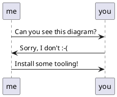

# hsadminNg Development

This documents gives an overview of the development environment and tools.
For architecture consider the files in the `doc` and `adr` folder.

<!-- generated TOC begin: -->
- [Setting up the Development Environment](#setting-up-the-development-environment)
  - [SDKMAN](#sdkman)
  - [PostgreSQL Server](#postgresql-server)
  - [Markdown](#markdown)
    - [Render Markdown embedded PlantUML](#render-markdown-embedded-plantuml)
  - [Other Tools](#other-tools)
- [Running the SQL files](#running-the-sql-files)
  - [For RBAC](#for-rbac)
  - [For Historization](#for-historization)
<!-- generated TOC end. -->

## Setting up the Development Environment

All instructions assume that you're using a current _Linux_ or _MacOS_ operating system.
Everything is tested on _Ubuntu Linux 22.04_ and _MacOS Monterey (12.4)_.

To be able to build and run the Java Spring Boot application, you need the following tools:

- Docker 20.x (on MacOS you also need *Docker Desktop* or similar)
- PostgreSQL Server 13.7-bullseye (see instructions below to install and run in Docker)
- Java JDK 17.x
- Gradle in some not too outdated version (7.4 will be installed via wrapper)

You also might need an IDE (e.g. *IntelliJ IDEA* or *Eclipse* or *VS Code* with *[STS](https://spring.io/tools)* and a GUI Frontend for *PostgreSQL* like *Postbird*.

If you have at least Docker, the Java JDK and Gradle installed in appropriate versions and in your `PATH`, then you can start like this:

    cd your-hsadmin-ng-directory
    
    gradle wrapper  # downloads Gradle 7.5 into the project
    source .aliases # creates some comforable bash aliases, e.g. 'gw'='./gradlew'

    gw test         # compiles and runs unit- and integration-tests
    
    pg-sql-run      # downloads + runs PostgreSQL in a Docker container on localhost:5432
    gw bootRun      # compiles and runs the application on localhost:8080

    # the following command should reply with "pong":
    curl http://localhost:8080/api/ping

    # the following command should return a JSON array with just all customers:
    curl \
        -H 'current-user: mike@hostsharing.net' \
        http://localhost:8080/api/customers

    # the following command should return a JSON array with just all packages visible for the admin of the customer aab:
    curl \
        -H 'current-user: mike@hostsharing.net' \
        -H 'assumed-roles: customer#aab.admin' \
        http://localhost:8080/api/packages

The latter `curl` command actually goes through the database server.

<big>&#9432;</big>
If you want a formatted JSON output, you can pipe the result to `jq` or similar.

If you still need to install some of these tools, find some hints in the next chapters. 


### SDKMAN

*SdkMan* is not necessary, but helpful to install and switch between different versions of SDKs (Software-Development-Kits) and development tools in general, e.g. *JDK* and *Gradle*.
It is available for _Linux_ and _MacOS_, _WSL_, _Cygwin_, _Solaris_ and _FreeBSD_.

You can get it from: https://sdkman.io/.

<big>**&#9888;**</big>
Yeah, the `curl ... | bash` install method looks quite scary;
but in a development environment you're downloading executables all the time,
e.g. through `npm`, `Maven` or `Gradle` when downloading dependencies.
Thus, maybe you should at least use a separate Linux account for development.

Once it's installed, you can install *JDK* and *Gradle*:

    sdk install java 17.0.3-tem
    sdk install gradle

    sdk use java 17.0.3-tem # use this to switch between installed JDK versions


### PostgreSQL Server

You could use any PostgreSQL Server (from version 13 on) installed on your machine.
You might amend the port and user settings in `src/main/resources/application.yml`, though.

But the easiest way to run PostgreSQL is via Docker.

Initially, pull an image compatible to current PostgreSQL version of Hostsharing:

    docker pull postgres:13.7-bullseye 

<big>**&#9888;**</big>
If we switch the version, please also amend the documentation as well as the aliases file. Thanks! 

Create and run a container with the given PostgreSQL version:

    docker run --name hsadmin-ng-postgres -e POSTGRES_PASSWORD=password -p 5432:5432 -d postgres:13.7-bullseye

    # or via alias: 
    pg-sql-run

To check if the PostgreSQL container is running, the following command should list a container with the name "hsadmin-ng-postgres": 

    docker container ls 

Stop the PostgreSQL container:
    
    docker stop hsadmin-ng-postgres
    # or via alias: pg-sql-stop

Start the PostgreSQL container again:

    docker container start hsadmin-ng-postgres
    # or via alias: pg-sql-start

Remove the PostgreSQL container:

    docker rm hsadmin-ng-postgres
    
    # or via alias:
    pg-sql-remove

To reset to a clean database, use:

    pg-sql-stop; pg-sql-remove; pg-sql-run

    # or via alias:
    pg-sql-reset

After the PostgreSQL container is removed, you need to create it again as shown in "Create and run ..." above.

Given the container is running, to create a backup in ~/backup, run:

    docker exec -i hsadmin-ng-postgres /usr/bin/pg_dump --clean --create -U postgres postgres | gzip -9 > ~/backup/hsadmin-ng-postgres.sql.gz

    # or via alias:
    pg-sql-backup >~/backup/hsadmin-ng-postgres.sql.gz


Again, given the container is running, to restore the backup from ~/backup, run:

    gunzip --stdout --keep ~/backup/hsadmin-ng-postgres.sql.gz | docker exec -i hsadmin-ng-postgres psql -U postgres -d postgres

    # or via alias:
    pg-sql-restore <~/backup/hsadmin-ng-postgres.sql.gz


### Markdown

To generate the TOC (Table of Contents), a little bash script from a
[Blog Article](https://medium.com/@acrodriguez/one-liner-to-generate-a-markdown-toc-f5292112fd14) was used.

To render the Markdown files, especially to watch embedded PlantUML diagrams, you can use one of the following methods:

#### Render Markdown embedded PlantUML

Can you see the following diagram right in your IDE?
I mean a real graphic diagram, not just some markup code.



If not, you need to install some tooling.

##### for IntelliJ IDEA (or derived products)

You just need the bundled Markdown plugin enabled and install and activate the PlantUML plugin in its settings:

jetbrains://idea/settings?name=Languages+%26+Frameworks--Markdown 

You might also need to install Graphviz on your operating system.
For Debian-based Linux systems this might work:

```sh
sudo apt install graphviz
```


##### Ubuntu Linux command line

```sh
sudo apt-get install pandoc texlive-latex-base texlive-fonts-recommended texlive-extra-utils texlive-latex-extra pandoc-plantuml-filter
```

```sh
pandoc --filter pandoc-plantuml rbac.md -o rbac.pdf
```

##### for other IDEs / operating systems

If you have figured out how it works, please add instructions above this section.

### Other Tools

**jq**: a JSON formatter. 
On _Debian_'oid systems you can install it with `sudo apt-get install jq`.
On _MacOS_ you can install it with `brew install jq`, given you have _brew_ installed.

## Running the SQL files

### For RBAC

The Schema is automatically created via *Liquibase*, a database migration library.
Currently, also some test data is automatically created.

To increase the amount of test data, increase the number of generated customers in `2022-07-28-051-hs-customer.sql` and run that

If you already have data, e.g. for customers 0..999 (thus with reference numbers 10000..10999) and want to add another 1000 customers, amend the for loop to 1000...1999 and also uncomment and amend the `CONTINUE WHEN` or `WHERE` conditions in the other test data generators, using the first new customer reference number (in the example that's 11000).

### For Historization

The historization is not yet integrated into the *Liquibase*-scripts.
You can explore the prototype as follows:

- start with an empty database
  (the example tables are currently not compatible with RBAC),
- then run `historization.sql` in the database,
- finally run `examples.sql` in the database.
