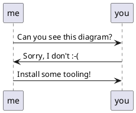

# hsadminNg Development

## Setting up the Development Environment

### PostgreSQL Server

So far the spike contains almost only PostgreSQL Code. 
All you need so far, is a PostgreSQL database, for now with full admin rights.
The easiest way to set it up is using docker:

Initially, pull an image compatible to current PostgreSQL version of Hostsharing:

    docker pull postgres:13.7-bullseye

Create and run a container with the given PostgreSQL version:

    docker run --name hsadmin-ng-postgres -e POSTGRES_PASSWORD=password -p 5432:5432 -d postgres:13.7-bullseye

To check if the PostgreSQL container is running, the following command should list a container with the name "hsadmin-ng-postgres": 

    docker container ls

Stop the PostgreSQL container:
    
    docker stop hsadmin-ng-postgres

Start the PostgreSQL container again:

    docker container start hsadmin-ng-postgres

Remove the PostgreSQL container:

    docker rm hsadmin-ng-postgres

After the PostgreSQL container is removed, you need to create it again as shown in "Create and run ..." above.

### Markdown with PlantUML plugin

Can you see the following diagram?



If not, you need to install some tooling.

#### for IntelliJ IDEA (or derived products)

You just need the bundled Markdown plugin enabled and install and activate the PlantUML plugin in its settings:

jetbrains://idea/settings?name=Languages+%26+Frameworks--Markdown 

You might also need to install Graphviz on your operating system.
For Debian-based Linux systems this might work:

```sh
sudo apt install graphviz
```


### Ubuntu Linux command line

```sh
sudo apt-get install pandoc texlive-latex-base texlive-fonts-recommended texlive-extra-utils texlive-latex-extra pandoc-plantuml-filter
```

```sh
pandoc --filter pandoc-plantuml rbac.md -o rbac.pdf
```

### for other IDEs / operating systems

If you have figured out how it works, please add instructions above this section.
