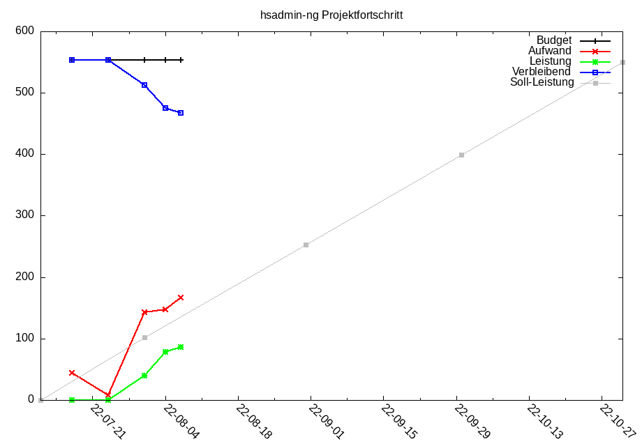

## TODO

This document is just for tracking the initial development project and thus only in German.

### Kommunikative Aufwände

| ID  | Beschreibung                                                |  Budget | Aufwand | Leistung |
|:----|:------------------------------------------------------------|--------:|--------:|---------:|
| PRE | Vorbesprechungen bis inkl. KickOff-Meeting                  |       8 |       4 |        4 |
| PRJ | Zweiwöchige Projektbesprechungen                            |      12 |       2 |        2 |
| RET | Vierwöchige Retrospektiven (optional)                       |       6 |         |          |
| TRA | Einarbeitung von Mitarbeitern des Auftraggebers (Training)  |      12 |         |          |
| E2E | Unterstützung beim Aufbau der E2E-System-Integrations-Tests |      40 |         |          |
| MIG | Unterstützung bei der Datenmigration                        |      16 |         |          |
| INS | Unterstützung ei der Inbetriebnahme / Einführung            |      16 |         |          |
| APP | Abnahme (Approval)                                          |       4 |         |          |
| SUP | Unterstützung nach der Abnahme (Support)                    |      12 |         |          |
|     |                                                             |         |         |          |

### Allgemeine Leistungen

| ID  | Beschreibung                                               |   Budget | Aufwand | Leistung |
|:----|:-----------------------------------------------------------|---------:|--------:|---------:|
| DEV | Aufbau der Entwicklungsumgebung (bis inkl. Unit-Tests)     |       16 |         |          |
| ATN | Entwurf des Authorisierungs-Systems                        |       40 |     100 |       36 |
| ATZ | Auswahl und Implementierung des Authentifizierungs-Systems |       20 |         |          |
| ITS | Aufbau einer Umgebung für Integrationstests (*1)           |        4 |       4 |       20 |
| ATS | Aufbau einer Umgebung für Akzeptanzteste (*1)              |       16 |       3 |        4 |
| PIP | Aufbau einer Build- und Testpipeline                       |       20 |         |          |
| ARC | Aufbau einer Architekturkontrolle                          |        8 |         |          |
|     |                                                            |          |         |          |

(*1: ITS+ATS sind aufgesplittet aus TST mit 20 geplanten Stunden entstanden)

### Leistungen bezogen auf fachliche Objekte

| ID  | fachliches Objekt      | Persona        | Ops         | Budget | Aufwand | Leistung |
|:----|:-----------------------|:---------------|:------------|-------:|--------:|---------:|
| ROL | Rollen                 | Hostmaster     | Scrulojtx   |     26 |      10 |        5 |
| USR | LDAP-User              | Hostmaster     | Scrufojtex  |     29 |      10 |        5 |
| USR | LDAP-User              | LDAP-User      | rufojex     |     20 |      10 |          |
| GRP | Gruppen                | Hostmaster     | scrulojtx   |     26 |         |          |
| CBD | Customer Base          | Sachbearbeiter | scruojia    |     20 |         |          |
| CBD | Customer Base          | Kunde          | sr          |      5 |         |          |
| MSV | Managed Virtual Server | Hostmaster     | crudfoj     |     20 |         |          |
| MSV | Managed Virtual Server | Owner          | rulojt      |     15 |         |          |
| MWS | Managed Webspace       | Hostmaster     | crudfojte   |     26 |         |          |
| MWS | Managed Webspace       | Owner          | rulojte     |     18 |         |          |
| MWS | Managed Websppace      | Admin          | rulojte     |      6 |         |          |
| ACC | Unix-Account           | Owner          | crudfojte   |     26 |         |          |
| ACC | Unix-Account           | Admin          | ruloje      |     15 |         |          |
| DOM | Domain                 | Owner          | (crudfojte) |      9 |         |          |
| DOM | Domain                 | Admin          | (rle)       |      3 |         |          |
| EMA | E-Mail-Address         | Owner          | (crudfojte) |      9 |         |          |
| MAL | E-Mail-Alias           | Owner          | -           |      0 |         |          |
| DBP | Database Postgres      | Owner          | (crudlojte) |      9 |         |          |
| DBP | Database Postgres      | Admin          | (rle)       |      3 |         |          |
| DUP | Database-User Postgres | Admin          | (crudlojte) |      9 |         |          |
| DUP | Database-User Postgres | Admin          | -           |      0 |         |          |
| DBM | Database MariaDB       | Owner          | -           |      0 |         |          |
| DBM | Database MariaDB       | Admin          | -           |      0 |         |          |
| DUM | Database-User MariaDB  | Admin          | -           |      0 |         |          |
| DUM | Database-User MariaDB  | Admin          | -           |      9 |         |          |
|     |                        |                |             |        |         |          |

### Wöchentlicher Status

In der folgenden Tabelle sind Aufwand und Leistung akkumulierte Werte.

<!-- generated todo-progress begin: -->
| Datum      | Budget | Aufwand | Leistung | Restschuld |
|------------|-------:|--------:|---------:|-----------:|
| 2022-07-17 |    553 |      44 |        0 |        553 |
| 2022-07-24 |    553 |       8 |        0 |        553 |
| 2022-07-31 |    553 |     143 |       76 |        477 |
<!-- generated todo-progress end. -->

