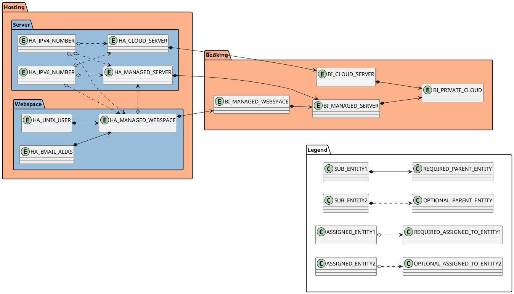
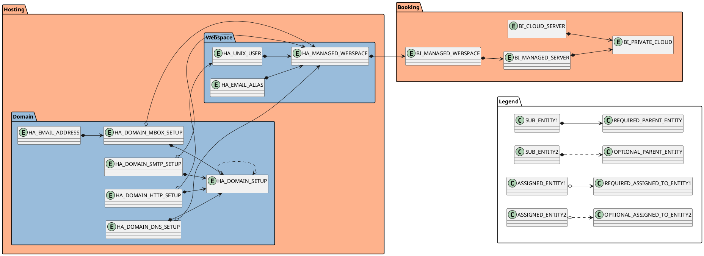
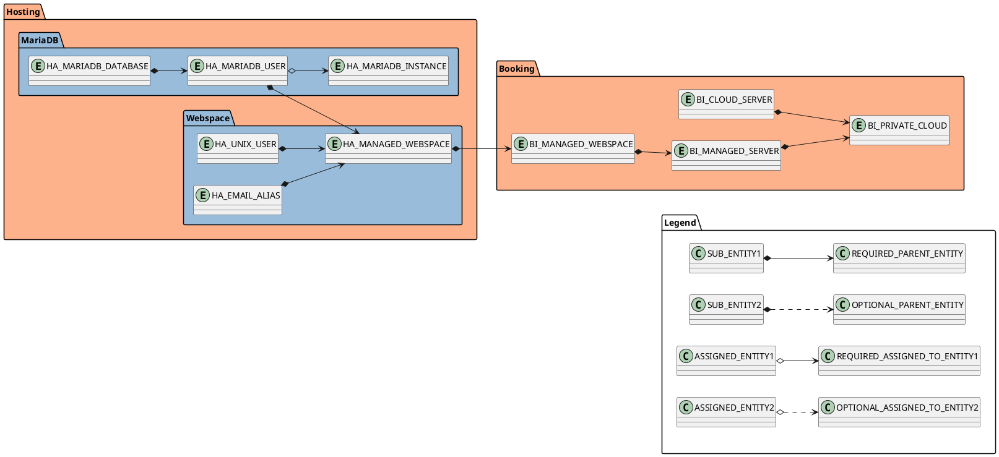
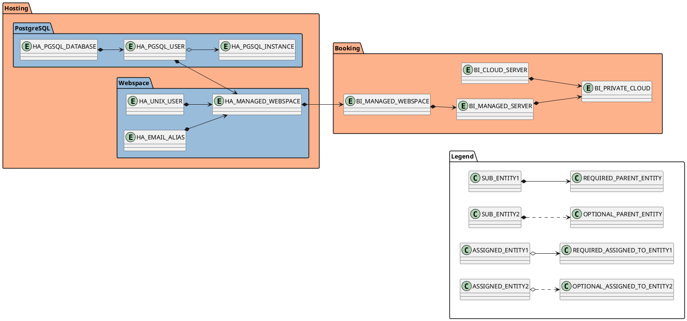

## HostingAsset Type Structure

### Server+Webspace

```plantuml
@startuml
left to right direction

package Booking #feb28c {
    entity BI_PRIVATE_CLOUD
    entity BI_CLOUD_SERVER
    entity BI_MANAGED_SERVER
    entity BI_MANAGED_WEBSPACE
}

package Hosting #feb28c{
    package Server #99bcdb {
        entity HA_CLOUD_SERVER
        entity HA_MANAGED_SERVER
        entity HA_IPV4_NUMBER
        entity HA_IPV6_NUMBER
    }

    package Webspace #99bcdb {
        entity HA_MANAGED_WEBSPACE
        entity HA_UNIX_USER
        entity HA_EMAIL_ALIAS
    }

}

BI_CLOUD_SERVER *--> BI_PRIVATE_CLOUD
BI_MANAGED_SERVER *--> BI_PRIVATE_CLOUD
BI_MANAGED_WEBSPACE *--> BI_MANAGED_SERVER

HA_CLOUD_SERVER *==> BI_CLOUD_SERVER
HA_MANAGED_SERVER *==> BI_MANAGED_SERVER
HA_MANAGED_WEBSPACE *==> BI_MANAGED_WEBSPACE
HA_MANAGED_WEBSPACE o..> HA_MANAGED_SERVER
HA_UNIX_USER *==> HA_MANAGED_WEBSPACE
HA_EMAIL_ALIAS *==> HA_MANAGED_WEBSPACE
HA_IPV4_NUMBER o..> HA_CLOUD_SERVER
HA_IPV4_NUMBER o..> HA_MANAGED_SERVER
HA_IPV4_NUMBER o..> HA_MANAGED_WEBSPACE
HA_IPV6_NUMBER o..> HA_CLOUD_SERVER
HA_IPV6_NUMBER o..> HA_MANAGED_SERVER
HA_IPV6_NUMBER o..> HA_MANAGED_WEBSPACE

package Legend #white {
    SUB_ENTITY1 *--> REQUIRED_PARENT_ENTITY
    SUB_ENTITY2 *..> OPTIONAL_PARENT_ENTITY
    ASSIGNED_ENTITY1 o--> REQUIRED_ASSIGNED_TO_ENTITY1
    ASSIGNED_ENTITY2 o..> OPTIONAL_ASSIGNED_TO_ENTITY2
}
Booking -down[hidden]->Legend
```

### Domain

```plantuml
@startuml
left to right direction

package Booking #feb28c {
    entity BI_PRIVATE_CLOUD
    entity BI_CLOUD_SERVER
    entity BI_MANAGED_SERVER
    entity BI_MANAGED_WEBSPACE
}

package Hosting #feb28c{
    package Domain #99bcdb {
        entity HA_DOMAIN_SETUP
        entity HA_DOMAIN_DNS_SETUP
        entity HA_DOMAIN_HTTP_SETUP
        entity HA_DOMAIN_SMTP_SETUP
        entity HA_DOMAIN_MBOX_SETUP
        entity HA_EMAIL_ADDRESS
    }

    package Webspace #99bcdb {
        entity HA_MANAGED_WEBSPACE
        entity HA_UNIX_USER
        entity HA_EMAIL_ALIAS
    }

}

BI_CLOUD_SERVER *--> BI_PRIVATE_CLOUD
BI_MANAGED_SERVER *--> BI_PRIVATE_CLOUD
BI_MANAGED_WEBSPACE *--> BI_MANAGED_SERVER

HA_MANAGED_WEBSPACE *==> BI_MANAGED_WEBSPACE
HA_UNIX_USER *==> HA_MANAGED_WEBSPACE
HA_EMAIL_ALIAS *==> HA_MANAGED_WEBSPACE
HA_DOMAIN_SETUP o..> HA_DOMAIN_SETUP
HA_DOMAIN_DNS_SETUP *==> HA_DOMAIN_SETUP
HA_DOMAIN_DNS_SETUP o--> HA_MANAGED_WEBSPACE
HA_DOMAIN_HTTP_SETUP *==> HA_DOMAIN_SETUP
HA_DOMAIN_HTTP_SETUP o--> HA_UNIX_USER
HA_DOMAIN_SMTP_SETUP *==> HA_DOMAIN_SETUP
HA_DOMAIN_SMTP_SETUP o--> HA_MANAGED_WEBSPACE
HA_DOMAIN_MBOX_SETUP *==> HA_DOMAIN_SETUP
HA_DOMAIN_MBOX_SETUP o--> HA_MANAGED_WEBSPACE
HA_EMAIL_ADDRESS *==> HA_DOMAIN_MBOX_SETUP

package Legend #white {
    SUB_ENTITY1 *--> REQUIRED_PARENT_ENTITY
    SUB_ENTITY2 *..> OPTIONAL_PARENT_ENTITY
    ASSIGNED_ENTITY1 o--> REQUIRED_ASSIGNED_TO_ENTITY1
    ASSIGNED_ENTITY2 o..> OPTIONAL_ASSIGNED_TO_ENTITY2
}
Booking -down[hidden]->Legend
```

### MariaDB

```plantuml
@startuml
left to right direction

package Booking #feb28c {
    entity BI_PRIVATE_CLOUD
    entity BI_CLOUD_SERVER
    entity BI_MANAGED_SERVER
    entity BI_MANAGED_WEBSPACE
}

package Hosting #feb28c{
    package MariaDB #99bcdb {
        entity HA_MARIADB_INSTANCE
        entity HA_MARIADB_USER
        entity HA_MARIADB_DATABASE
    }

    package Webspace #99bcdb {
        entity HA_MANAGED_WEBSPACE
        entity HA_UNIX_USER
        entity HA_EMAIL_ALIAS
    }

}

BI_CLOUD_SERVER *--> BI_PRIVATE_CLOUD
BI_MANAGED_SERVER *--> BI_PRIVATE_CLOUD
BI_MANAGED_WEBSPACE *--> BI_MANAGED_SERVER

HA_MANAGED_WEBSPACE *==> BI_MANAGED_WEBSPACE
HA_UNIX_USER *==> HA_MANAGED_WEBSPACE
HA_EMAIL_ALIAS *==> HA_MANAGED_WEBSPACE
HA_MARIADB_USER *==> HA_MANAGED_WEBSPACE
HA_MARIADB_USER o--> HA_MARIADB_INSTANCE
HA_MARIADB_DATABASE *==> HA_MARIADB_USER

package Legend #white {
    SUB_ENTITY1 *--> REQUIRED_PARENT_ENTITY
    SUB_ENTITY2 *..> OPTIONAL_PARENT_ENTITY
    ASSIGNED_ENTITY1 o--> REQUIRED_ASSIGNED_TO_ENTITY1
    ASSIGNED_ENTITY2 o..> OPTIONAL_ASSIGNED_TO_ENTITY2
}
Booking -down[hidden]->Legend
```

### PostgreSQL

```plantuml
@startuml
left to right direction

package Booking #feb28c {
    entity BI_PRIVATE_CLOUD
    entity BI_CLOUD_SERVER
    entity BI_MANAGED_SERVER
    entity BI_MANAGED_WEBSPACE
}

package Hosting #feb28c{
    package PostgreSQL #99bcdb {
        entity HA_PGSQL_INSTANCE
        entity HA_PGSQL_USER
        entity HA_PGSQL_DATABASE
    }

    package Webspace #99bcdb {
        entity HA_MANAGED_WEBSPACE
        entity HA_UNIX_USER
        entity HA_EMAIL_ALIAS
    }

}

BI_CLOUD_SERVER *--> BI_PRIVATE_CLOUD
BI_MANAGED_SERVER *--> BI_PRIVATE_CLOUD
BI_MANAGED_WEBSPACE *--> BI_MANAGED_SERVER

HA_MANAGED_WEBSPACE *==> BI_MANAGED_WEBSPACE
HA_UNIX_USER *==> HA_MANAGED_WEBSPACE
HA_EMAIL_ALIAS *==> HA_MANAGED_WEBSPACE
HA_PGSQL_USER *==> HA_MANAGED_WEBSPACE
HA_PGSQL_USER o--> HA_PGSQL_INSTANCE
HA_PGSQL_DATABASE *==> HA_PGSQL_USER

package Legend #white {
    SUB_ENTITY1 *--> REQUIRED_PARENT_ENTITY
    SUB_ENTITY2 *..> OPTIONAL_PARENT_ENTITY
    ASSIGNED_ENTITY1 o--> REQUIRED_ASSIGNED_TO_ENTITY1
    ASSIGNED_ENTITY2 o..> OPTIONAL_ASSIGNED_TO_ENTITY2
}
Booking -down[hidden]->Legend
```

This code generated was by HsHostingAssetType.main, do not amend manually.
