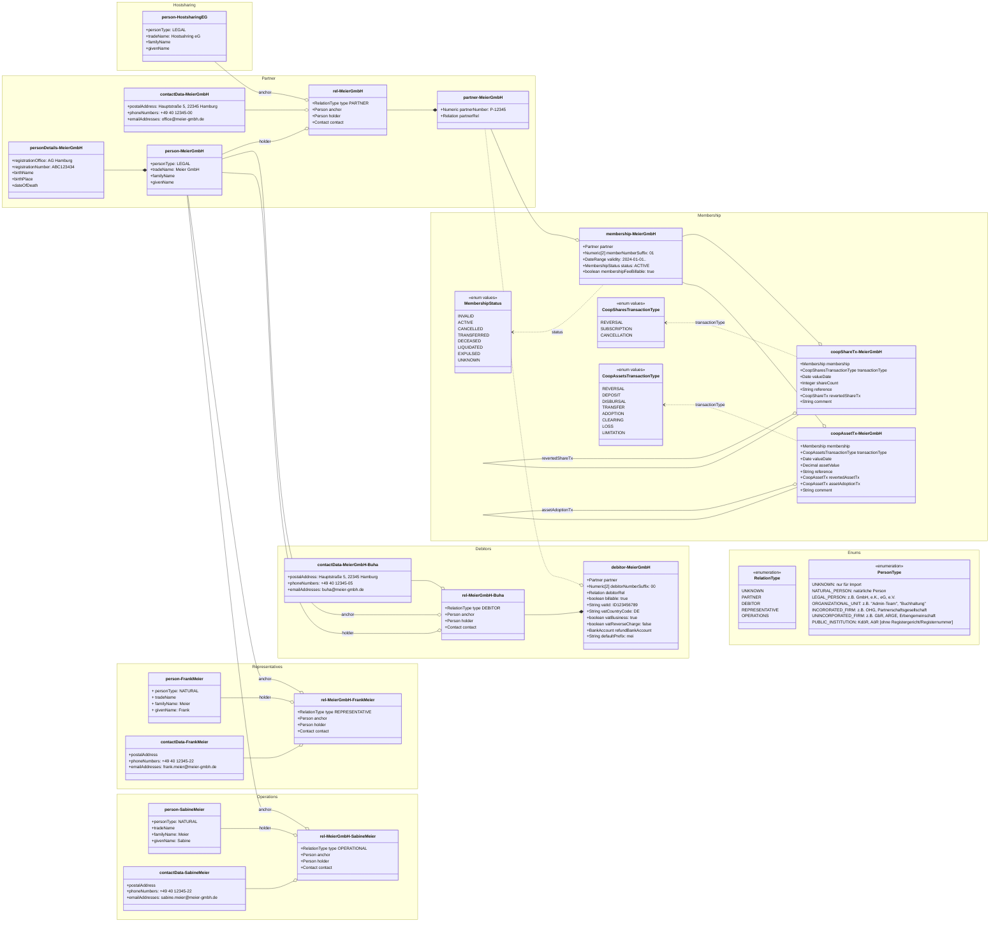

# Beispiel: juristische Person (GmbH) 

```mermaid
classDiagram
    direction RL

    namespace Hostsharing {
        class person-HostsharingEG
    }

    namespace Partner {
        class partner-MeierGmbH
        class rel-MeierGmbH
        class personDetails-MeierGmbH
        class contactData-MeierGmbH
        class person-MeierGmbH
    }
    
    namespace Representatives {
        class person-FrankMeier
        class contactData-FrankMeier
        class rel-MeierGmbH-FrankMeier
    }
    
    namespace Debitors {
        class debitor-MeierGmbH
        class contactData-MeierGmbH-Buha
        class rel-MeierGmbH-Buha
    }

    namespace Membership {
        class membership-MeierGmbH
        class coopShareTx-MeierGmbH
        class coopAssetTx-MeierGmbH
        class MembershipStatus
        class CoopSharesTransactionType
        class CoopAssetsTransactionType
    }

    namespace Operations {
        class person-SabineMeier
        class contactData-SabineMeier
        class rel-MeierGmbH-SabineMeier
    }
    
    namespace Enums {

        class RelationType {
            <<enumeration>>
            UNKNOWN
            PARTNER
            DEBITOR
            REPRESENTATIVE
            OPERATIONS
        }

        class PersonType {
            <<enumeration>>
            UNKNOWN: nur für Import
            NATURAL_PERSON: natürliche Person
            LEGAL_PERSON: z.B. GmbH, e.K., eG, e.V.
            ORGANIZATIONAL_UNIT: z.B. "Admin-Team", "Buchhaltung"
            INCORORATED_FIRM: z.B. OHG, Partnerschaftsgesellschaft
            UNINCORPORATED_FIRM: z.B. GbR, ARGE, Erbengemeinschaft
            PUBLIC_INSTITUTION: KdöR, AöR [ohne Registergericht/Registernummer]
        }
    }

    class person-HostsharingEG {
        +personType: LEGAL
        +tradeName: Hostsahring eG
        +familyName
        +givenName
    }

    class partner-MeierGmbH {
        +Numeric partnerNumber: P-12345
        +Relation partnerRel
    }
    partner-MeierGmbH *-- rel-MeierGmbH

    class person-MeierGmbH {
        +personType: LEGAL
        +tradeName: Meier GmbH
        +familyName
        +givenName
    }
    person-MeierGmbH *-- personDetails-MeierGmbH

    class personDetails-MeierGmbH {
        +registrationOffice: AG Hamburg
        +registrationNumber: ABC123434
        +birthName
        +birthPlace
        +dateOfDeath
    }

    class contactData-MeierGmbH {
        +postalAddress:     Hauptstraße 5, 22345 Hamburg
        +phoneNumbers:      +49 40 12345-00
        +emailAddresses:    office@meier-gmbh.de
    }

    class rel-MeierGmbH {
        +RelationType type PARTNER
        +Person anchor
        +Person holder
        +Contact contact
    }
    rel-MeierGmbH o-- person-HostsharingEG : anchor
    rel-MeierGmbH o-- person-MeierGmbH : holder
    rel-MeierGmbH o-- contactData-MeierGmbH

    %% --- Debitors ---

    class debitor-MeierGmbH {
        +Partner     partner
        +Numeric[2]  debitorNumberSuffix:    00
        +Relation    debitorRel
        +boolean     billable:               true
        +String      vatId:                  ID123456789
        +String      vatCountryCode:         DE
        +boolean     vatBusiness:            true
        +boolean     vatReverseCharge:       false
        +BankAccount refundBankAccount
        +String      defaultPrefix:          mei
    }
    debitor-MeierGmbH o.. partner-MeierGmbH
    debitor-MeierGmbH *-- rel-MeierGmbH-Buha

    class contactData-MeierGmbH-Buha {
        +postalAddress:     Hauptstraße 5, 22345 Hamburg
        +phoneNumbers:      +49 40 12345-05
        +emailAddresses:    buha@meier-gmbh.de
    }

    class rel-MeierGmbH-Buha {
        +RelationType type DEBITOR
        +Person anchor
        +Person holder
        +Contact contact
    }
    rel-MeierGmbH-Buha o-- person-MeierGmbH : anchor
    rel-MeierGmbH-Buha o-- person-MeierGmbH : holder
    rel-MeierGmbH-Buha o-- contactData-MeierGmbH-Buha

    %% --- Membership, Coop-Shares and Coop-Assets ---

    class membership-MeierGmbH {
        +Partner partner
        +Numeric[2] memberNumberSuffix: 01
        +DateRange validity: 2024-01-01..
        +MembershipStatus status: ACTIVE
        +boolean membershipFeeBillable: true
    }
    membership-MeierGmbH o-- partner-MeierGmbH
    membership-MeierGmbH ..> MembershipStatus : status

    class coopShareTx-MeierGmbH {
        +Membership membership
        +CoopSharesTransactionType transactionType
        +Date valueDate
        +Integer shareCount
        +String reference
        +CoopShareTx revertedShareTx
        +String comment
    }
    coopShareTx-MeierGmbH o-- membership-MeierGmbH
    coopShareTx-MeierGmbH o-- coopShareTx-MeierGmbH : revertedShareTx
    coopShareTx-MeierGmbH ..> CoopSharesTransactionType : transactionType

    class coopAssetTx-MeierGmbH {
        +Membership membership
        +CoopAssetsTransactionType transactionType
        +Date valueDate
        +Decimal assetValue
        +String reference
        +CoopAssetTx revertedAssetTx
        +CoopAssetTx assetAdoptionTx
        +String comment
    }
    coopAssetTx-MeierGmbH o-- membership-MeierGmbH
    coopAssetTx-MeierGmbH o-- coopAssetTx-MeierGmbH : revertedAssetTx
    coopAssetTx-MeierGmbH o-- coopAssetTx-MeierGmbH : assetAdoptionTx
    coopAssetTx-MeierGmbH ..> CoopAssetsTransactionType : transactionType

    class MembershipStatus {
        <<enum values>>
        INVALID
        ACTIVE
        CANCELLED
        TRANSFERRED
        DECEASED
        LIQUIDATED
        EXPULSED
        UNKNOWN
    }

    class CoopSharesTransactionType {
        <<enum values>>
        REVERSAL
        SUBSCRIPTION
        CANCELLATION
    }

    class CoopAssetsTransactionType {
        <<enum values>>
        REVERSAL
        DEPOSIT
        DISBURSAL
        TRANSFER
        ADOPTION
        CLEARING
        LOSS
        LIMITATION
    }

    %% --- Representatives ---

    class person-FrankMeier {
        + personType: NATURAL
        + tradeName
        + familyName: Meier
        + givenName: Frank
    }

    class contactData-FrankMeier {
        +postalAddress
        +phoneNumbers: +49 40 12345-22
        +emailAddresses: frank.meier@meier-gmbh.de
    }

    class rel-MeierGmbH-FrankMeier {
        +RelationType type REPRESENTATIVE
        +Person anchor
        +Person holder
        +Contact contact
    }
    rel-MeierGmbH-FrankMeier o-- person-MeierGmbH : anchor
    rel-MeierGmbH-FrankMeier o-- person-FrankMeier : holder
    rel-MeierGmbH-FrankMeier o-- contactData-FrankMeier

    %% --- Operations ---

    class person-SabineMeier {
        +personType: NATURAL
        +tradeName
        +familyName: Meier
        +givenName: Sabine
    }

    class contactData-SabineMeier {
        +postalAddress
        +phoneNumbers: +49 40 12345-22
        +emailAddresses: sabine.meier@meier-gmbh.de
    }

    class rel-MeierGmbH-SabineMeier {
        +RelationType type OPERATIONAL
        +Person anchor
        +Person holder
        +Contact contact
    }
    rel-MeierGmbH-SabineMeier o-- person-MeierGmbH : anchor
    rel-MeierGmbH-SabineMeier o-- person-SabineMeier : holder
    rel-MeierGmbH-SabineMeier o-- contactData-SabineMeier

```
