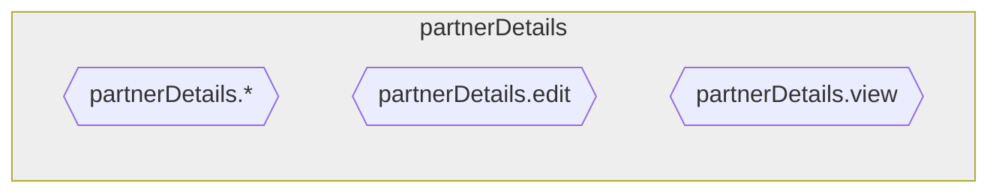

*(this is just a scribbled draft, that's why it's still in German)*

### *Schema-F* für Permissions, Rollen und Grants

Permissions, Rollen und Grants werden in den INSERT/UPDATE/DELETE-Triggern von Geschäftsobjekten erzeugt und gelöscht. Das Löschen erfolgt meistens automatisch über das zugehörige RbacObject, die INSERT- und UPDATE-Trigger müssen jedoch in *pl/pgsql* ausprogrammiert werden.

Das folgende Schema soll dabei unterstützen, die richtigen Permissions, Rollen und Grants festzulegen.

An einigen Stellen ist vom *Initiator* die Rede. Als *Initiator* gilt derjenige User, der die Operation (INSERT oder UPDATE) durchführt bzw. dessen primary assumed Rol. (TODO: bisher gibt es nur assumed roles, das Konzept einer primary assumed Role müsste noch eingeführt werden, derzeit nehmen wir dafür immer den `globalAdmin()`. Bevor Kunden aber selbst Objekte anlegen können, muss das geklärt sein.)

#### Typ Root: Objekte, welche nur eine Spezialisierung bzw. Zusatzdaten für andere Objekte bereitstellen (z.B. Partner für Relations vom Typ Partner oder Partner Details für Partner)

Objektorientiert gedacht, enthalten solche Objekte die Zusatzdaten einer Subklasse; die Daten im Partner erweitern also eine Relation vom Typ `partner`.

- Dann muss dieses Objekt zeitlich nach dem Objekt erzeugt werden, auf dass es sich bezieht, also z.B. zeitlich nach der Relation.
- Es werden Delete (\*), Edit und View Permissions für dieses Objekt erzeugt.
- Es werden **keine** Rollen für dieses Objekt erzeugt.
- Statt eigener Rollen werden die o.g. Permissions passenden Rollen des Hauptobjekts zugewiesen (granted) bzw. aus denen entfernt (revoked).
  - Handelt es sich um Zusatzdaten zum Zwecke der Spezialisierung, dann z.B. so: 
      - Delete (\*) <-- Owner des Hauptobjektes
      - Edit <-- **Admin** des Hauptobjektes
      - View <-- Agent des Hauptobjektes
  - Handelt es sich um Zusatzdaten, für die sich Edit-Rechte delegieren lassen sollen (wie im Falle der Partner-Details eines Partners), dann z.B. so:
      - Delete (\*) <-- Owner des Hauptobjektes
      - Edit <-- **Agent** des Hauptobjektes
      - View <-- Agent des Hauptobjektes
- Für die Rollenzuordnung zwischen referenzierten Objekten gilt:
  - Für Objekte vom Typ Root werden die Rollen des zugehörigen Aggregator-Objektes verwendet. 
  - Gibt es Referenzen auf hierarchisch verbundene Objekte (z.B. Debitor.refundBankAccount) gilt folgende Faustregel:
        ***Nach oben absteigen, nach unten halten oder aufsteigen.*** An einem fachlich übergeordneten Objekt wird also eine niedrigere Rolle (z.B. Debitor-admin -> Partner.agent), einem fachlich untergeordneten Objekt eine gleichwertige Rolle (z.B. Partner.admin -> Debitor.admin) zugewiesen oder sogar aufgestiegen (Debitor.admin -> Package.tenant).
  - Für Referenzen zwischen Objekten, die nicht hierarchisch zueinander stehen (z.B. Debitor und Bankverbindung), wird auf beiden seiten abgestiegen (also Debitor.admin -> BankAccount.referrer und BankAccount.admin -> Debitor.tenant).

Anmerkung: Der Typ-Begriff *Root* bezieht sich auf die Rolle im fachlichen Datenmodell. Im Bezug auf den Teilgraphen eines fachlichen Kontexts ist dies auch eine Wurzel im Sinne der Graphentheorie. Aber in anderen fachlichen Kontexten können auch diese Objekte von anderen Teilgraphen referenziert werden und werden dann zum inneren Knoten.

#### Typ Aggregator: Objekte, welche weitere Objekte zusammenfassen (z.B. Relation fasst zwei Persons und einen Contact zusammen)

Solche Objekte verweisen üblicherweise auf Objekte vom Typ Leaf und werden oft von Objekten des Typs Root referenziert.

- Es werden i.d.R. folgende Rollen für diese Objekte erzeugt:
    - Owner, Admin, Agent, Tenent(, Guest?)
- Es werden Delete (\*), Edit und View Permissions für dieses Objekt erzeugt.
- Die Permissions werden den Rollen sinnvoll zugewiesen, z.B.:
    - Owner -> Delete (\*)
    - Admin --> Edit
    - Tenant (oder ggf. Guest) --> View
-  Außerdem werden folgende Grants erstellt bzw. entzogen:
    - Initiator --> Owner
    - Owner --> Admin
    - Admin --> Referrer
    - Admins der referenzierten Objekte werden Agent des Aggregators
    - Tenants des Aggregators werden Referrer der referenzierten Objekte

### Typ Leaf: Handelt es sich um ein Objekt, welches (außer zur Modellierung separater Permissions) keine Unterobjekte enthält (z.B. Person, Customer)?

Solche Objekte werden üblicherweise von Objekten des Typs Aggregator, manchmal auch von Objekten des Typs Root, referenziert.

- Es werden i.d.R. folgende Rollen für diese Objekte erzeugt:
    - Owner, Admin, Referrer
- Es werden Delete (\*), Edit und View Permissions für dieses Objekt erzeugt.
- Die Permissions werden den Rollen sinnvoll zugewiesen, z.B.:
    - Delete (\*) <-- Owner
    - Edit <-- Admin
    - View <-- Referrer
- Außerdem werden folgende Grants erstellt bzw. entzogen:
    - Owner --> Admin
    - Admin --> Referrer

