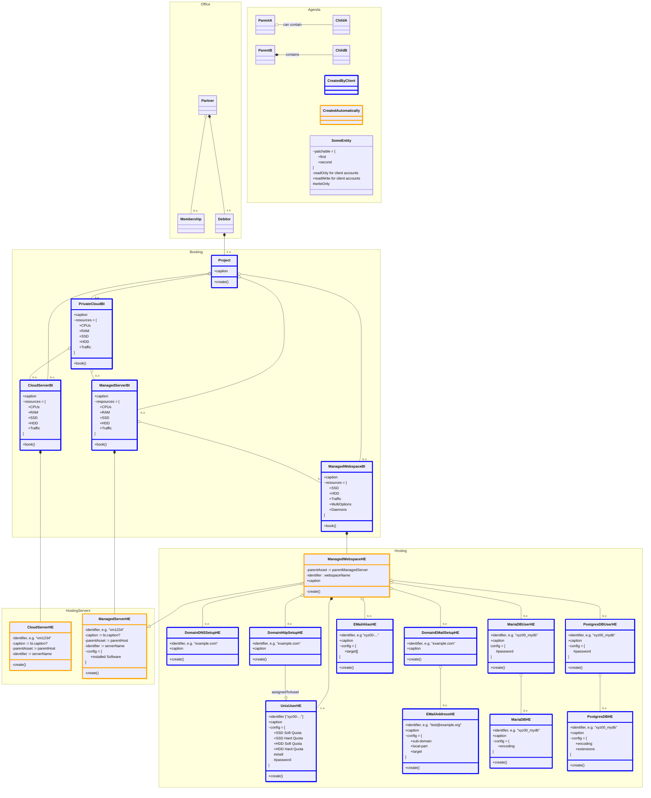

## HSAdmin-NG
### Project/BookingItems/HostingEntities

__ATTENTION__: The notation uses UML clas diagram elements, but partly with different meanings. See Agenda.

```mermaid
classDiagram
    direction TD

    Partner o-- "0..n" Membership
    Partner *-- "1..n" Debitor
    Debitor *-- "1..n" Project

    Project o-- "0..n" PrivateCloudBI
    Project o-- "0..n" CloudServerBI
    Project o-- "0..n" ManagedServerBI
    Project o-- "0..n" ManagedWebspaceBI

    PrivateCloudBI o-- "0..n" ManagedServerBI
    PrivateCloudBI o-- "0..n" CloudServerBI

    CloudServerBI *-- CloudServerHE

    ManagedServerBI *-- ManagedServerHE
    ManagedServerBI o-- "0..n" ManagedWebspaceBI
    ManagedWebspaceBI *-- ManagedWebspaceHE

    ManagedWebspaceHE *-- "1..n" UnixUserHE
    ManagedWebspaceHE o-- "0..n" DomainDNSSetupHE
    ManagedWebspaceHE o-- "0..n" DomainHttpSetupHE
    ManagedWebspaceHE o-- "0..n" DomainEMailSetupHE
    ManagedWebspaceHE o-- "0..n" EMailAliasHE
    DomainEMailSetupHE o-- "0..n" EMailAddressHE
    ManagedWebspaceHE o-- "0..n" MariaDBUserHE
    MariaDBUserHE o-- "0..n" MariaDBHE
    ManagedWebspaceHE o-- "0..n" PostgresDBUserHE
    PostgresDBUserHE o-- "0..n" PostgresDBHE

    DomainHttpSetupHE --|> UnixUserHE : assignedToAsset

    ManagedWebspaceHE --|> ManagedServerHE

    namespace Office {
        class Partner {
        }

        class Membership {
        }

        class Debitor {

        }
    }

    namespace Booking {
        class Project {
            +caption
            +create()
        }
        class PrivateCloudBI {
            +caption
            ~resources = [
            ⠀⠀+CPUs
            ⠀⠀+RAM
            ⠀⠀+SSD
            ⠀⠀+HDD
            ⠀⠀+Traffic
            ]

            +book()
        }
        class CloudServerBI {
            +caption
            ~resources = [
            ⠀⠀+CPUs
            ⠀⠀+RAM
            ⠀⠀+SSD
            ⠀⠀+HDD
            ⠀⠀+Traffic
            ]

            +book()
        }
        class ManagedServerBI {
            +caption
            ~respources = [
            ⠀⠀+CPUs
            ⠀⠀+RAM
            ⠀⠀+SSD
            ⠀⠀+HDD
            ⠀⠀+Traffic
            ]

            +book()
        }
        class ManagedWebspaceBI {
            +caption
            ~resources = [
            ⠀⠀+SSD
            ⠀⠀+HDD
            ⠀⠀+Traffic
            ⠀⠀+MultiOptions
            ⠀⠀+Daemons
            ]

            +book()
        }
    }

    style Project stroke:blue,stroke-width:4px
    style PrivateCloudBI stroke:blue,stroke-width:4px
    style CloudServerBI stroke:blue,stroke-width:4px
    style ManagedServerBI stroke:blue,stroke-width:4px
    style ManagedWebspaceBI stroke:blue,stroke-width:4px

    %% ---------------------------------------------------------

    namespace HostingServers {
        %% separate (pseudo-) namespace just for better rendering

        class CloudServerHE {
            -identifier, e.g. "vm1234"
            -caption := bi.caption?
            -parentAsset := parentHost
            -identifier := serverName
            -create()
        }
        class ManagedServerHE {
            -identifier, e.g. "vm1234"
            -caption := bi.caption?
            -parentAsset := parentHost
            -identifier := serverName
            ~config = [
            ⠀⠀+installed Software
            ]
            -create()
        }
    }

    namespace Hosting {
        class ManagedWebspaceHE {
            -parentAsset := parentManagedServer
            -identifier : webspaceName
            +caption

            -create()
        }

        class UnixUserHE {
            +identifier ["xyz00-..."]
            +caption
            ~config = [
            ⠀⠀+SSD Soft Quota
            ⠀⠀+SSD Hard Quota
            ⠀⠀+HDD Soft Quota
            ⠀⠀+HDD Hard Quota
            ⠀⠀#shell
            ⠀⠀#password
            ]

            +create()
        }
        class DomainDNSSetupHE {
            +identifier, e.g. "example.com"
            +caption

            +create()
        }
        class DomainHttpSetupHE {
            +identifier, e.g. "example.com"
            +caption

            +create()
        }
        class DomainEMailSetupHE {
            +identifier, e.g. "example.com"
            +caption

            +create()
        }
        class EMailAliasHE {
            +identifier, e.g "xyz00-..."
            +caption

            ~config = [
            ⠀⠀+target[]
            ]

            +create()
        }
        class EMailAddressHE {
            +identifier, e.g. "test@example.org"
            +caption
            ~config = [
            ⠀⠀+sub-domain
            ⠀⠀+local-part
            ⠀⠀+target
            ]

            +create()
        }
        class MariaDBUserHE {
            +identifier, e.g. "xyz00_mydb"
            +caption
            config = [
            ⠀⠀#password
            ]

            +create()
        }
        class MariaDBHE {
            +identifier, e.g. "xyz00_mydb"
            +caption
            ~config = [
            ⠀⠀+encoding
            ]

            +create()
        }
        class PostgresDBUserHE {
            +identifier, e.g. "xyz00_mydb"
            +caption
            ~config = [
            ⠀⠀#password
            ]

            +create()
        }
        class PostgresDBHE {
            +identifier, e.g. "xyz00_mydb"
            +caption

            ~config = [
            ⠀⠀+encoding
            ⠀⠀+extensions
            ]
            +create()
        }
    }

    style CloudServerHE stroke:orange,stroke-width:4px
    style ManagedServerHE stroke:orange,stroke-width:4px
    style ManagedWebspaceHE stroke:orange,stroke-width:4px
    style UnixUserHE stroke:blue,stroke-width:4px
    style DomainDNSSetupHE stroke:blue,stroke-width:4px
    style DomainHttpSetupHE stroke:blue,stroke-width:4px
    style DomainEMailSetupHE stroke:blue,stroke-width:4px
    style EMailAliasHE stroke:blue,stroke-width:4px
    style EMailAddressHE stroke:blue,stroke-width:4px
    style MariaDBUserHE stroke:blue,stroke-width:4px
    style MariaDBHE stroke:blue,stroke-width:4px
    style PostgresDBUserHE stroke:blue,stroke-width:4px
    style PostgresDBHE stroke:blue,stroke-width:4px

%% --------------------------------------

    ParentA o-- ChildA : can contain
    ParentB *-- ChildB : contains

    namespace Agenda {
        class ParentA {
        }
        class ChildA {
        }
        class ParentB {
        }
        class ChildB {
        }
        class CreatedByClient {
        }
        class CreatedAutomatically {
        }
        class SomeEntity {
            ~patchable = [
            %% the following indentations uses two U+2800 to have effect in the rendered diagram
            ⠀⠀+first
            ⠀⠀+second
            ]
            -readOnly for client accounts
            +readWrite for client accounts
            #writeOnly
        }
    }

    style CreatedByClient stroke:blue,stroke-width:4px
    style CreatedAutomatically stroke:orange,stroke-width:4px
end
```
