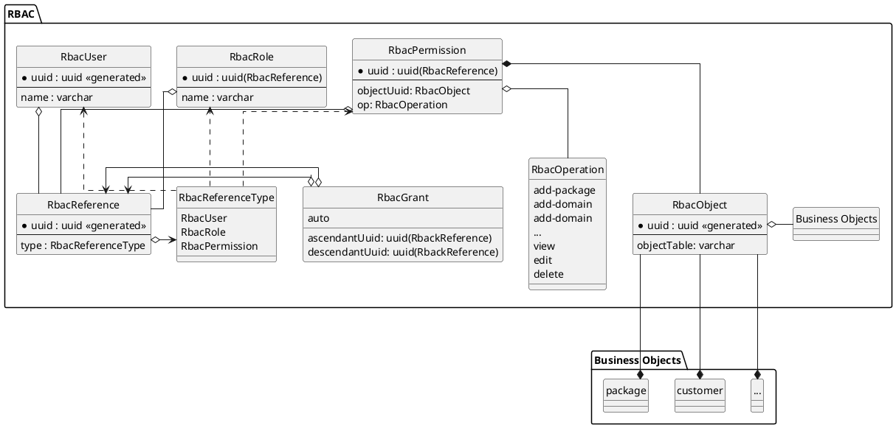
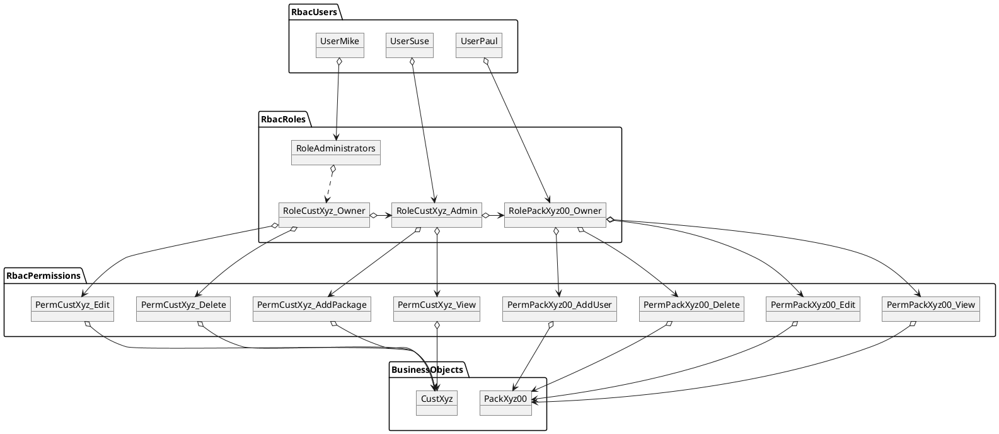
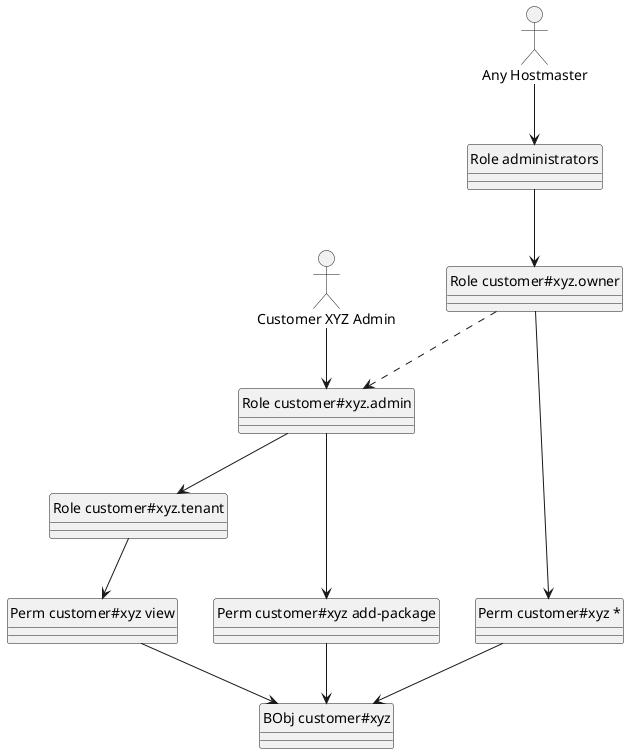

## *hsadmin-ng*'s Role-Based-Access-Management (RBAC)

The requirements of *hsadmin-ng* include table-m row- and column-level-security for read and write access to business-objects.
More precisely, any access has to be controlled according to given rules depending on the accessing users, their roles and the accessed business-object.
Further, roles and business-objects are hierarchical.

To avoid misunderstandings, we are using the term "business-object" what's usually called a "domain-object".
But as we are in the context of a webhosting infrastructure provider, "domain" would have a double meaning.

Our implementation is based on Role-Based-Access-Management (RBAC) in conjunction with views and triggers on the business-objects.
As far as possible, we are using the same terms as defined in the RBAC standard, for our function names though, we chose more expressive names.

In RBAC, subjects can be assigned to roles, roles can be hierarchical and eventually have assigned permissions.
A permission allows a specific operation (e.g. view or edit) on a specific (business-) object.

You can find the entity structure as a UML class diagram as follows:



### The RBAC Entity Types

#### RbacReference

An *RbacReference* is a generalization of all entity types which participate in the hierarchical role system, defined via *RbacGrant*.

The primary key of the *RbacReference* and its referred object is always identical.

#### RbacReferenceType

The enum *RbacReferenceType* describes the type of reference.
It's only needed to make it easier to find the referred object in *RbacUser*, *RbacRole* or *RbacPermission*.

#### RbacUser

An *RbacUser* is a type of RBAC-subject which references a login account outside this system, identified by a name (usually an email-address).

*RbacUser*s can be assigned to multiple *RbacRole*s, through which they can get permissions to *RbacObject*s.

The primary key of the *RbacUser* is identical to its related *RbacReference*.

#### RbacRole

An *RbacRole* represents a collection of directly or indirectly assigned *RbacPermission*s. 
Each *RbacRole* can be assigned to *RbacUser*s or to another *RbacRole*.

Both kinds of assignments are represented via *RbacGrant*.

*RbacRole* entities can *RbacObject*s, or more precise

#### RbacPermission

An *RbacPermission* allows a specific *RbacOperation* on a specific *RbacObject*.

#### RbacOperation

An *RbacOperation* determines, <u>what</u> an *RbacPermission* allows to do.
It can be one of:

- **'add-...'** - permits creating new instances of specific entity types underneath the object specified by the permission, e.g. "add-package"
- **'view'** - permits reading the contents of the object specified by the permission
- **'edit'** - change the contents of the object specified by the permission
- **'delete'** - delete the object specified by the permission
- **'\*'**

This list is extensible according to the needs of the access rule system.

Please notice, that there is no **create** operation to create new instances of unrelated business-object-types.
For such a singleton business-object-type, e.g. *Organization" or "Hostsharing" has to be defined, and its single entity is referred in the permission.
Only with this rule, the foreign key in *RbacPermission* can be defined as `NOT NULL`. 

#### RbacGrant

The *RbacGrant* entities represent the access-rights structure from *RbacUser*s via hierarchical *RbacRoles* down to *RbacPermission*s.

The core SQL queries to determine access rights are all recursive queries on the *RbacGrant* table.

### Role naming

The naming pattern of a role is important to be able to address specific roles.
E.g. if a new package is added, the admin-role of the related customer has to be addressed.

There can be global roles like 'administrators'.
Most roles, though, are specific for certain business-objects and automatically generated as such:

    business-object-table#business-object-name.relative-role


Where *business-object-table* is the name of the SQL table of the business object (e.g *customer* or 'package'),
*business-object-name* is generated from an immutable business key(e.g. a prefix like 'xyz' or 'xyz00')
and the *relative-role*' describes the role relative to the referenced business-object as follows:

#### owner

The owner-role is granted to the subject which created the business object.
E.g. for a new *customer* it would be granted to 'administrators' and for a new *package* to the 'customer#...admin'. 

Whoever has the owner-role assigned can do everything with the related business-object, including deleting (or deactivating) it.

In most cases, the permissions to other operations than 'delete' are granted through the 'admin' role.
By this, all roles ob sub-objects, which are assigned to the 'admin' role, are also granted to the 'owner'.

#### admin

The admin-role is granted to a role of those subjects who manage the business object.
E.g. a 'package' is manged by the admin of the customer.

Whoever has the admin-role assigned, can usually edit the related business-object but not deleting (or deactivating) it.

The admin-role also comprises lesser roles, through which the view-permission is granted.

#### agent

The agent-role is not used in the examples of this document, because it's for more complex cases.
It's usually granted to those roles and users who represent the related business-object, but are not allowed to edit it.

Other than the tenant-role, it usually offers broader visibility of sub-business-objects (joined entities).
E.g. a package-admin is allowed to see the related debitor-business-object, 
but not its banking data.

#### tenant

The tenant-role is granted to everybody who needs to be able to view the business-object and (probably some) related business-objects.
Usually all owners, admins and tenants of sub-objects get this role granted.

Some business-objects only have very limited data directly in the main business-object and store more sensitive data in special sub-objects (e.g. 'customer-details') to which tenants of sub-objects of the main-object (e.g. package admins) do not get view permission.

#### guest

Like the agent-role, the guest-role too is not used in the examples of this document, because it's for more complex cases.

If the guest-role exists, the view-permission is granted to it, instead of to the tenant-role.
Other than the tenant-role, the guest-roles does never grant any roles of related objects. 

Also, if the guest-role exists, the tenant-role receives the view-permission through the guest-role.


### Referenced Business Objects and Role-Depreciation

A general rule is, if one business object *origin* references another object *target* (in other words: one database table joins another table),
**and** a role for *origin* needs also access to *target*,
then usually the *target* role is granted to the *origin* role which is one level lower.

E.g. the admin-role of the *origin* object gets granted the agent-role (or, if it does not exist, then the tenant-role) of the *target* object. 

Following this rule, also implies, that the number of indirections to which visibility can be granted is limited.
The admin-role of one object could be granted visibility to another object through at maximum 3 joins (agent->tenant->guest).

But not in all cases role-depreciation takes place. 
E.g. often a tenant-role is granted another tenant-role,
because it should be again allowed to view sub-objects.
The same for the agent-role, often it is granted another agent-role.


## Example Users, Roles, Permissions and Business-Objects

The following diagram shows how users, roles and permissions could be granted access to operations on business objects. 



## Business-Object-Tables, Triggers and Views

To support the RBAC system, for each business-object-table, some more artifacts are created in the database:

- a `BEFORE INSERT TRIGGER` which creates the related *RbacObject* instance,
- an `AFTER INSERT TRIGGER` which creates the related *RbacRole*s, *RbacPermission*s together with their related *RbacReference*s as well as *RbacGrant*s,
- a restricted view (e.g. *customer_rv*) through which restricted users can access the underlying data.

Not yet implemented, but planned are these actions:

- an `ON DELETE ... DO INSTEAD` rule to allow `SQL DELETE` if applicable for the business-object-table and the user has 'delete' permission,
- an `ON UPDATE ... DO INSTEAD` rule to allow `SQL UPDATE` if the user has 'edit' right,
- an `ON INSERT ... DO INSTEAD` rule to allow `SQL INSERT` if the user has 'add-..' right to the parent-business-object.

The restricted view takes the current user from a session property and applies the hierarchy of its roles all the way down to the permissions related to the respective business-object-table.
This way, each user can only view the data they have 'view'-permission for, only create those they have 'add-...'-permission, only update those they have 'edit'- and only delete those they have 'delete'-permission to.

### Current User

The current use is taken from the session variable `hsadminng.currentUser` which contains the name of the user as stored in the 
*RbacUser*s table. Example:

    SET LOCAL hsadminng.currentUser = 'mike@hostsharing.net';

That user is also used for historicization and audit log, but which is a different topic.

### Assuming Roles

If the session variable `hsadminng.assumedRoles` is set to a non-empty value, its content is interpreted as a list of semicolon-separated role names.
Example:

    SET LOCAL hsadminng.assumedRoles = 'customer#aab.admin;customer#aac.admin';

In this case, not the current user but the assumed roles are used as a starting point for any further queries.
Roles which are not granted to the current user, directly or indirectly, cannot be assumed.


### Example

A full example is shown here:

    BEGIN TRANSACTION;
        SET SESSION SESSION AUTHORIZATION restricted;
        SET LOCAL hsadminng.currentUser = 'mike@hostsharing.net';
        SET LOCAL hsadminng.assumedRoles = 'customer#aab.admin;customer#aac.admin';
        
        SELECT c.prefix, p.name as "package", ema.localPart || '@' || dom.name as "email-address"
          FROM emailaddress_rv ema
          JOIN domain_rv dom ON dom.uuid = ema.domainuuid
          JOIN domain_rv uu ON uu.uuid = dom.domainuuid
          JOIN package_rv p ON p.uuid = uu.packageuuid
          JOIN customer_rv c ON c.uuid = p.customeruuid;
    END TRANSACTION;


## Roles and Their Assignments for Certain Business Objects

To give you an overview of the business-object-types for the following role-examples,
check this diagram:

```plantuml
@startuml
left to right direction
' top to bottom direction

' hide the ugly E in a circle left to the entity name
hide circle

' use right-angled line routing
' skinparam linetype ortho

entity EMailAddress

entity Domain
Domain o-- "*" EMailAddress

entity domain
domain o-- "*" Domain

entity Package
Package o.. "*" domain

entity Customer
Customer o-- "*" Package

@enduml
```



It's mostly an example hierarchy of business-object-types, but resembles a part of Hostsharing's actual hosting infrastructure.

The following diagrams show which roles are created for each business-object-type
and how they relate to roles from other business-object-types.

### Customer Roles

The highest level of the business-object-type-hierarchy is the *Customer*.



As you can see, there something special:
From the 'Role customer#xyz.owner' to the 'Role customer#xyz.admin' there is a dashed line, whereas all other lines are solid lines.
Solid lines means, that one role is granted to another and automatically assumed in all queries to the restricted views.
The dashed line means that one role is granted to another but not automatically assumed in queries to the restricted views.

The reason here is that otherwise simply too many objects would be accessible to those with the 'administrators' role and all queries would be slowed down vastly.

Grants which are not automatically assumed are still valid grants for `hsadminng.assumedRoles`.
Thus, if you want to access anything below a customer, assume its role first.

There is actually another speciality in the customer roles:
For all others, a user defined by the customer gets the owner role assigned, just for the customer, the owner's role is assigned to the 'administrators' role.


### Package Roles

One example of the business-object-type-level right below is the *Package*.

```plantuml
@startuml
' left to right direction
top to bottom direction

' hide the ugly E in a circle left to the entity name
hide circle

' use right-angled line routing
' skinparam linetype ortho

' needs PlantUML 1.2021.14 as Markdown plugin
allow_mixing 

entity "BObj package#xyz00" as boPacXyz00

together {
    entity "Perm package#xyz00 *" as permPackageXyzAll
    permPackageXyzAll --> boPacXyz00
    
    entity "Perm package#xyz00 add-domain" as permPacXyz00AddUser
    permPacXyz00AddUser --> boPacXyz00

    entity "Perm package#xyz00 edit" as permPacXyz00Edit
    permPacXyz00Edit --> boPacXyz00

    entity "Perm package#xyz00 view" as permPacXyz00View
    permPacXyz00View --> boPacXyz00
}

package {
    entity "Role customer#xyz.tenant" as roleCustXyzTenant
    entity "Role customer#xyz.admin" as roleCustXyzAdmin    
    entity "Role customer#xyz.owner" as roleCustXyzOwner
}

package {
    entity "Role package#xyz00.owner" as rolePacXyz00Owner
    entity "Role package#xyz00.admin" as rolePacXyz00Admin
    entity "Role package#xyz00.tenant" as rolePacXyz00Tenant
}

rolePacXyz00Tenant --> permPacXyz00View
rolePacXyz00Tenant --> roleCustXyzTenant

rolePacXyz00Owner --> rolePacXyz00Admin
rolePacXyz00Owner --> permPackageXyzAll
    
roleCustXyzAdmin --> rolePacXyz00Owner
roleCustXyzAdmin --> roleCustXyzTenant

roleCustXyzOwner ..> roleCustXyzAdmin
    
rolePacXyz00Admin --> rolePacXyz00Tenant
rolePacXyz00Admin --> permPacXyz00AddUser
rolePacXyz00Admin --> permPacXyz00Edit

actor "Package XYZ00 Admin" as actorPacXyzAdmin
actorPacXyzAdmin -l-> rolePacXyz00Admin

actor "Customer XYZ Admin" as actorCustXyzAdmin
actorCustXyzAdmin --> roleCustXyzAdmin

entity "Role administrators" as roleAdmins
roleAdmins --> roleCustXyzOwner

actor "Any Hostmaster" as actorHostmaster
actorHostmaster --> roleAdmins

@enduml
```

Initially, the customer's admin role is assigned to the package owner role.
They can use the package's admin role to hand over most management functionality to a third party.
The 'administrators' can get access through an assumed customer's admin role or directly by assuming the package's owner or admin role.

## Performance

We did not define maximum response time in our requirements,
but set a target of 7.000 customers, 15.000 packages, 150.000 Unix users, 100.000 domains and 500.000 email-addresses.

For such a dataset the response time for typical queries from a UI should be acceptable.
Also, when adding data beyond these quantities, increase in response time should be roughly linear or below.
For this, we increased the dataset by 14% and then by another 25%, ending up with 10.000 customers, almost 25.000 packages, over 174.000 unix users, over 120.000 domains and almost 750.000 email-addresses.

The performance test suite comprised 8 SELECT queries issued by an administrator, mostly with two assumed customer owner roles.
The tests started with finding a specific customer and ended with listing all accessible email-addresses joined with their domains, unix-users, packages and customers.

Find the SQL script here: `28-hs-tests.sql`.

### Two View Query Variants

We have tested two variants of the query for the restricted view,
both utilizing a PostgreSQL function like this:

    FUNCTION queryAccessibleObjectUuidsOfSubjectIds(
            requiredOp RbacOp,
            forObjectTable varchar,
            subjectIds uuid[],
            maxObjects integer = 16000)
        RETURNS SETOF uuid

The function returns all object uuids for which the given subjectIds (user o assumed roles) have a permission or required operation.

Let's have a look at the two view queries:

#### Using WHERE ... IN

    CREATE OR REPLACE VIEW customer_rv AS
        SELECT DISTINCT target.*
          FROM customer AS target
         WHERE target.uuid IN (
            SELECT uuid
              FROM queryAccessibleObjectUuidsOfSubjectIds( 
                'view', 'customer', currentSubjectsUuids()));

This view should be automatically updatable.
Where, for updates, we actually have to check for 'edit' instead of 'view' operation, which makes it a bit more complicated.

With the larger dataset, the test suite initially needed over 7 seconds with this view query.
At this point the second variant was tried.

But after the initial query, the execution time was drastically reduced,
even with different query values. 
Looks like the query optimizer needed some statistics to find the best path.

#### Using A JOIN

    CREATE OR REPLACE VIEW customer_rv AS
        SELECT DISTINCT target.*
          FROM customer AS target
          JOIN queryAccessibleObjectUuidsOfSubjectIds( 
                'view', 'customer', currentSubjectsUuids()) AS allowedObjId
            ON target.uuid = allowedObjId;

This view cannot is not updatable automatically,
but it was quite fast from the beginning.

### Performance Results

The following table shows the average between the second and the third repeat of the test-suite:

|         Dataset | using JOIN | using WHERE IN |
|----------------:|-----------:|---------------:|
|  7000 customers |      670ms |         1040ms |
| 10000 customers |     1050ms |         1125ms |
|            +43% |       +57% |            +8% |

The JOIN-variant is still faster, but the growth in execution time exceeded the growth of the dataset.

The WHERE-IN-variant is about 50% slower on the smaller dataset, but almost keeps its performance on the larger dataset.
 
Both variants a viable option, depending on other needs, e.g. updatable views. 


## Access Control to RBAC-Objects

Access Control for business objects checked according to the assigned roles.
But we decided not to create such roles and permissions for the RBAC-Objects itself.
It would have overcomplicated the system and the necessary information can easily be added to the RBAC-Objects itself, mostly the `RbacGrant`s.

### RbacUser

Users can self-register, thus to create a new RbacUser entity, no login is required.
But such a user has no access-rights except viewing itself.

Users can view themselves.
And any user can view all other users as long as they have the same roles assigned.
As an exception, users which are assigned to global roles are not visible by other users.

At least an indirect lookup of known user-names (e.g. email address of the user) is possible 
by users who have an empowered assignment of any role.
Otherwise, it would not be possible to assign roles to new users.

### RbacRole

All roles are system-defined and cannot be created or modified by any external API.

Users can view only the roles to which they are assigned.

## RbacGrant

Grant can be `empowered`, this means that the grantee user can grant the granted role to other users
and revoke grants to that role.
(TODO: access control part not yet implemented)

Grants can be `managed`, which means they are created and deleted by system-defined rules.
If a grant is not managed, it was created by an empowered user and can be deleted by empowered users.

Grants can be `assumed`, which means that they are immediately active.
If a grant is not assumed, the grantee user needs to use `assumeRoles` to activate it.

Users can see only grants of roles to which they are (directly?) assigned themselves.

TODO: If a user grants an indirect role to another user, that grant would not be visible to the user.
But if we make indirect grants visible, this would reveal too much information.
We also cannot keep the granting user in the grant because grants must survive deleted users,
e.g. if after an account was transferred to another user.
 
