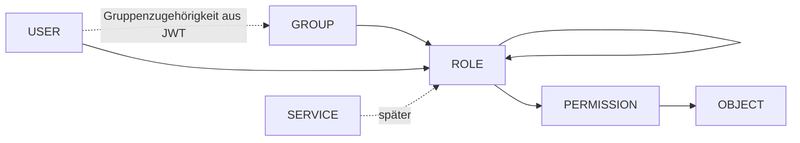
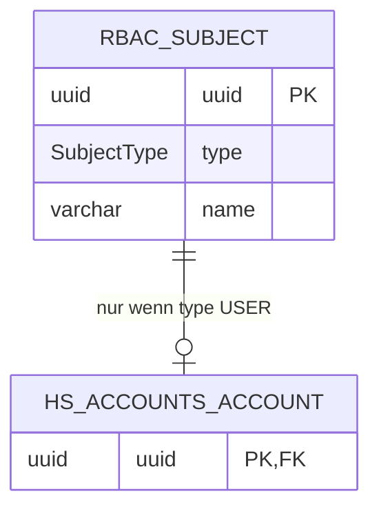
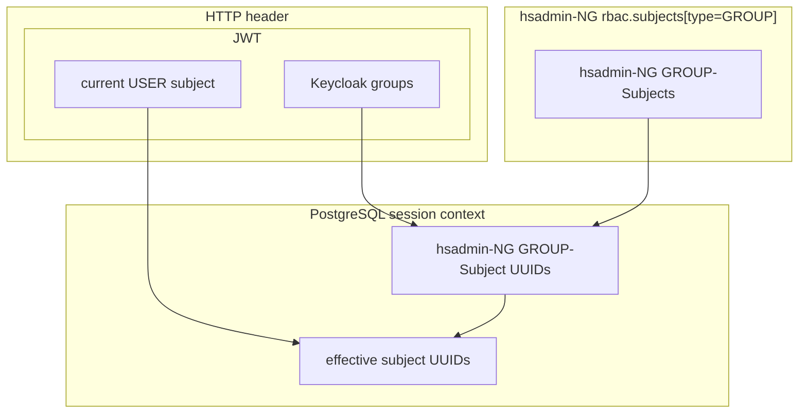
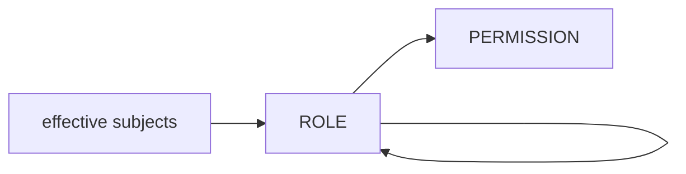
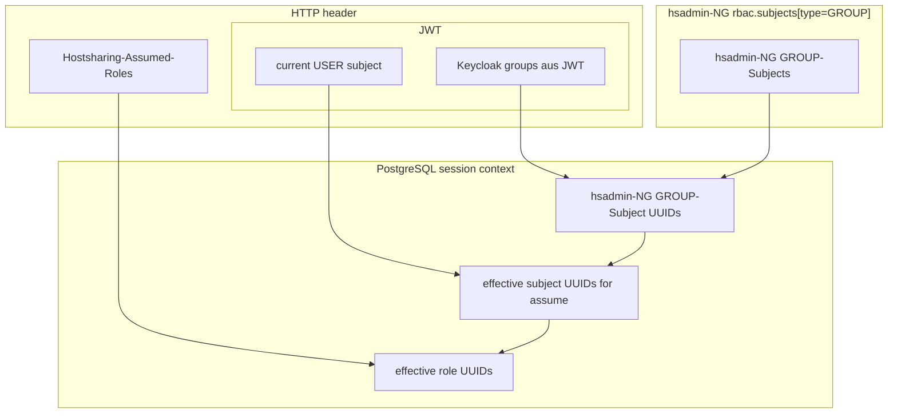
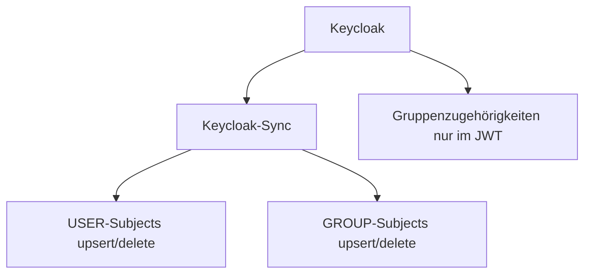

# RFC#0001: Gruppen als Subject-Typ im ReBAC-System

- Status: akzeptiert / in Umsetzung
- Stand: 2026-06-23 18:19
- Author: Michael Hönnig

## Ausgangslage

Unser bestehendes RBAC-System ist faktisch ein ReBAC-System: Zugriffsrechte ergeben sich aus einem gerichteten Graphen aus `rbac.reference`s, welche konkret `rbac.subject`, `rbac.role` oder `rbac.permission` sein können.
Rollen und Permissions, sowie indirekt auch die Grants, hängen an Objekten, die typabhängig über ein Regelwerk automatisch erzeugt und gelöscht werden.

Dabei steht
- ein `rbac.subject` quasi für einen Rechteinhaber,
- eine `rbac.permission` für eine zulässige Operation ('SELECT', 'INSERT', 'UPDATE' und 'DELETE') in Bezug auf ein `rbac.object` bzw. im Falle der Operation 'ASSUME' auf die Rolle selbst,
- des Weiteren `rbac.grant`s für Rollenzuweisungen zwischen `rbac.reference`s.

Bisher sind `rbac.subject`s immer User-Subjects.
Diese User-Subjects sind 1:1 mit jeweils einem `hs_accounts.account` verbunden.

## Motivation

In diesem RFC geht es darum, dass zukünftig ein weiterer Subject-Typ `GROUP` unterstützt werden soll.
Eine Gruppe in dem Sinne fasst mehrere User-Subjects zusammen und kann selbst Rollen zugewiesen (granted) bekommen.

Später könnten noch Service-Accounts mit API-Keys hinzukommen.
Diese werden vermutlich eher nicht an einen User gebunden, sondern eher an eine Gruppe.
Dies ist aber nur eine Hintergrundinformation, Service-Accounts sind nicht Thema dieses RFCs.

## Zielbild

Ein `rbac.subject` ist ein Principal im ReBAC-Sinne.

Dieser Principal kann ein User oder eine (User-)Gruppe sein.

Repräsentiert ein solcher Principal einen User, dann ergeben sich dessen Gruppenzugehörigkeiten zur Laufzeit aus dem JWT.

Repräsentiert ein solcher Principal eine Gruppe, dann können diesem Rollen zugewiesen (gegranted) werden.

Ist ein User Mitglied einer Gruppe, dann hat er zusätzlich die Rollen dieser Gruppe inne.

### Subject-Typen

Für diese Umsetzung vorgeschlagene Subject-Typen:

- `USER`: ein menschlicher Login-Principal, aktuell 1:1 mit `hs_accounts.account`
- `GROUP`: ein Gruppen-Principal, typischerweise aus Keycloak übernommen

Der spätere Typ `SERVICE` für Service-Accounts mit API-Keys ist als Erweiterung eingeplant, aber nicht Teil dieser Umsetzung.

Das führt konzeptionell zu:



### Warum Gruppen nicht als Rollen modellieren?

Eine Modellierung von Gruppen als `rbac.role` wäre zwar technisch naheliegend, würde aber zwei unterschiedliche Konzepte vermischen:

- `rbac.role` ist objektbezogen, z.B. `hs_office.partner#P-123:ADMIN`.
- `rbac.subject` ist ein Principal, also ein möglicher Träger von Rollen.
- Eine Gruppe ist fachlich ein Principal, keine Berechtigungsstufe an einem Objekt.

Wenn Gruppen als Rollen modelliert würden, müssten Gruppen entweder künstlich an ein Pseudo-Objekt gebunden werden oder das Rollenmodell würde seine klare Objektbindung verlieren.

### Empfohlenes Datenmodell

`rbac.subject` sollte um einen Subject-Typ erweitert werden:

```sql
create type rbac.SubjectType as enum ('USER', 'GROUP'); -- später auch 'SERVICE'

alter table rbac.subject
    add column type rbac.SubjectType not null default 'USER'; -- bestehende Subjects sind USER
```

Da unser RBAC-System bereits sehr viele Tabellen und Rows erzeugt, sollten zusätzliche Tabellen vermieden werden.
Bislang sehen wir auch keine zusätzlichen Daten, welche solche erfordern würden.

### Account-Kopplung für USER-Subjects

Accounts verbinden derzeit eine natürliche Person mit einem Subject.
Für `GROUP`-Subjects gibt es aber keine Accounts.
Ein `hs_accounts.account` darf also nur noch `rbac.subject`s vom Typ `USER` referenzieren.



Auf SQL-Ebene bedeutet das:

- `rbac.subject` bleibt die gemeinsame Principal-Tabelle.
- `hs_accounts.account.uuid` zeigt weiterhin auf `rbac.subject(uuid)`, darf aber nur ein Subject vom Typ `USER` referenzieren.

Ein `CHECK`-Constraint reicht dafür leider nicht aus, weil ein solcher in PostgreSQL keine Queries auf andere Tabellen ausführen darf.
Daher sollte die Typprüfung über Trigger oder über zentrale Insert-/Update-Procedures erfolgen.
Ein Trigger hat den Vorteil, dass die Regel auch dann gilt, wenn jemand direkt in die Tabelle schreibt.

Beispielhaft:

```sql
create or replace function rbac.assert_subject_type(subjectUuid uuid, expectedType rbac.SubjectType)
    returns void
    language plpgsql as $$
declare
    actualType rbac.SubjectType;
begin
    select type into actualType
        from rbac.subject
        where uuid = subjectUuid;

    if not found then
        raise exception 'subject % does not exist', subjectUuid;
    end if;

    if actualType is distinct from expectedType then
        raise exception 'subject % must be of type %, but is %', subjectUuid, expectedType, actualType;
    end if;
end; $$;

create or replace function hs_accounts.assert_account_subject_is_user_tf()
    returns trigger
    language plpgsql as $$
begin
    perform rbac.assert_subject_type(new.uuid, 'USER');
    return new;
end; $$;

create trigger assert_account_subject_is_user_tg
    before insert or update on hs_accounts.account
    for each row
execute function hs_accounts.assert_account_subject_is_user_tf();
```

Die Erzeugung sollte dennoch weiterhin nicht durch beliebige direkte Inserts erfolgen, sondern über zentrale Insert-Pfade wie `rbac.create_subject(subjectName, subjectType)` bzw. eine spätere Sync-Prozedur.
Diese Insert-Pfade legen nämlich zuerst den Eintrag in `rbac.reference` und danach in `rbac.subject` mit dem passenden Typ an.
Für aus Keycloak synchronisierte Subjects darf dabei nicht die namensbasierte Testdaten-UUID-Erzeugung verwendet werden; die stabile Keycloak-UUID muss explizit als `rbac.subject.uuid` übernommen werden.

Damit bleibt `rbac.subject` der gemeinsame Principal-Begriff, während `hs_accounts.account` weiterhin eindeutig nur User-Subjects referenziert.

### Gruppensynchronisation

Die in Keycloak definierten User und Gruppen werden per Synchronisation hsadmin-NG bekannt gemacht.
Somit können den Gruppen ReBAC-Rollen zugewiesen werden (*grant*), sobald die Synchronisation erfolgt ist.
Die Identitäten selbst kommen aus dem Sync; die Zuordnung von Usern zu Gruppen wird dagegen nicht in hsadmin-NG gespeichert, sondern beim Zugriff aus dem JWT abgeleitet.
Details zu UUIDs, Namen, Realm-Prefixen und Assembly-Realm-Gruppen stehen im Abschnitt [Keycloak-Integration](#keycloak-integration).

### Gruppen-Zuordnung zur Laufzeit

Die Gruppenzugehörigkeiten werden beim Eintritt in einen REST-Request beim Definieren des Contexts einmalig berechnet,
also die Keycloak-Gruppenpfade bzw. Gruppennamen aus dem JWT auf synchronisierte ReBAC-GROUP-Subjects gemappt und deren UUIDs als PostgreSQL-Session-Setting abgelegt,
vergleiche bestehendes `hsadminng.currentSubjectOrAssumedRolesUuids`.
Im aktuellen Assembly Realm sind diese Gruppen flach, z.B. `/xyz-Team` und `/xyz-Service`.
Noch nicht synchronisierte Gruppen-Zuordnungen würden ignoriert werden, da diesen eh noch keine Rollen zugewiesen sein können.

### Effektive Subjects beim Request ohne assumed Roles

Für normale Requests ohne `assumedRoles` wäre der Startpunkt der Grant-Rekursion dann:

> UUID des aktuellen USER-Subjects \
> zzgl. der hsadmin-NG GROUP-Subject UUIDs der im JWT zugeordneten Groups

Zielbild ist, dass das USER-Subject über die Keycloak-UUID aus dem `sub`-Claim identifiziert wird.
Die aktuelle Übergangs-Implementierung akzeptiert jedoch weiterhin Subject-Namen und löst auch UUID-Eingaben zunächst auf den Subject-Namen auf, bevor der Datenbank-Context daraus die `rbac.subject.uuid` bestimmt.

Die rekursive grant-CTE in `rbac.generateRbacRestrictedView(...)` kann somit unverändert bleiben.
Sie startet wie bisher mit einem UUID-Array, jetzt nur ggf. inklusive Group-Subject-UUIDs.



Danach laufen die bestehenden Grants weiter wie bisher:



Es muss sichergestellt sein, dass die stored procedures und functions,
welche RBAC-Rechte überprüfen, auch funktionieren,
wenn `rbac.currentSubjectOrAssumedRolesUuids()` mehrere Subject- bzw. Role-UUIDs enthält.
(Dies wird durch einen Test sichergestellt, der gleichzeitig mit diesem RFC geliefert wird.)

### Effektive Subjects beim Request mit assumed Roles

> ℹ️ **Exkurs:** `assumedRoles`
>
> Über den HTTP-Header `Hostsharing-Assumed-Roles` können gezielt spezielle Rollen angenommen werden.
> Der alte Header `assumed-roles` wird noch als Migrations-Fallback akzeptiert.
> Diese Rollen müssen für den jeweiligen User oder für mindestens eine seiner Gruppen erreichbar sein, also per Grant ableitbar sein.
> Dadurch passieren zwei Dinge:
>
> - Die Sichtbarkeit fachlicher Objekte wird auf diese Rollen eingeschränkt, was übersichtlicher und performanter ist.
> - Das Anlegen bestimmter fachlicher Objekte kann an eine dedizierte Rolle gebunden werden und wäre ohne diese Rolle nicht möglich.

Bei Requests mit `assumedRoles`
werden die Gruppenzugehörigkeiten nicht selbst zum Startpunkt der Berechtigungsauflösung für die fachlichen Zielobjekte.
Sie werden nur genutzt, um zu prüfen,
ob die anzunehmenden Rollen vom aktuellen User oder von einer seiner Gruppen erreichbar sind.
Der finale Startpunkt der Grant-Rekursion ist dann wie bisher die UUIDs der angenommenen Rollen.
Zusätzlich werden dabei Rollen erreichbar, die mindestens einer dieser Gruppen per Grant zugewiesen wurden.

Konkret erreichbar sind UUIDs der `assumedRoles`, die auf Basis 
- der UUID aus dem sub-Property des JWT oder
- der GROUP-Subject-UUIDs der synchronisierten Groups, deren Namen im JWT enthalten sind.

Die Erreichbarkeit wird, wie jetzt bereits, vorab beim Definieren des Context
mit einer rekursiven CTE-Query auf die Rollen geprüft.
Ist eine `assumedRoles` dabei, die weder mit der USER-Subject-UUID noch mit den GROUP-Subject-UUIDs erreichbar ist,
ist dies ein Fehler und wird mit einem 403 (Forbidden) HTTP Response-Code quittiert.




Damit bleibt die Semantik von `assumedRoles` erhalten:
Ohne `assumedRoles` wirken der User und seine Gruppen gemeinsam auf die fachliche Query.
Mit `assumedRoles` wirken nur die angenommenen Rollen; User und Gruppen dienen vorher ausschließlich zur Autorisierung dieser Annahme.

Die Performance der rekursiven CTE muss mit mehreren effektiven Subjects getestet werden.
Ein Request mit vielen Gruppen darf keine funktionale Sonderlogik benötigen; falls nötig, sind Indexe oder eine Obergrenze für berücksichtigte Gruppen einzuführen.


## Keycloak-Integration

User-Subjects und Group-Subjects werden in Keycloak definiert und per Sync nach hsadmin-NG übernommen.
Der Sync ist die einzige Quelle für diese Identitäten.
Gruppenzugehörigkeiten von Usern werden dagegen nicht nach hsadmin-NG synchronisiert und dort auch nicht gespeichert.
Sie stehen ausschließlich im JWT des aktuellen Requests.
Aus einem JWT werden daher keine neuen User-Subjects oder Group-Subjects angelegt.

Für Keycloak-User gilt:

- Die Keycloak-User-UUID (die im JWT unter der Property `sub` steht) wird als stabile UUID verwendet und mit `rbac.subject.uuid` abgeglichen.
- `preferred_username` wird nach `rbac.subject.name` übernommen.
- Ein `USER`-Subject ist in hsadmin-NG praktisch erst nutzbar, wenn das zugehörige `hs_accounts.account` vorhanden ist.
- Die fachlichen Account-Daten, insbesondere `person_uuid`, `global_uid` und `global_gid`, müssen aus dem Sync-Kontext übernommen worden sein.
- **TODO.spec**: Ob aus einem Login-JWT eine implizite Account-Erzeugung erfolgen können soll, ist zu klären.

Für Keycloak-Gruppen gilt:

- Die stabile Keycloak-Gruppen-UUID wird als `rbac.subject.uuid` übernommen.
- Der Name der Keycloak-Gruppe wird nach `rbac.subject.name` übernommen.
- Der Ursprungs-Realm wird aus einem Prefix abgeleitet (z.B. `xyz` aus dem Group-Subject `/xyz-gruppenname`); eine separate Realm-Spalte ist daher nicht erforderlich.
- Im Assembly Realm werden Gruppen aktuell flach synchronisiert.
  Kundengruppenhierarchien werden dort zu einzelnen, kundengepräfixten Gruppennamen aufgelöst, z.B. `/xyz-Team` und `/xyz-Service`.
  Eine Hierarchie wie `/xyz/Team/Service` wird nicht synchronisiert.
- Die Laufzeit-Auflösung der Gruppenzugehörigkeiten erfolgt nicht über die Gruppen-UUID, sondern über den im JWT enthaltenen Gruppenpfad bzw. Gruppennamen.

### Keycloak Groups und JWT Claims

>  ℹ️ **Exkurs:** Keycloak Groups und JWT Claims
>
> Keycloak-Gruppen haben der Dokumentation nach optional eine eindeutige ID, ähnlich wie User.
> Aus der Keycloak Admin REST API kann ein Gruppenobjekt beispielsweise so geliefert werden:
>
> ```json
> {
>   "id": "6ec7f7c8-3e9a-4a91-9f6c-5b7e9b6f3c11",
>   "name": "/xyz-Service"
> }
> ```
>
> In der Admin-REST-API-Dokumentation ist `GroupRepresentation` ein generisches Repräsentationsmodell;
> dort sind `id` und `name` als optional dokumentiert.
> Das bedeutet nicht zwingend, dass persistierte Gruppen in Keycloak intern keine ID haben.
> Für den hsadmin-NG-Sync ist die Gruppen-ID dennoch erforderlich, weil sie als `rbac.subject.uuid` übernommen wird.
> Falls die Sync-API für eine Gruppe keine ID liefert, kann diese Gruppe nicht als `GROUP`-Subject synchronisiert werden.
>
> Keycloak schreibt Gruppen-UUIDs standardmäßig nicht in JWTs.
> Der übliche `groups`-Claim enthält Gruppenpfade, z.B.:
>
> ```json
> {
>   "sub": "0f3c...",
>   "preferred_username": "alice",
>   "groups": [
>     "/xyz-Team",
>     "/xyz-Service"
>   ]
> }
> ```
> 
>
> Damit ist der Standardfall:
>
> - Der Keycloak-Sync liest Gruppen inklusive ID aus der Admin REST API und legt `GROUP`-Subjects mit `rbac.subject.uuid = <keycloak-group-id>` an.
> - Der Request-Context liest die Gruppenzugehörigkeiten aus dem JWT, typischerweise aus `groups`.
> - Die JWT-Gruppenpfade werden gegen die synchronisierten `GROUP`-Subjects gemappt.
> - Erst nach diesem Mapping liegen die effektiven GROUP-Subject-UUIDs für die RBAC-Rekursion vor.
>
> Wenn Gruppen-UUIDs direkt im JWT enthalten sein sollen, ist ein eigener OIDC Protocol Mapper notwendig.
> Empfohlen wäre dann, den standardisierten `groups`-Claim unverändert zu lassen und einen separaten Claim wie `group_ids` zu ergänzen:
>
> ```json
> {
>   "sub": "0f3c...",
>   "preferred_username": "alice",
>   "group_ids": [
>     "6ec7f7c8-3e9a-4a91-9f6c-5b7e9b6f3c11",
>     "5e7395fc-e4c6-44db-841c-ab5203d414e8"
>   ]
> }
> ```
>
> Alternativ könnte ein Custom Mapper einen strukturierten Claim mit ID und Pfad schreiben:
>
> ```json
> {
>   "sub": "0f3c...",
>   "preferred_username": "alice",
>   "groups": [
>     {
>       "id": "6ec7f7c8-3e9a-4a91-9f6c-5b7e9b6f3c11",
>       "path": "/xyz-Team"
>     },
>     {
>       "id": "5e7395fc-e4c6-44db-841c-ab5203d414e8",
>       "path": "/xyz-Service"
>     }
>   ]
> }
> ```
>
> Ein solcher Custom Mapper würde typischerweise einen OIDC Protocol Mapper implementieren, über die Gruppen des Users iterieren, `GroupModel.getId()` lesen und das Ergebnis in einen eigenen Token-Claim schreiben.
> Das ist eine mögliche spätere Optimierung, aber keine Voraussetzung für diesen RFC.
> 
> **Das Keycloak-Default-Verhalten, bei dem das JWT nur die Gruppen-Namen enthält
> und die UUIDs der Gruppen nur im Sync übermittelt werden, reicht uns aus.
> Der Einfachheit halber gehen wir zunächst von diesem Ansatz aus.**
>
> Relevante Dokumentation:
>
> - Keycloak Admin REST API, `GroupRepresentation`: https://www.keycloak.org/docs-api/latest/rest-api/index.html#GroupRepresentation
> - Keycloak Server Developer Guide: https://www.keycloak.org/docs/latest/server_development/
> - OIDC Protocol Mapper JavaDoc: https://www.keycloak.org/docs-api/latest/javadocs/org/keycloak/protocol/oidc/mappers/package-summary.html
> - ProtocolMapper SPI JavaDoc: https://www.keycloak.org/docs-api/latest/javadocs/org/keycloak/protocol/ProtocolMapper.html
> - Beispiel-Tutorial für Custom Mapper: https://www.baeldung.com/keycloak-custom-protocol-mapper

Damit ist auch der Lebenszyklus von in Keycloak gelöschten Gruppen geklärt:
Der Sync erkennt gelöschte Gruppen und kann die entsprechenden Group-Subjects in hsadmin-NG löschen, soweit keine bestehenden Grants oder Referenzregeln dies verhindern.
Beim Löschen eines Group-Subjects werden dessen grants implizit mit gelöscht (cascade).

(Das Zuvorstehende gilt auch für die Synchronisation der User-Subjects, um die es hier aber nicht geht.)

Der grundsätzliche Ablauf ist:



(upsert = insert if new, update if existing)

Das JWT dient zur Authentisierung des aktuellen Requests, identifiziert im Zielbild das bereits synchronisierte `USER`-Subject über die Keycloak-`sub` und liefert die Gruppenzugehörigkeiten für die Laufzeit-Berechtigungsauflösung.
Die aktuelle Übergangs-Implementierung bevorzugt noch `preferred_username` als Subject-Namen und fällt auf `sub` zurück.

## Gruppen-Sichtbarkeit und Grants

### Sichtbarkeit im eigenen Realm

Jeder User muss alle User-Subjects und Group-Subjects im eigenen Realm sehen können.
Diese Sichtbarkeit ist unabhängig davon, ob der User selbst Mitglied der jeweiligen Gruppe ist.
Der Prefix entsteht, wenn der zentrale Hostsharing-Keycloak die User und Gruppen aus den
Kunden-spezifischen Keycloaks übernimmt.
Die Präfixe sind über die originären Keycloaks hinweg eindeutig.
Der eigene Realm kann somit aus dem Prefix des aktuellen Subject-Namens bestimmt
und mit dem Prefix der sichtbaren Subjects verglichen werden.

### Grants an Gruppen

User müssen im eigenen Realm Rollen an Gruppen *granten* können, auch wenn sie selbst nicht Mitglied dieser Gruppe sind.
Nur die entsprechende Rolle benötigen sie dafür.

Dies ist z. B. der Fall, wenn bestimmte Admin-Rechte an eigenen Objekten an eine Admin-Gruppe übertragen werden sollen,
derjenige User selbst aber nicht in dieser Admin-Gruppe ist.

Fachlich entspricht ein Grant an eine Gruppe einem Grant an einen User: `rbac.grant.ascendantUuid` zeigt auf ein `rbac.subject`, dessen `type` entweder `USER` oder `GROUP` ist.

## Umsetzung

Die konkrete Umsetzung und die geplanten Folgearbeiten werden in [PR#223](../PR/2026-05-06-PR%23223-support-user-groups-as-RBAC-subject.md) nachgehalten.

### Nicht Teil dieser Umsetzung

- Subject-Typ `SERVICE` für Service-Accounts mit API-Keys.

## Begriffsabgrenzung

- `subject`: Principal im ReBAC-System.
- `user-subject`: Subject vom Typ `USER`, über identische UUID verbunden mit `hs_accounts.account`.
- `group-subject`: Subject vom Typ `GROUP`, typischerweise aus Keycloak.
- `service-subject`: Subject vom Typ `SERVICE`, später für API-Key- oder technische Accounts.
- `group-assignment`: Gruppenzugehörigkeit, also die Beziehung von einem (User-)Subject zu einem Group-Subject; in hsadmin-NG keine gespeicherte Beziehung, sondern ausschließlich zur Laufzeit aus dem JWT abgeleitet.
- `grant`: Autorisierungsbeziehung zu Role oder Permission.
- `role`: objektbezogene Berechtigungsstufe.
- `object`: fachliches Objekt an dem Rechte vergeben werden können.
- `permission`: erlaubte Operation auf einem bestimmten Objekt.

Der Begriff `membership` sollte im hsadmin-NG-Kontext vermieden werden, weil er auch die Mitgliedschaft in der Genossenschaft bezeichnen kann.
