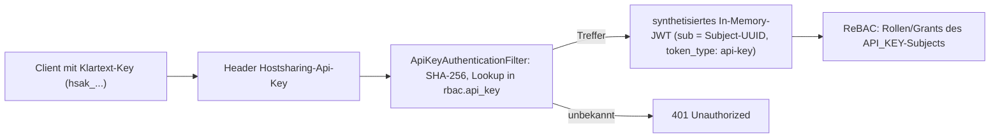
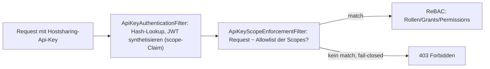

# RFC#0002: API-Keys

- Status: Umsetzung
- Stand: 2026-07-20
- Author: Michael Hönnig

Themen-RFC für API-Key-Credentials technischer Clients; wird über mehrere PRs
fortgeschrieben. Umgesetzte Fähigkeiten (PR#244): Authentifizierung und optionale
Endpoint-Scopes. Geplant: Key-Rotation/-Erneuerung (siehe Nicht-Ziele/Follow-Ups).

## Ausgangslage

Bisher mussten alle REST-API-Requests mit einem OIDC-JWT des Hostsharing-Keycloak
authentifiziert werden. Ein `rbac.subject` ist ein Principal im ReBAC-Sinne
(siehe [RFC#0001](2026-05-06-RFC%230001-rbac-subject-groups.md)); bislang gibt es
USER-Subjects (Keycloak-Login, `hs_accounts.account`) und GROUP-Subjects (aus Keycloak
synchronisiert, nicht selbst-authentisierbar). Technische Clients (Deployment,
Synchronisation, Monitoring) brauchten damit immer einen Keycloak-Login samt
Token-Handling. Probleme:

- Bei Keycloak-Ausfall kein Zugang zur API — auch nicht für Notfall-Automatisierung.
- Aus einem Legacy-DB-Dump existiert kein Credential: der erste Zugang über die API
  ist nicht einrichtbar (Henne-Ei-Problem der Erstausstattung).

## Motivation

Gebraucht wird ein langlebiges Machine-to-Machine-Credential, das

- unabhängig von der Keycloak-Verfügbarkeit funktioniert,
- als eigenständiger Principal mit eigenen, minimalen Rollen agiert (Least Privilege
  statt geliehenem Admin-Login),
- einzeln und sofort widerrufbar ist,
- sich aus leerer bzw. Legacy-Datenbank bootstrappen lässt.

Erster Nutzer ist die Keycloak-Subject-Synchronisation; weitere: Deployments,
Monitoring, Reporting.

## Zielbild

- `rbac.SubjectType` erhält den dritten Wert **`API_KEY`** (neben `USER`, `GROUP`).
  RFC#0001 antizipierte dafür `SERVICE`; umgesetzt wird der spezifischere Name
  `API_KEY`, da das Subject genau ein Credential repräsentiert. Wie GROUP-Subjects
  können API_KEY-Subjects kein `hs_accounts.account` haben (bestehender Trigger).
- Der Klartext-Key (`hsak_<subject-name>.<64 Hex-Zeichen>`, 256 Bit Entropie) wird
  **genau einmal** zurückgegeben — in der Response der Subject-Erzeugung
  (`POST /api/rbac/subjects`, `type: API_KEY`); gespeichert wird nur sein
  SHA-256-Hash (Tabelle `rbac.api_key`, cascading am Subject).
- Der **eingebettete Subject-Name** macht den Key selbstbeschreibend (analog zum
  `preferred_username` im JWT) — rein informativ, Stand der Erzeugung. Da der Hash über
  den *gesamten* Key gebildet wird, invalidiert jede Namens-Manipulation den Key; eine
  Signatur ist unnötig. Der Zufallsteil hat feste Länge, daher ist das Parsen auch bei
  Namen mit `.` eindeutig. Alt-Format ohne Namen (`hsak_<64 Hex>`) bleibt gültig.
- Clients senden den Klartext-Key im Header **`Hostsharing-Api-Key`**; unbekannte Keys
  → `401 Unauthorized`.
- Die **Autorisierung bleibt rollenbasiert**: die per Grants-API zugewiesenen Rollen
  bestimmen, was der Key darf. Ein frisch erzeugter Key hat keinerlei Rollen; nur der
  gebootstrappte `hsadminng.provisioning.key` erhält automatisch die globale ADMIN-Rolle.
- **Widerruf** = Löschen des Subjects (`DELETE /api/rbac/subjects/{uuid}`, physisch inkl.
  Hash-Zeile und Grants; Name und Typ müssen als Query-Parameter wiederholt werden — als
  Schutz vor Verwechslung); wirkt sofort mit dem nächsten Request, ohne Token-Restlaufzeit
  wie bei JWTs. Ein Soft-Delete (Deaktivierung) existiert nur für USER/GROUP-Subjects per
  `PUT` mit `deactivated: true`; deaktivierte API-Keys kann es nicht geben.
- **Optionales Ablaufdatum**: `expiresAt` bei der Erzeugung (Spalte
  `rbac.api_key.expires_at`, `null` = unbefristet); abgelaufene Keys weist der
  Authentication-Filter mit `401 expired API-key` ab. Absicherung gegen *vergessene* Keys;
  per DB änderbar ohne Neuausstellung.
- **Selbst-Inspektion**: `GET /api/rbac/context` liefert bei API-Key-Authentisierung
  zusätzlich die Key-Eigenschaften (Property `apiKey`: Endpoint-Scopes, Ablaufdatum) neben
  dem API_KEY-Subject (UUID, Name, Typ); dieser Endpoint ist auch für endpoint-gescopte
  Keys immer erlaubt (siehe Abschnitt Endpoint-Scopes).
- **Bootstrap**: aus `HSADMINNG_PROVISIONING_API_KEY_SHA256` provisioniert ein ApplicationRunner
  beim Start idempotent das Subject `hsadminng.provisioning.key` (vormals `initial_api_key`) mit
  globaler ADMIN-Rolle. Ein bereits gespeicherter Key hat immer Vorrang; ein abweichender
  konfigurierter Hash ändert nichts (nur Log-Warnung). Der Klartext existiert damit nur beim
  Client, nicht auf dem Server und nicht in der DB. Recovery nach gelöschtem
  `hsadminng.provisioning.key` siehe Abschnitt „Recovery des Provisioning-API-Keys" unten.
- Globale API_KEY-Subject-Namen folgen der Grammatik `^[a-z0-9]+(\.[a-z0-9]+)*$`
  (Kleinbuchstaben/Ziffern, Punkt als Hierarchie-Trenner), z.B. `deployment.production`;
  realm-bezogene Keys sind spätere Erweiterung. Das führende Segment `hsadminng.` ist für
  Hostsharing-betriebene Keys reserviert (z.B. `hsadminng.provisioning.key`), damit der übrige
  flache Namensraum konfliktfrei für kundenerzeugte Keys frei bleibt. Abgrenzung zu allen
  Usernamen-Formen siehe Namensraum-Sektion unten.



## Entwurfsentscheidungen

### API_KEY als Subject-Typ, nicht als Anhängsel eines Users

Ein API-Key ist ein eigener Principal: eigene Grants, eigene Identität im Audit-Log
(`base.tx_context`), unabhängig von Personalwechseln. Die Alternative — Keys an bestehende
USER-Subjects hängen ("agiert als User X") — wurde verworfen: Audit-Einträge wären nicht von
echten User-Logins unterscheidbar, der Widerruf hinge am User-Lebenszyklus, und
Team-Credentials hätten eine künstliche persönliche Bindung. Folgt direkt dem
Principal-Begriff aus RFC#0001.

### Synthetisiertes JWT statt eigenem Authentication-Typ

Der `ApiKeyAuthenticationFilter` (registriert *vor* Spring Securitys
`BearerTokenAuthenticationFilter`) synthetisiert nach erfolgreichem Hash-Lookup ein
In-Memory-`Jwt`/`JwtAuthenticationToken` mit der Subject-UUID als `sub`-Claim — dieselbe Form
wie eine echte OIDC-Authentication, aber ohne Issuer, Signatur oder `JwtDecoder`. So bleibt
der nachgelagerte Code (RBAC-`Context`, Controller, Tests) unverändert; kein zweiter,
divergierender Autorisierungspfad. Requests ohne den Header sind unberührt; sind beide Header
vorhanden, wird der Request mit `401` abgewiesen — mehrere Authentisierungsarten pro Request
sind nicht erlaubt, es gibt keinen Vorrang. Das Token trägt den Claim `token_type: api-key`,
damit nachgelagerte Filter (z.B. die
Endpoint-Scopes, siehe unten) API-Key-Requests erkennen.

### SHA-256 statt Passwort-Hashing (bcrypt/argon2)

API-Keys sind server-generierte Zufallsgeheimnisse mit 256 Bit Entropie, keine Passwörter:
Wörterbuch- und Brute-Force-Angriffe sind aussichtslos, Salting und Key-Stretching bringen
keinen Sicherheitsgewinn. Der deterministische SHA-256-Hash erlaubt den direkten
Index-Lookup (`where keyHash = ?`) — bei bcrypt müsste pro Request über alle Keys iteriert
werden.

### Bootstrap über konfigurierten Hash statt Seed-Daten

Ein Seeding des Provisioning-Keys per Liquibase-Changeset wurde verworfen: das Geheimnis (oder
auch nur sein Hash) stünde versioniert im Repository bzw. im DB-Dump. Stattdessen wird der
Hash als Umgebungsvariable des Backend-Services konfiguriert (`tools/remote provisioning-api-key`
automatisiert das: Key lokal generieren, nur den Hash ins `EnvironmentFile` schreiben, Service
neu starten, Provisionierung im Log verifizieren).

### Verworfene Alternative: Keycloak Service-Accounts (Client-Credentials-Grant)

OAuth2-Client-Credentials über Keycloak wären der Standardweg für M2M, erfüllen aber zwei
Kernanforderungen nicht: Unabhängigkeit von der Keycloak-Verfügbarkeit (Notfall-Zugang) und
das Bootstrap-Problem (die Subject-Synchronisation, die Keycloak-Identitäten überhaupt erst
nach hsadmin-NG bringt, kann nicht selbst von funktionierendem Keycloak abhängen). Zudem bliebe
Token-TTL-Handling in jedem Skript. Für Clients ohne diese Anforderungen bleibt der JWT-Weg —
API-Keys sind eine *zusätzliche* Authentisierung, kein Ersatz.

## Namensraum der API-Key-Subjekte

Aufgekommen im Zuge der Trennung von Organisation und Usernamen (eigener, bereits auf den
Master gemergter PR). **Entschieden:** Variante A (disjunkte Namens-Grammatik samt Invariante)
wird in diesem PR umgesetzt; der spätere Umbau auf Eindeutigkeit per (Typ, Name) ist unten als
Migrationspfad festgehalten und kommt in eigenem PR, falls externe Systeme ihn nötig machen.

### Das Problem

Subject-Namen sollen eindeutig sein — jedenfalls unter den aktiven Subjects; dafür sorgt ein
globaler Unique-Constraint.

Die derzeitigen Usernamen sind organisations-gepräfixt (`xyz00-name`), evtl. künftig ergänzt
(oder ersetzt) um E-Mail-Adressen und Matrix-Handles. Alle diese Formen sind gleichermaßen
Usernamen — die organisations-gepräfixte Form ist keine Legacy-Form. Mit der getrennten
Organisation (eigene Spalte statt Prefix-Ableitung) ist das Namensformat dafür offen:
E-Mail-Local-Parts können mit fast beliebigen Zeichen beginnen (auch `_`), Matrix-Handles mit
`@`.

Zwei Risiken für frei wählbare API-Key-Namen:

- **(a) Verwechslungsgefahr:** Admins könnten in Subject-Listen/Grants einen API-Key-Namen für
  einen Usernamen halten (oder umgekehrt). Ziel ist Verwechslungs*armut*, nicht
  hundertprozentige Erkennbarkeit.
- **(b) Unique-Constraint-Kollision mit dem Keycloak-Sync:** ein API-Key mit einem Namen, den
  der Sync später als Usernamen aus Keycloak bringt, ließe diesen User am Unique-Constraint
  scheitern.

### Kernbeobachtung

Jeder Identifikator-Typ trägt bereits ein syntaktisches Erkennungsmerkmal:

| Identifikator                     | Muster                    | Erkennungsmerkmal            |
|-----------------------------------|---------------------------|------------------------------|
| Username, organisations-gepräfixt | `organization-localpart`  | enthält `-`                  |
| Username, E-Mail-Adresse          | `localpart@example.com`   | enthält `@`                  |
| Username, Matrix-Handle           | `@user:homeserver`        | beginnt mit `@`, enthält `:` |
| Gruppe                            | `/organization-groupname` | beginnt mit `/`              |

Ein Namensraum, der `-`, `@`, `:` und `/` ausschließt, ist per Konstruktion disjunkt zu allen
anderen Identifikator-Typen — ein reserviertes Prefix ist dafür nicht nötig.

### Vorschlag (Variante A): strukturell disjunkte Namens-Grammatik

API_KEY-Subject-Namen folgen der Grammatik

```
^[a-z0-9]+(\.[a-z0-9]+)*$
```

also z.B. `purpose.environment`:

```
ci
ci.main
deployment.production
backup.nightly
monitoring.healthcheck
github.actions
terraform.production
```

Design-Prinzipien:

- nur ASCII-Kleinbuchstaben und Ziffern,
- Punkt (`.`) trennt hierarchische Namensbestandteile (`service.environment.function`),
- `-` bleibt reserviert für organisations-gepräfixte Usernamen, `@` für E-Mail/Matrix, `:` für
  Matrix, `/` für Gruppen,
- kein `_`, kein Whitespace,
- keine führenden, abschließenden oder doppelten Punkte (folgt aus der Grammatik).

Eigenschaften:

1. **Disjunktheit gegen Risiko (a):** kein möglicher Username irgendeiner Form und kein
   Gruppenname — sofort erkennbar in Logs, CLIs, Grant-Anzeigen, Subject-Listen; kurz und
   lesbar, ohne redundantes Prefix (der Typ steht in der `type`-Spalte, der Klartext-Key trägt
   `hsak_`).
2. **Erzwungener Inverse-Guard gegen Risiko (b):** `POST`/`PUT /api/rbac/subjects` weisen für
   Nicht-API_KEY-Typen Namen ab, die dieser Grammatik entsprechen — siehe Invariante unten.
   Ohne diesen Guard wäre die Disjunktheit nur Konvention.
3. Der Unique-Constraint bleibt global und wird harmlos: Risiko (b) kann nicht mehr eintreten.
4. **Verträglich mit dem Key-Format:** der eingebettete Name wird vom Ende her geparst (fixe
   Länge des Zufallsteils), Punkte sind unproblematisch. Der Klartext liest sich natürlich:
   `hsak_deployment.production.<64 Hex>`.

Konsequenz: der Bootstrap-Name `initial_api_key` enthielt ein `_` und wird zu
`hsadminng.provisioning.key` umbenannt — eine Java-Konstante; vor dem Merge auf den Master ist der
günstigste Zeitpunkt. Bereits ausgegebene Keys bleiben gültig (Lookup über den Hash), nur der
eingebettete Name ist veraltet — ausdrücklich erlaubt ("Stand der Erzeugung").

### Reserviertes Prefix `hsadminng.` für betriebseigene Keys

Die disjunkte Grammatik trennt API-Keys von USER- und GROUP-Subjects, aber alle API_KEY-Namen
teilen sich denselben flachen Namensraum. Sollen künftig auch **Kunden** eigene API-Keys
erzeugen können, dürfen deren frei gewählte Namen (`deployment.production`, `ci.main`, …) nicht
mit den betriebseigenen Keys von Hostsharing kollidieren.

Deshalb erhalten Hostsharing-betriebene Keys ein reserviertes führendes Segment `hsadminng.`:

- gebootstrappter Provisioning-Key: `hsadminng.provisioning.key`,
- Keycloak-Sync-Key: `hsadminng.keycloak.sync` (via `tools/create-api-key-for-keycloak-sync`).

Der restliche Namensraum bleibt damit konfliktfrei für kundenerzeugte Keys. Vorerst ist
`hsadminng.` reine Konvention (nur die betriebseigenen Namen tragen es); eine erzwungene
Reservierung — Ablehnung kundenseitig gesetzter `hsadminng.`-Namen bzw. eine an die
Organisation gebundene Prefix-Pflicht — ist ein Folge-Schritt, sobald Kunden-API-Keys tatsächlich
eingeführt werden (siehe Migrationspfad unten).

### Invariante: Anforderung an alle Usernamen-Muster

> **Usernamen müssen mindestens ein `-` oder `@` enthalten; Namen, die der API-Key-Grammatik
> entsprechen, werden für USER- und GROUP-Subjects abgewiesen (400).**

Belastbar ist allein das Marker-Zeichen `-` oder `@` (auf Punkt-Verstöße oder Großbuchstaben
stützt sich die Invariante bewusst nicht — beide normalisiert Keycloak leicht weg). Alle
bekannten und geplanten Usernamen-Formen erfüllen sie von selbst: organisations-gepräfixt
(`organization-localpart`, enthält `-`), E-Mail-Adresse (enthält `@`), Matrix-Handle (beginnt mit
`@`). Gruppen brauchen keine eigene Regel: das führende `/` schließt Kollisionen aus.

Das Risiko sitzt bei Keycloaks Default-Validierung, die schlichte Usernamen wie `john.doe` erlaubt
— gültige Wörter der API-Key-Grammatik. Heimtückisch ist die *zeitversetzte* Kollision: der User
`ci.main` synct heute, blockiert später am Unique-Constraint den gleichnamigen API-Key. Deshalb
muss der Sync markerloser Usernamen deterministisch mit 400 scheitern.

Durchsetzungsorte:

1. **Primär die OpenAPI-Schemata:** das lose `^[^/].*$` im `RbacUserSubjectWithOrganizationUpsert`
   wird auf `^[^/]*[-@].*$` verschärft (mindestens ein `-` oder `@`).
2. **Optional als DB-Level-Re-Check** in `rbac.upsert_subject` (Defense-in-Depth).
3. Keycloak-Realm-Konfiguration optional — nur Komfort (frühere Fehlermeldung), nicht die
   Verteidigungslinie.

### Späterer Migrationspfad: Eindeutigkeit per (Typ, Name)

Die Grammatik samt Invariante reserviert einen Namensraum — eine Annahme über externe Systeme,
die wir nicht kontrollieren (schlichte SSO-/LDAP-Usernamen wie `john.doe` können exakt der
API-Key-Grammatik entsprechen). Zukunftssicherer Ausweg: den Unique-Constraint auf **(Typ, Name)**
umstellen — dann koexistieren User `ci.main` und API-Key `ci.main`, und die Usernamen-Invariante
entfällt ersatzlos (die Grammatik bleibt reine Namenskonvention, Verwechslungsarmut nur noch
anzeigeseitig über typ-abhängige IdName-Prefixe). Machbar, weil jeder Auth-Pfad seinen Subject-Typ
kennt. Voraussetzung: zuerst alle rein namens-keyed Auflösungen (u.a.
`rbac.determineCurrentSubjectUuid`, `find_subject_id`, der partielle Unique-Index, das Audit-Log)
typ-bewusst bzw. auf UUID umstellen und **erst danach** den Index — sonst drohen bei
Gleichnamigkeit stille Identitätsverwechslungen (bis dahin schützt der globale Unique-Constraint
fail-closed davor). Eigener PR, falls externe Systeme es erzwingen.

### Verworfene bzw. nachrangige Alternativen

| # | Ansatz | Pro | Contra |
|---|--------|-----|--------|
| B | **Reserviertes Prefix** (`apikey:` oder `hsak:`, Muster `^apikey:[a-z0-9._]+$`) | selbsterklärend; gruppiert API-Keys in sortierten Listen | redundant zu Typ und Key-Prefix `hsak_`; längere, hässlichere Namen; „doppeltes Moppeln" im Klartext (`hsak_apikey:...`); braucht denselben Inverse-Guard wie A |
| C | **Server-generierte Namen** (Admin gibt Label, Server vergibt z.B. `apikey-7f3a`) | maximal kollisionssicher | neues Feld im API-Contract; Szenario-Reports und Grant-Anzeigen weniger lesbar |
| D | **Unique-Constraint pro Typ** statt global (User `foo` und API-Key `foo` koexistieren) | löst Risiko (b) strukturell, ohne Namensraum-Reservierung | erfordert vorher die Umstellung aller namens-keyed Auflösungen — deshalb nicht verworfen, sondern als Migrationspfad (oben) auf späteren PR verschoben |
| E | **Suffix** (`sync-tool.apikey`) | ähnliche Disjunktheit | in sortierten Listen und beim Überfliegen schlechter erkennbar; kein Gruppierungseffekt |

### Umsetzung in diesem PR

1. API-Key-Grammatik in der OpenAPI-Spezifikation (`RbacApiKeySubjectInsert.name`) **und** als
   DB-Level-Re-Check (Verschärfung von `rbac.is_valid_api_key_subject_name` von `^[^/-]+$` auf
   die Grammatik; der Check-Constraint existiert bereits).
2. Invariante für Usernamen in den OpenAPI-Schemata: die losen `^[^/].*$`-Patterns der
   Insert/Upsert-Varianten mit expliziter Organisation verlangen künftig mindestens ein `-`
   oder `@`. Kein neuer DB-Constraint für Usernamen — die wurden mit der Organisations-Trennung
   bewusst abgeschafft.
3. Umbenennung `initial_api_key` → `hsadminng.provisioning.key` (Java-Konstante). Ein bereits
   provisioniertes Subject wird per Liquibase-Changeset
   (`rbac-api-key-RENAME-PROVISIONING-SUBJECT` in `1086-rbac-api-key.sql`) automatisch nachgezogen
   — kein manueller DB-Eingriff nötig, und der Bootstrap legt kein zweites Admin-Subject an. Auf
   einer frischen DB trifft der Changeset keine Zeile und der Bootstrap erzeugt das Subject direkt
   unter dem neuen Namen.

## Endpoint-Scopes

Die Autorisierung eines API-Keys ist rein rollenbasiert: die dem Subject gegranteten Rollen
bestimmen, was der Key darf — auf *jedem* Endpoint. Eine Beschränkung auf bestimmte Endpoints
kann das Rollenmodell nicht ausdrücken. Endpoint-Scopes schließen diese Lücke.

### Motivation

Anlass ist die Keycloak-Subject-Synchronisation: sie braucht `rbac.global#global:ADMIN`, um die
Subjects *aller* Realms zu sehen (`RealSubjectRepository.VISIBLE_SUBJECT_CONDITION` verlangt
`rbac.hasGlobalAdminRole()`), soll aber nur `GET`/`PUT` auf `/api/rbac/subjects[/{uuid}]` dürfen.
Struktureller Mismatch: volle Daten-*Sichtbarkeit* bei minimaler Endpoint-*Oberfläche*. Vor
diesem RFC gab es *keinerlei* Endpoint-Level-Zugriffskontrolle: `BaseWebSecurityConfig` erlaubt
`/api/**` pauschal für authentifizierte Requests.

Weitere Anwendungsfälle desselben Musters:

- **Read-only-Keys** (`*:read`): Reporting-/Monitoring-Key darf alles lesen (`GET`), nichts
  verändern.
- **Sync-Keys** (`rbac.subjects:sync`): darf Subjects lesen (`GET`) und per Create-or-Update
  anlegen/aktualisieren/deaktivieren (`PUT`, Deaktivierung deklarativ via `deactivated: true`),
  aber weder per `POST` erstellen noch per `DELETE` löschen.

### Zielbild

Endpoint-Scopes sind eine **optionale, fail-closed Allowlist-Umzäunung** eines
API-Key-*Credentials*, zusätzlich zu den Rollen seines Subjects:

- Ein API-Key erhält bei der Erzeugung optional Scopes (`POST /api/rbac/subjects`, Property
  `scopes`).
- Ein Key **mit** Scopes darf nur Endpoints aufrufen, die mindestens ein Scope abdeckt; alles
  andere → `403 Forbidden`.
- Ein Key **ohne** Scopes bleibt uneingeschränkt (rückwärtskompatibel, insb. für den
  gebootstrappten `hsadminng.provisioning.key`).
- Ausgenommen von der Durchsetzung: offene Endpoints (`/api/ping`), Nicht-API-Pfade (Actuator,
  Swagger-UI) sowie `GET /api/rbac/context` (Selbst-Inspektion).
- Scopes ersetzen keine Rollen: die Daten-Autorisierung bleibt beim ReBAC-System, Scopes
  begrenzen nur die HTTP-Oberfläche des Credentials (Defense in Depth).



Die Durchsetzung erfolgt in einem eigenen Filter *nach* Spring Securitys
`BearerTokenAuthenticationFilter`, erkennbar am Claim `token_type: api-key`. Requests mit
*beiden* Auth-Headern werden bereits vom `ApiKeyAuthenticationFilter` mit `401` abgewiesen
(siehe Entwurfsentscheidungen), sodass der Scope-Filter nur reine API-Key-Authentications
sieht; ungescopte Keys und echte JWTs passieren ihn als No-op. Durchsetzung per `@PreAuthorize`
auf den generierten Controllern wurde verworfen, weil Annotationen kein Deny-by-Default
ausdrücken — eine vergessene Methode wäre fail-open.

### Wo werden Scopes auf HTTP-Methoden und URL-Pfade abgebildet?

Zentrale Design-Entscheidung. Zwei Varianten:

#### Variante A (umgesetzt): benannte Scopes, Mapping im Java-Enum

Die Datenbank speichert pro API-Key nur *Namen* benannter Scopes (Format
`<endpoint-area>:<access>`), eine Zeile pro Key und Scope:

```sql
create table rbac.api_key_scope
(
    apiKeyUuid uuid        not null references rbac.api_key (uuid) on delete cascade,
    scope      varchar(64) not null
        constraint api_key_scope_scope_format check (scope ~ '^([a-z][a-z0-9._-]*|\*):[a-z]+$'),
    primary key (apiKeyUuid, scope)
);
```

Die Abbildung von Scope-Namen auf (HTTP-Methode, Pfad-Pattern)-Allowlists lebt an genau
**einer** Stelle, dem handgeschriebenen Enum `config.ApiKeyScope` (Spring
`PathPatternRequestMatcher`):

```java
public enum ApiKeyScope {
    RBAC_SUBJECT_SYNC("rbac.subjects:sync",
            endpoint(GET, "/api/rbac/subjects"),
            endpoint(GET, "/api/rbac/subjects/{uuid}"),
            endpoint(PUT, "/api/rbac/subjects/{uuid}")), // bewusst ohne .../{uuid}/permissions, POST und DELETE, siehe Sicherheit
    ANY_READ("*:read",
            endpoint(GET, "/api/**"));                      // read-only API-Keys
}
```

Ein OpenAPI-Enum gleicher Wire-Namen validiert die Scopes bereits bei der Key-Erzeugung
(unbekannte Namen → `400 Bad Request` mit gültigen Werten); ein Unit-Test hält beide Enums
synchron. `GET /api/rbac/scopes` listet die verfügbaren Scopes samt erlaubter Endpoints direkt
aus dem Enum, kann also nie von der Durchsetzung abweichen.

Eigenschaften:

- **Auditierbarkeit**: `rbac.subjects:sync` ist in jedem Key-Review selbsterklärend; die
  Bedeutung ist zentral kuratiert und versioniert.
- **Eine Quelle der Wahrheit**: ändert sich ein URL-Pfad, gibt es genau eine mitzuziehende
  Stelle — im selben Commit, vom Compiler-/Test-Netz abgesichert.
- **Validierung zur Erzeugungszeit**: nur Katalog-Werte sind speicherbar.
- **Kosten**: ein neuer Scope erfordert ein Deployment (ein Enum-Eintrag plus ein
  OpenAPI-Enum-Wert). Für eine kuratierte Security-Oberfläche akzeptabel.

#### Entscheidung und verworfene Alternativen

**Variante A** ist umgesetzt: Endpoint-Scopes sind eine *Security*-Oberfläche; Auditierbarkeit,
zentrale Kuratierung und Compiler-/Test-Absicherung wiegen schwerer als die Flexibilität,
Einschränkungen ohne Deployment anzulegen — der Katalog wächst erwartbar langsam.

Verworfen: **URL-Pfade/Patterns direkt in der DB-Tabelle** (statt benannter Scopes) — flexibel
ohne Deployment, aber schlecht auditierbar (Patterns interpretieren statt Namen lesen), pro Key
fehleranfällig (zu breite/ungeankerte Patterns, ReDoS bei RegEx) und ohne Refactoring-Netz (kein
Compiler/Test bemerkt ins Leere zeigende Patterns). Ebenso der **DB-Katalog-Mittelweg**
(`rbac.endpoint_scope`, per Name referenziert): behielte die Auditierbarkeit, aber Mapping und
Enforcement wären nicht mehr im selben Artefakt versioniert — lohnt bei kleinem Katalog nicht.
Beide bleiben als spätere Erweiterung koexistenzfähig möglich.

### Durchsetzung im Detail

- `ApiKeyAuthenticationFilter` lädt die Scopes des Keys mit demselben Query (`left join
  rbac.api_key_scope`), legt sie als Standard-`scope`-Claim (space-separiert) in das
  synthetisierte JWT und zusätzlich als `SCOPE_...`-Authorities.
- Der `ApiKeyScopeEnforcementFilter` (nach dem `BearerTokenAuthenticationFilter`) ist No-op,
  außer die Authentication ist ein API-Key-Token (`token_type: api-key`) *mit* Scopes und der
  Pfad liegt unter `/api/` (außer `GET /api/ping` und `GET /api/rbac/context` — die Ausnahme
  gilt method-spezifisch nur für GET). Dann muss der Request von
  mindestens einem Matcher eines gehaltenen Scopes abgedeckt sein, sonst `403` im bestehenden
  JSON-Fehlerformat. Unbekannte Scope-Namen in der DB matchen nie (fail-closed).
- Keycloak-JWTs, ungescopte API-Keys, anonyme Requests und Nicht-API-Pfade sind nachweislich
  unberührt (No-op-Pfade, per Unit-Tests abgedeckt).

## Recovery des Provisioning-API-Keys

Bei einem Sicherheits-Review von PR#244 aufgefallen.

**Entschieden und in diesem PR umgesetzt (2026-07-17):** `DELETE /api/rbac/subjects/{uuid}`
löscht ab sofort immer physisch, einen Soft-Delete per `DELETE` gibt es nicht mehr;
Deaktivierung erfolgt nur explizit per `PUT` mit `deactivated: true` — und das weist
API_KEY-Subjects ab (400). Deaktivierte API-Keys können über die API also gar nicht entstehen;
API_KEY-Subjects sind damit immutabel — nur Anlegen und endgültiger Widerruf. Recovery ist
schlicht: Subject löschen, Backend neu starten — der Bootstrap findet keine `api_key`-Zeile mehr
(FK-Kaskade räumt sie mit ab) und provisioniert regulär neu.

Als Schutz vor versehentlichem Löschen des falschen Subjects muss `DELETE` Name und Typ als
Query-Parameter wiederholen; beide werden gegen das per UUID identifizierte Subject geprüft
(400 bei Abweichung).

Der Nachteil "verhindert vorübergehendes Stilllegen" ist für ein Credential verschmerzbar:
Widerrufen plus neu ausstellen ist billig, ein widerrufener Key soll ohnehin tot bleiben, und
für befristete Keys gibt es `expiresAt`. Verworfen wurden die zunächst erwogenen Alternativen:
Auto-Reaktivierung des deaktivierten Subjects durch den Bootstrap (hebt einen bewussten Widerruf
auf, kann Absicht nicht von Versehen unterscheiden) sowie reine Log-Diagnose bzw. Runbook (der
Lockout — ohne zweites Global-Admin-Credential kein API-Weg zurück — bliebe bestehen).

**Rotations-Hinweis (Folge-PR):** Nach Löschen + Neustart provisioniert der Bootstrap
denselben Key erneut, solange `HSADMINNG_PROVISIONING_API_KEY_SHA256` unverändert konfiguriert ist.
Ein Widerruf des `hsadminng.provisioning.key` wegen Kompromittierung ist also nur dauerhaft wirksam, wenn
auch der konfigurierte Hash rotiert oder entfernt wird. Das Runbook (und ggf. eine laute
Bootstrap-Diagnose) kommt in einem Folge-PR.

## Sicherheit

Credential-Handling:

- Der `Hostsharing-Api-Key`-Header wird im Audit-Log maskiert
  (`base.tx_context.currentRequest`, analog zur `Authorization`-Maskierung).
- Das Shell-Tooling (`APIKEY`-Funktion) speichert Keys nur GPG-verschlüsselt (`.apikeys.gpg`,
  git-ignoriert); `APIKEY --transient` hält sie nur in der Session.
- Verlorene Keys sind nicht wiederherstellbar (nur Hash gespeichert) — Ersatz = neues Subject,
  alter Key löschen.

Scope-basierte Härtung:

- **Privilege-Escalation verhindert**: `rbac.subjects:sync` umfasst bewusst *nicht*
  `POST /api/rbac/subjects` — darüber ließen sich neue API_KEY-Subjects und damit
  uneingeschränkte Keys erzeugen, was die Umzäunung aushebeln würde. Die Sync legt Subjects per
  HTTP PUT (Create-or-Update) an. Ohne Scopes kann jeder Global-Admin-Key weitere,
  uneingeschränkte Keys erzeugen — wo unerwünscht, begrenzt genau dieser ausgeschlossene
  Write-Scope das.
- **API_KEY-Subjects sind vor der Synchronisation geschützt**: sie existieren nur in
  hsadmin-ng, nie in Keycloak. Eine zustandsreplizierende Sync würde sie sonst als "in Keycloak
  gelöscht" einstufen und sämtliche Keys deaktivieren (inkl. eigenem und `hsadminng.provisioning.key` →
  Lockout). Deshalb weist `PUT` den Typ `API_KEY` mit `400` ab, die Deaktivierung erfolgt
  deklarativ per `PUT` mit `deactivated: true`, und `DELETE /api/rbac/subjects/{uuid}` ist
  bewusst nicht Teil von `rbac.subjects:sync` — ein Sync-Key kann API-Keys weder anlegen noch
  ändern noch löschen.
- **Scopes granten nichts**: sie schränken nur ein. Ein gescopter Key ohne Rollen sieht
  weiterhin nichts; die Sync-Sichtbarkeit kommt regulär per Grants-API über die globale
  ADMIN-Rolle (Defense in Depth: Rollen für Daten, Scopes für die HTTP-Oberfläche).
- Mit der globalen AUDITOR-Rolle aus
  [RFC#0004](2026-07-14-RFC%230004-global-auditor-role.md) kann ein Reporting-Key künftig
  doppelt abgesichert werden: `global:AUDITOR` (strukturell read-only im Grant-Baum) plus Scope
  `*:read` (read-only auf HTTP-Ebene).

## Zusammenspiel mit den anderen RFCs

- [RFC#0001](2026-05-06-RFC%230001-rbac-subject-groups.md): Subject-/Principal-Begriff, auf dem
  das API_KEY-Subject aufsetzt.
- [RFC#0004](2026-07-14-RFC%230004-global-auditor-role.md): die globale AUDITOR-Rolle macht
  Read-only-Zugriff auch im Grant-Baum strukturell; Reporting-Keys können künftig AUDITOR +
  Scope `*:read` kombinieren (doppelte Absicherung).

## Nicht-Ziele / Follow-Ups

- Key-Expiry und -Rotation/-Erneuerung — geplante Fähigkeit, wird diesen RFC in einem eigenen
  PR fortschreiben (aktuell: neues Subject anlegen, altes löschen). Dazu gehört das
  Rotations-Runbook für `hsadminng.provisioning.key` (siehe „Recovery des Provisioning-API-Keys")
  und ggf. die laute Bootstrap-Diagnose.
- Frei definierbare Patterns pro Key (URL-Pfade direkt in der DB) und der DB-Katalog-Mittelweg —
  erst bei nachgewiesenem Bedarf.
- Eindeutigkeit per (Typ, Name) statt globalem Unique-Index — Migrationspfad im
  Namensraum-Abschnitt.
- Realm-bezogene API-Keys mit realm-gepräfixten Namen.
- Endpoint-Scopes für USER-/GROUP-Subjects — bewusst verworfen; für Personen ist die
  AUDITOR-Rolle (RFC#0004) der richtige Mechanismus, Scopes fencen Credentials.
- Implizite Konten- oder Rollen-Provisionierung — Rollen werden immer explizit per Grants-API
  vergeben (nur `hsadminng.provisioning.key` ist die dokumentierte Ausnahme).
- **Herkunft/Ersteller eines API-Keys (offen):** wer einen Key erzeugt hat, ist heute nur über
  das Audit-Journal ermittelbar (`base.tx_journal_v` für den `INSERT` auf `rbac.subject`, Spalte
  `currentSubject`) — es gibt keine `created_by`-Spalte und keinen API-Zugriff darauf. Zu
  entscheiden: ob mehr gewünscht ist, z.B. ein API-Endpoint für die Ersteller-/Provenienz-Info,
  eine explizite `created_by`-Spalte oder ein Ausweis im `GET /api/rbac/context`.

## Begriffsabgrenzung

- API-Key: langlebiges Credential; Klartext `hsak_<subject-name>.<64 Hex>`, existiert nur beim
  Client; serverseitig nur der SHA-256-Hash in `rbac.api_key`, optional mit Ablaufdatum
  (`expires_at`).
- API_KEY-Subject: Principal (`rbac.subject`, `type = API_KEY`), an dem Key-Hash und Grants
  hängen; ohne Account, ohne Realm-Prefix.
- `hsadminng.provisioning.key`: das aus der Konfiguration gebootstrappte API_KEY-Subject mit globaler
  ADMIN-Rolle; einziger Key, der nicht über die API erzeugt wird.
- Endpoint-Scope: benannte, fail-closed Allowlist von (HTTP-Methode, Pfad-Pattern)-Paaren, die
  die HTTP-Oberfläche eines API-Key-Credentials begrenzt.
- Scope-Name: Wire-Format `<endpoint-area>:<access>`, z.B. `rbac.subjects:sync`; `*` als
  Endpoint-Area für methodenweite Scopes wie `*:read`.
- Rolle/Grant: Daten-Autorisierung im ReBAC-System, orthogonal zu Scopes; siehe
  [RFC#0001](2026-05-06-RFC%230001-rbac-subject-groups.md) und
  [RFC#0004](2026-07-14-RFC%230004-global-auditor-role.md).
