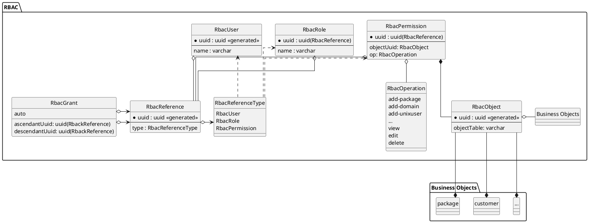
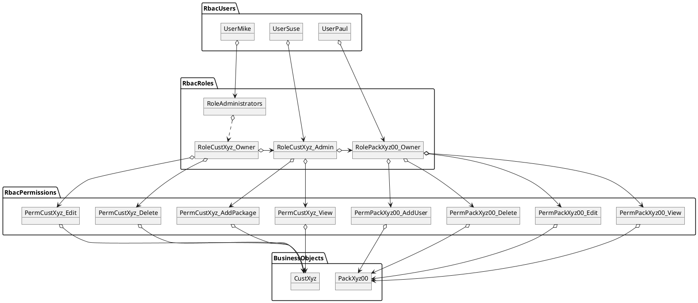

## *hsadmin-ng*'s Role-Based-Access-Management (RBAC)

The requirements of *hsadmin-ng* include table-m row- and column-level-security for read and write access to business-objects.
More precisely, any access has to be controlled according to given rules depending on the accessing users, their roles and the accessed business-object.
Further, roles and business-objects are hierarchical.

To avoid misunderstandings, we are using the term "business-object" what's usually called a "domain-object".
But as we are in the context of a webhosting infrastructure provider, "domain" would have a double meaning.

Our implementation is based on Role-Based-Access-Management (RBAC) in conjunction with views and triggers on the business-objects.
As far as possible, we are using the same terms as defined in the RBAC standard, for our function names though, we chose more expressive names.

In RBAC, subjects can be assigned to roles, roles can be hierarchical and eventually have assigned permissions.
A permission allows a specific operation (e.g. view or edit) on a specific (business-) object.

You can find the entity structure as a UML class diagram as follows:



### The RBAC Entity Types

#### RbacReference

An *RbacReference* is a generalization of all entity types which participate in the hierarchical role system, defined via *RbacGrant*.

The primary key of the *RbacReference* and its referred object is always identical.

#### RbacUser

An *RbacUser* is a type of RBAC-subject which references a login account outside this system, identified by a name (usually an email-address).

*RbacUser*s can be assigned to multiple *RbacRole*s, through which they can get permissions to *RbacObject*s.

The primary key of the *RbacUser* is identical to its related *RbacReference*.

#### RbacRole

An *RbacRole* represents a collection of directly or indirectly assigned *RbacPermission*s. 
Each *RbacRole* can be assigned to *RbacUser*s or to another *RbacRole*.

Both kinds of assignments are represented via *RbacGrant*.

*RbacRole* entities can *RbacObject*s, or more precise

#### RbacPermission

An *RbacPermission* allows a specific *RbacOperation* on a specific *RbacObject*.

#### RbacOperation

An *RbacOperation* determines, <u>what</u> an *RbacPermission* allows to do.
It can be one of:

- **add-...** - permits creating new instances of specific entity types underneath the object specified by the permission, e.g. "add-package"
- **view** - permits reading the contents of the object specified by the permission
- **edit** - change the contents of the object specified by the permission
- **delete** - delete the object specified by the permission

This list is extensible according to the needs of the access rule system.

Please notice, that there is no **create-...** operation to create new instances of related business-object-types.
For such a singleton business-object-type, e.g. *Organization" or "Hostsharing" has to be defined, and its single entity is referred in the permission.
By this, the foreign key in *RbacPermission* can be defined as `NOT NULL`. 

#### RbacGrant

The *RbacGrant* entities represent the access-rights structure from *RbacUser*s via hierarchical *RbacRoles* down to *RbacPermission*s.

The core SQL queries to determine access rights are all recursive queries on the *RbacGrant* table.

### Role naming

Automatically generated roles are named as such:

#### business-table#business-object-name.tenant
This role is assigned to users who manage objects underneath the object which is accessible through the role.
This rule usually gets only view permissions assigned.

**Example**

'dd'

## Example Users, Roles, Permissions and Business-Objects 




```plantuml
@startuml
left to right direction
' top to bottom direction

' hide the ugly E in a circle left to the entity name
hide circle

' use right-angled line routing
' skinparam linetype ortho

package rbacPerms {
    cust
}

package rbacRoles {
    entity administrators
    entity custXXX
}

package rbacUsers {
    entity adminMike
    adminMike <-- administrators

    entity adminSven
    entity custXXX
    entity pacAdmXXX00
}

@enduml
```

