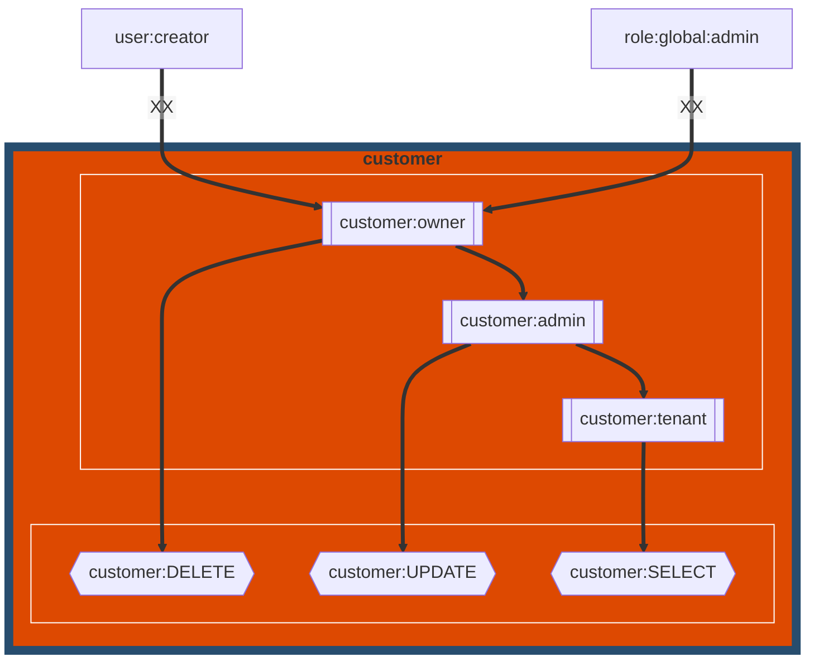

### rbac customer

This code generated was by RbacViewMermaidFlowchartGenerator at  2024-03-11T11:29:11.571772062.

```mermaid
%%{init:{'flowchart':{'htmlLabels':false}}}%%
flowchart TB

subgraph customer["`**customer**`"]
    direction TB
    style customer fill:#dd4901,stroke:#274d6e,stroke-width:8px

    subgraph customer:roles[ ]
        style customer:roles fill:#dd4901,stroke:white

        role:customer:owner[[customer:owner]]
        role:customer:admin[[customer:admin]]
        role:customer:tenant[[customer:tenant]]
    end

    subgraph customer:permissions[ ]
        style customer:permissions fill:#dd4901,stroke:white

        perm:customer:DELETE{{customer:DELETE}}
        perm:customer:UPDATE{{customer:UPDATE}}
        perm:customer:SELECT{{customer:SELECT}}
    end
end

%% granting roles to users
user:creator ==>|XX| role:customer:owner

%% granting roles to roles
role:global:admin ==>|XX| role:customer:owner
role:customer:owner ==> role:customer:admin
role:customer:admin ==> role:customer:tenant

%% granting permissions to roles
role:customer:owner ==> perm:customer:DELETE
role:customer:admin ==> perm:customer:UPDATE
role:customer:tenant ==> perm:customer:SELECT

```
