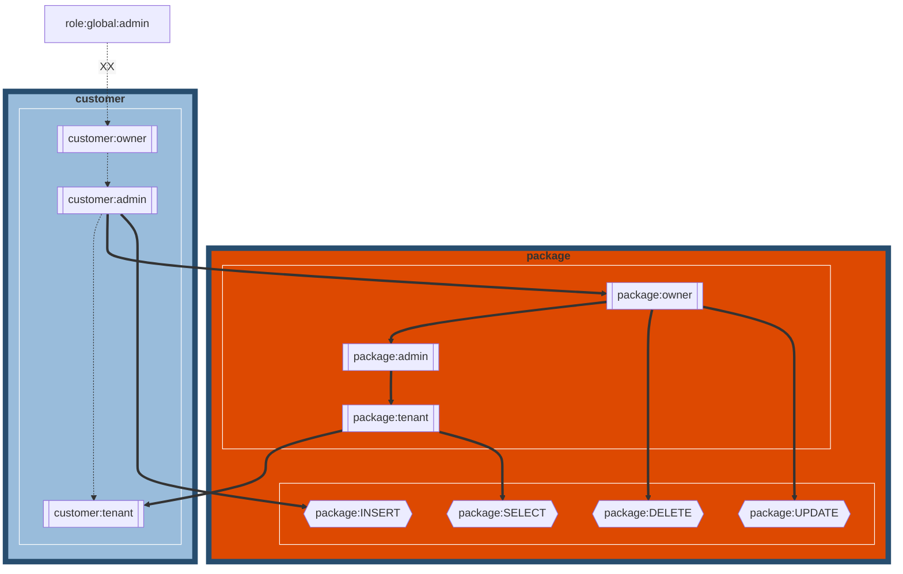

### rbac package

This code generated was by RbacViewMermaidFlowchartGenerator at  2024-03-11T11:29:11.624847792.

```mermaid
%%{init:{'flowchart':{'htmlLabels':false}}}%%
flowchart TB

subgraph package["`**package**`"]
    direction TB
    style package fill:#dd4901,stroke:#274d6e,stroke-width:8px

    subgraph package:roles[ ]
        style package:roles fill:#dd4901,stroke:white

        role:package:owner[[package:owner]]
        role:package:admin[[package:admin]]
        role:package:tenant[[package:tenant]]
    end

    subgraph package:permissions[ ]
        style package:permissions fill:#dd4901,stroke:white

        perm:package:INSERT{{package:INSERT}}
        perm:package:DELETE{{package:DELETE}}
        perm:package:UPDATE{{package:UPDATE}}
        perm:package:SELECT{{package:SELECT}}
    end
end

subgraph customer["`**customer**`"]
    direction TB
    style customer fill:#99bcdb,stroke:#274d6e,stroke-width:8px

    subgraph customer:roles[ ]
        style customer:roles fill:#99bcdb,stroke:white

        role:customer:owner[[customer:owner]]
        role:customer:admin[[customer:admin]]
        role:customer:tenant[[customer:tenant]]
    end
end

%% granting roles to roles
role:global:admin -.->|XX| role:customer:owner
role:customer:owner -.-> role:customer:admin
role:customer:admin -.-> role:customer:tenant
role:customer:admin ==> role:package:owner
role:package:owner ==> role:package:admin
role:package:admin ==> role:package:tenant
role:package:tenant ==> role:customer:tenant

%% granting permissions to roles
role:customer:admin ==> perm:package:INSERT
role:package:owner ==> perm:package:DELETE
role:package:owner ==> perm:package:UPDATE
role:package:tenant ==> perm:package:SELECT

```
