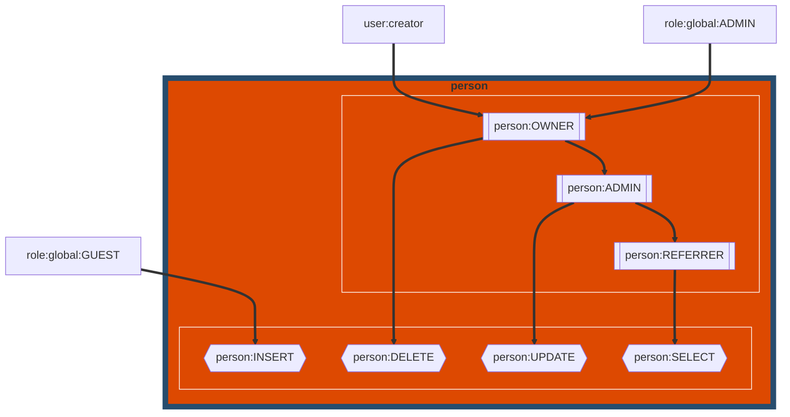

### rbac person

This code generated was by RbacViewMermaidFlowchartGenerator, do not amend manually.

```mermaid
%%{init:{'flowchart':{'htmlLabels':false}}}%%
flowchart TB

subgraph person["`**person**`"]
    direction TB
    style person fill:#dd4901,stroke:#274d6e,stroke-width:8px

    subgraph person:roles[ ]
        style person:roles fill:#dd4901,stroke:white

        role:person:OWNER[[person:OWNER]]
        role:person:ADMIN[[person:ADMIN]]
        role:person:REFERRER[[person:REFERRER]]
    end

    subgraph person:permissions[ ]
        style person:permissions fill:#dd4901,stroke:white

        perm:person:INSERT{{person:INSERT}}
        perm:person:DELETE{{person:DELETE}}
        perm:person:UPDATE{{person:UPDATE}}
        perm:person:SELECT{{person:SELECT}}
    end
end

%% granting roles to users
user:creator ==> role:person:OWNER

%% granting roles to roles
role:global:ADMIN ==> role:person:OWNER
role:person:OWNER ==> role:person:ADMIN
role:person:ADMIN ==> role:person:REFERRER

%% granting permissions to roles
role:global:GUEST ==> perm:person:INSERT
role:person:OWNER ==> perm:person:DELETE
role:person:ADMIN ==> perm:person:UPDATE
role:person:REFERRER ==> perm:person:SELECT

```
