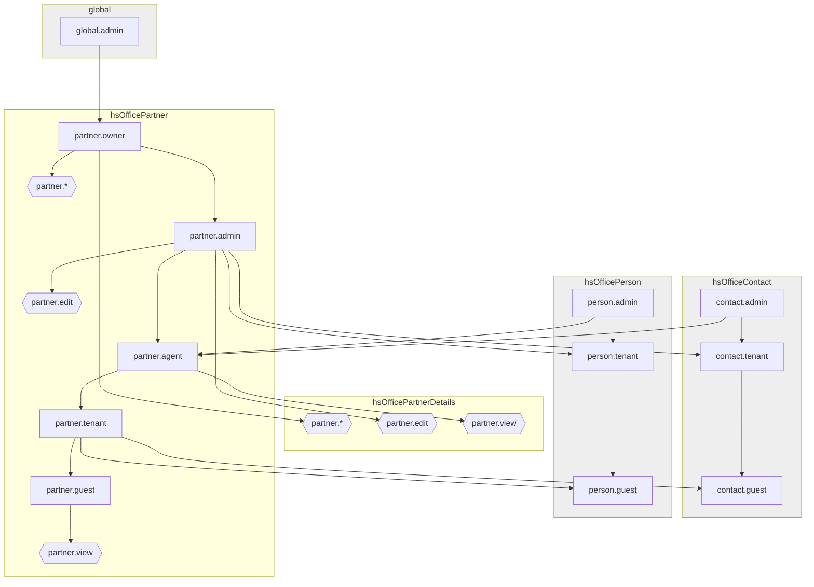

### hs_office_partner RBAC

```mermaid
flowchart TB

subgraph global
    style global fill:#eee
    
    role:global.admin[global.admin]    
end

subgraph hsOfficeContact
    direction TB
    style hsOfficeContact fill:#eee
    
    role:hsOfficeContact.admin[contact.admin]    
    --> role:hsOfficeContact.tenant[contact.tenant]    
    --> role:hsOfficeContact.guest[contact.guest]    
end

subgraph hsOfficePerson
    direction TB
    style hsOfficePerson fill:#eee
    
    role:hsOfficePerson.admin[person.admin]    
    --> role:hsOfficePerson.tenant[person.tenant]    
    --> role:hsOfficePerson.guest[person.guest]    
end

subgraph hsOfficePartnerDetails
    direction TB
    
    perm:hsOfficePartnerDetails.*{{partner.*}}
    perm:hsOfficePartnerDetails.edit{{partner.edit}}
    perm:hsOfficePartnerDetails.view{{partner.view}}
end

subgraph hsOfficePartner
                    
   role:hsOfficePartner.owner[partner.owner]
   %% permissions
       role:hsOfficePartner.owner --> perm:hsOfficePartner.*{{partner.*}}
       role:hsOfficePartner.owner --> perm:hsOfficePartnerDetails.*{{partner.*}}
   %% incoming
       role:global.admin ---> role:hsOfficePartner.owner
  
   role:hsOfficePartner.admin[partner.admin]
   %% permissions
       role:hsOfficePartner.admin --> perm:hsOfficePartner.edit{{partner.edit}}
       role:hsOfficePartner.admin --> perm:hsOfficePartnerDetails.edit{{partner.edit}}
   %% incoming
       role:hsOfficePartner.owner ---> role:hsOfficePartner.admin
   %% outgoing
       role:hsOfficePartner.admin --> role:hsOfficePerson.tenant
       role:hsOfficePartner.admin --> role:hsOfficeContact.tenant
  
   role:hsOfficePartner.agent[partner.agent]
   %% permissions
       role:hsOfficePartner.agent --> perm:hsOfficePartnerDetails.view{{partner.view}}
   %% incoming
       role:hsOfficePartner.admin ---> role:hsOfficePartner.agent
       role:hsOfficePerson.admin --> role:hsOfficePartner.agent
       role:hsOfficeContact.admin --> role:hsOfficePartner.agent
  
   role:hsOfficePartner.tenant[partner.tenant]
   %% incoming
       role:hsOfficePartner.agent --> role:hsOfficePartner.tenant
   %% outgoing   
       role:hsOfficePartner.tenant --> role:hsOfficePerson.guest
       role:hsOfficePartner.tenant --> role:hsOfficeContact.guest

   role:hsOfficePartner.guest[partner.guest]
   %% permissions
       role:hsOfficePartner.guest -->  perm:hsOfficePartner.view{{partner.view}}
   %% incoming
       role:hsOfficePartner.tenant --> role:hsOfficePartner.guest
end
```
