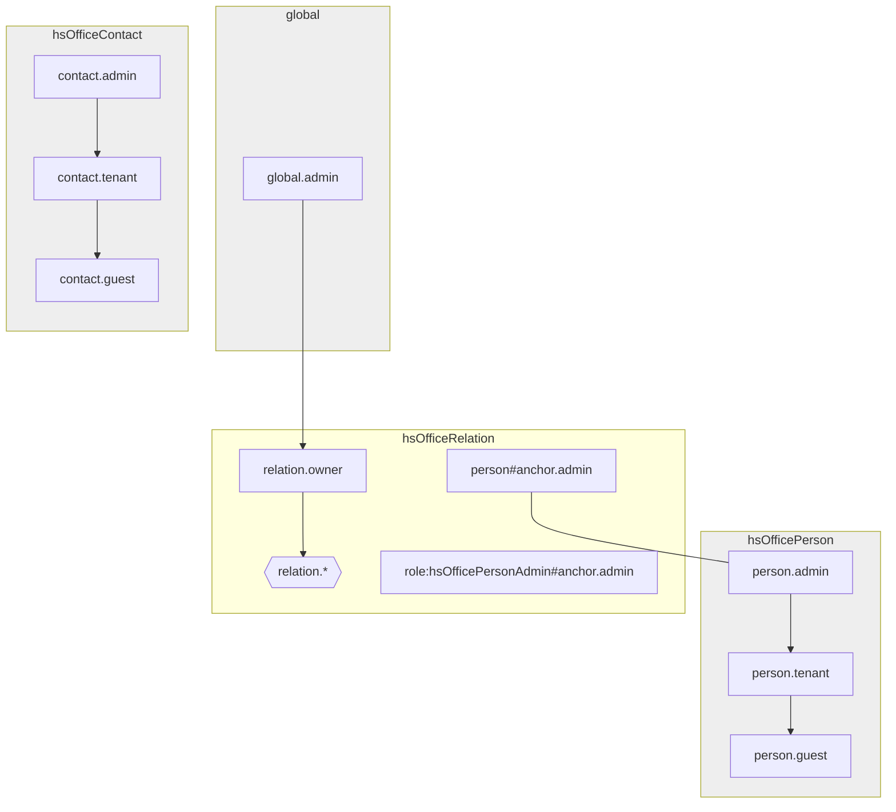

### hs_office_relation RBAC

```mermaid

flowchart TB

subgraph global
    style global fill:#eee
    
    role:global.admin[global.admin]    
end

subgraph hsOfficeContact
    direction TB
    style hsOfficeContact fill:#eee
    
    role:hsOfficeContact.admin[contact.admin]    
    --> role:hsOfficeContact.tenant[contact.tenant]    
    --> role:hsOfficeContact.guest[contact.guest]    
end

subgraph hsOfficePerson
    direction TB
    style hsOfficePerson fill:#eee
    
    role:hsOfficePerson.admin[person.admin]    
    --> role:hsOfficePerson.tenant[person.tenant]    
    --> role:hsOfficePerson.guest[person.guest]    
end

subgraph hsOfficeRelation

    role:hsOfficePerson#anchor.admin[person#anchor.admin]
    --- role:hsOfficePerson.admin
       
   role:hsOfficeRelation.owner[relation.owner]
   %% permissions
       role:hsOfficeRelation.owner --> perm:hsOfficeRelation.*{{relation.*}}
   %% incoming
       role:global.admin ---> role:hsOfficeRelation.owner
       role:hsOfficePersonAdmin#anchor.admin
end
```

