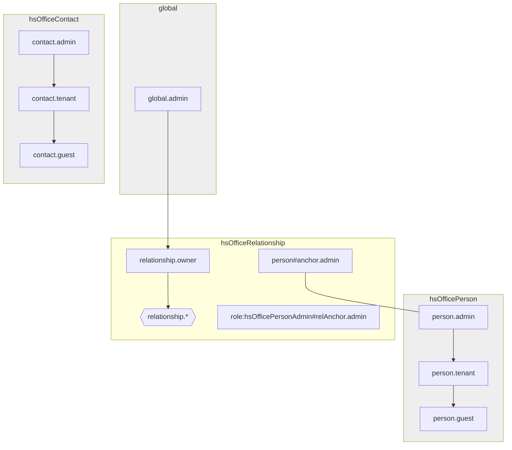

### hs_office_relationship RBAC

```mermaid

flowchart TB

subgraph global
    style global fill:#eee
    
    role:global.admin[global.admin]    
end

subgraph hsOfficeContact
    direction TB
    style hsOfficeContact fill:#eee
    
    role:hsOfficeContact.admin[contact.admin]    
    --> role:hsOfficeContact.tenant[contact.tenant]    
    --> role:hsOfficeContact.guest[contact.guest]    
end

subgraph hsOfficePerson
    direction TB
    style hsOfficePerson fill:#eee
    
    role:hsOfficePerson.admin[person.admin]    
    --> role:hsOfficePerson.tenant[person.tenant]    
    --> role:hsOfficePerson.guest[person.guest]    
end

subgraph hsOfficeRelationship

    role:hsOfficePerson#relAnchor.admin[person#anchor.admin]
    --- role:hsOfficePerson.admin
       
   role:hsOfficeRelationship.owner[relationship.owner]
   %% permissions
       role:hsOfficeRelationship.owner --> perm:hsOfficeRelationship.*{{relationship.*}}
   %% incoming
       role:global.admin ---> role:hsOfficeRelationship.owner
       role:hsOfficePersonAdmin#relAnchor.admin
end
```

