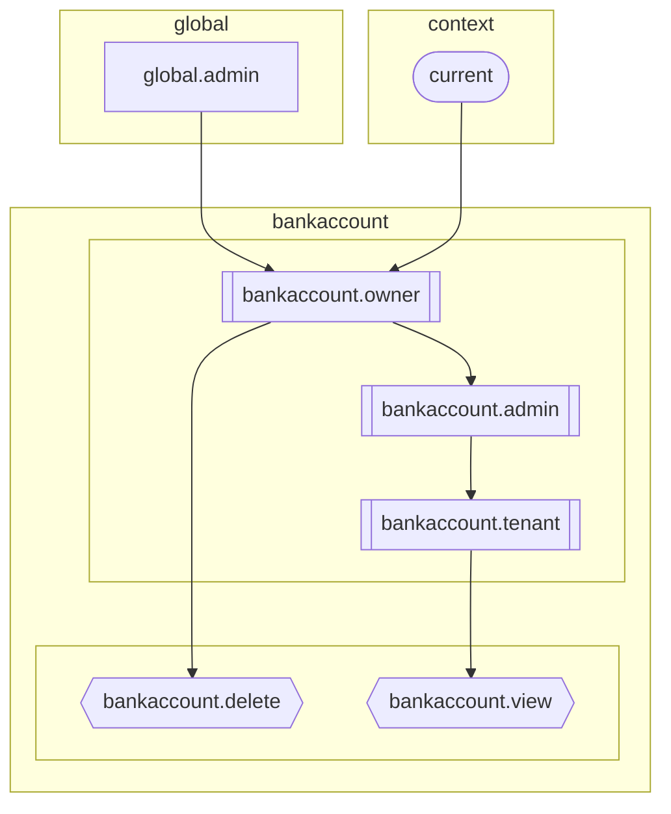

### hs_office_bankaccount RBAC Roles

```mermaid
flowchart TB

%% ---------- generated start: ---------- 

subgraph global
    role:global.admin[global.admin]
end

subgraph context
    user:current([current])
end

subgraph bankaccount

    subgraph roles[ ]
        role:bankaccount.owner[[bankaccount.owner]]
        role:bankaccount.admin[[bankaccount.admin]]    
        role:bankaccount.tenant[[bankaccount.tenant]]
    end

    subgraph perms[ ]
        perm:bankaccount.delete{{bankaccount.delete}}
        perm:bankaccount.view{{bankaccount.view}}
    end   

end

%% ---------- generated end. ----------

role:bankaccount.owner --> perm:bankaccount.delete

role:global.admin --> role:bankaccount.owner
user:current --> role:bankaccount.owner

role:bankaccount.owner --> role:bankaccount.admin

role:bankaccount.admin --> role:bankaccount.tenant
role:bankaccount.tenant --> perm:bankaccount.view
```

