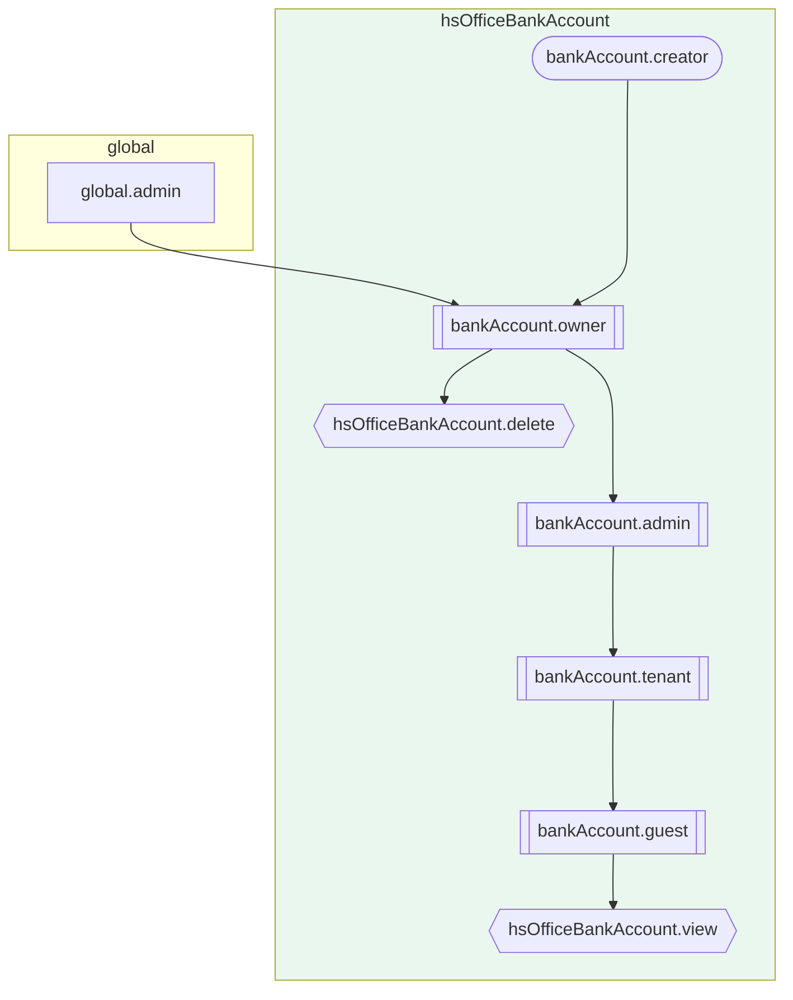

### hs_office_bankaccount RBAC Roles

```mermaid
flowchart TB

subgraph global
    style hsOfficeBankAccount fill: #e9f7ef

    role:global.admin[global.admin]
end

subgraph hsOfficeBankAccount
    direction TB
    style hsOfficeBankAccount fill: #e9f7ef
   
    user:hsOfficeBankAccount.creator([bankAccount.creator])       

    role:hsOfficeBankAccount.owner[[bankAccount.owner]]
    %% permissions
        role:hsOfficeBankAccount.owner --> perm:hsOfficeBankAccount.*{{hsOfficeBankAccount.delete}}
    %% incoming
        role:global.admin --> role:hsOfficeBankAccount.owner
        user:hsOfficeBankAccount.creator ---> role:hsOfficeBankAccount.owner
       
    role:hsOfficeBankAccount.admin[[bankAccount.admin]]
    %% incoming
        role:hsOfficeBankAccount.owner ---> role:hsOfficeBankAccount.admin        
   
    role:hsOfficeBankAccount.tenant[[bankAccount.tenant]]
    %% incoming
        role:hsOfficeBankAccount.admin ---> role:hsOfficeBankAccount.tenant
   
    role:hsOfficeBankAccount.guest[[bankAccount.guest]]
    %% permissions
        role:hsOfficeBankAccount.guest --> perm:hsOfficeBankAccount.view{{hsOfficeBankAccount.view}}
    %% incoming
        role:hsOfficeBankAccount.tenant ---> role:hsOfficeBankAccount.guest
end
```

