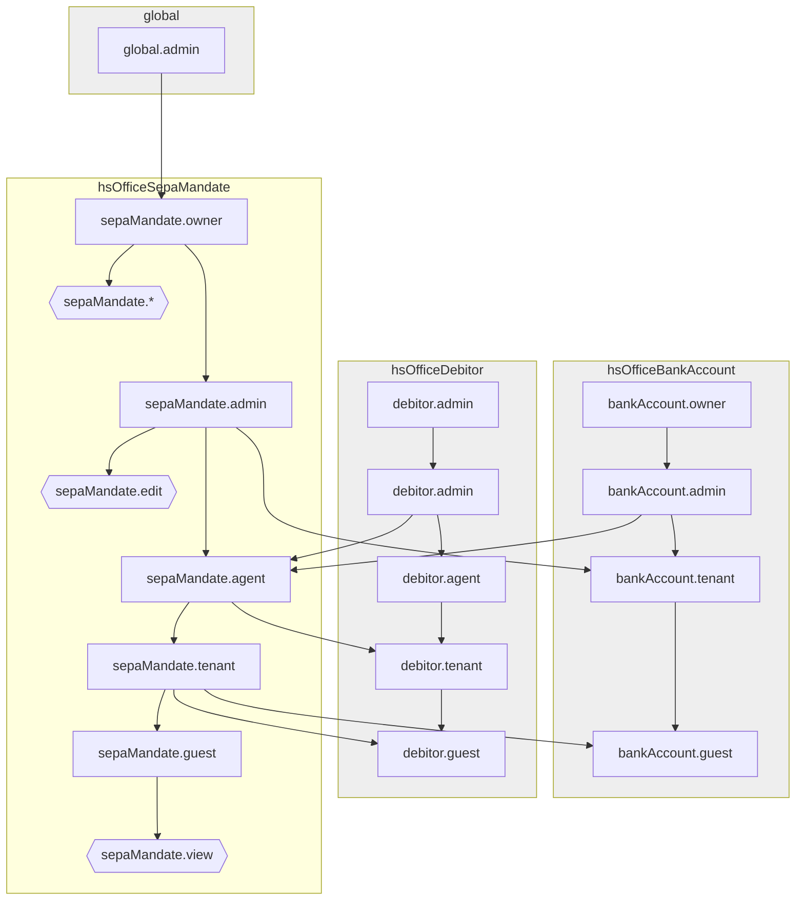

### hs_office_sepaMandate RBAC

```mermaid
flowchart TB

subgraph global
    style global fill:#eee
    
    role:global.admin[global.admin]    
end

subgraph hsOfficeBankAccount
    direction TB
    style hsOfficeBankAccount fill:#eee
    
    role:hsOfficeBankAccount.owner[bankAccount.owner]    
    --> role:hsOfficeBankAccount.admin[bankAccount.admin]    
    --> role:hsOfficeBankAccount.tenant[bankAccount.tenant]    
    --> role:hsOfficeBankAccount.guest[bankAccount.guest]    
end

subgraph hsOfficeDebitor
    direction TB
    style hsOfficeDebitor fill:#eee
    
    role:hsOfficeDebitor.owner[debitor.admin]    
    --> role:hsOfficeDebitor.admin[debitor.admin]    
    --> role:hsOfficeDebitor.agent[debitor.agent]    
    --> role:hsOfficeDebitor.tenant[debitor.tenant]    
    --> role:hsOfficeDebitor.guest[debitor.guest]    
end

subgraph hsOfficeSepaMandate
                    
   role:hsOfficeSepaMandate.owner[sepaMandate.owner]
   %% permissions
       role:hsOfficeSepaMandate.owner --> perm:hsOfficeSepaMandate.*{{sepaMandate.*}}
   %% incoming
       role:global.admin ---> role:hsOfficeSepaMandate.owner
  
   role:hsOfficeSepaMandate.admin[sepaMandate.admin]
   %% permissions
       role:hsOfficeSepaMandate.admin --> perm:hsOfficeSepaMandate.edit{{sepaMandate.edit}}
   %% incoming
       role:hsOfficeSepaMandate.owner ---> role:hsOfficeSepaMandate.admin
  
   role:hsOfficeSepaMandate.agent[sepaMandate.agent]
   %% incoming
       role:hsOfficeSepaMandate.admin ---> role:hsOfficeSepaMandate.agent
       role:hsOfficeDebitor.admin --> role:hsOfficeSepaMandate.agent
       role:hsOfficeBankAccount.admin --> role:hsOfficeSepaMandate.agent
   %% outgoing
       role:hsOfficeSepaMandate.agent --> role:hsOfficeDebitor.tenant
       role:hsOfficeSepaMandate.admin --> role:hsOfficeBankAccount.tenant
  
   role:hsOfficeSepaMandate.tenant[sepaMandate.tenant]
   %% incoming
       role:hsOfficeSepaMandate.agent --> role:hsOfficeSepaMandate.tenant
   %% outgoing   
       role:hsOfficeSepaMandate.tenant --> role:hsOfficeDebitor.guest
       role:hsOfficeSepaMandate.tenant --> role:hsOfficeBankAccount.guest

   role:hsOfficeSepaMandate.guest[sepaMandate.guest]
   %% permissions
       role:hsOfficeSepaMandate.guest -->  perm:hsOfficeSepaMandate.view{{sepaMandate.view}}
   %% incoming
       role:hsOfficeSepaMandate.tenant --> role:hsOfficeSepaMandate.guest
end


```
