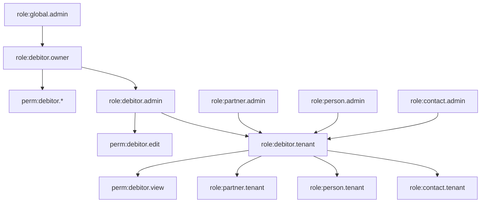

### hs_office_debitor RBAC Roles

```mermaid
graph TD;
    %% role:debitor.owner
    role:debitor.owner --> perm:debitor.*;
    role:global.admin --> role:debitor.owner;

    %% role:debitor.admin
    role:debitor.admin --> perm:debitor.edit;
    role:debitor.owner --> role:debitor.admin;

    %% role:debitor.tenant
        role:debitor.tenant --> perm:debitor.view;
    %% super-roles
        role:debitor.admin --> role:debitor.tenant;
        role:partner.admin --> role:debitor.tenant;
        role:person.admin --> role:debitor.tenant;
        role:contact.admin --> role:debitor.tenant;
    %% sub-roles
        role:debitor.tenant --> role:partner.tenant;
        role:debitor.tenant --> role:person.tenant;
        role:debitor.tenant --> role:contact.tenant;
```
