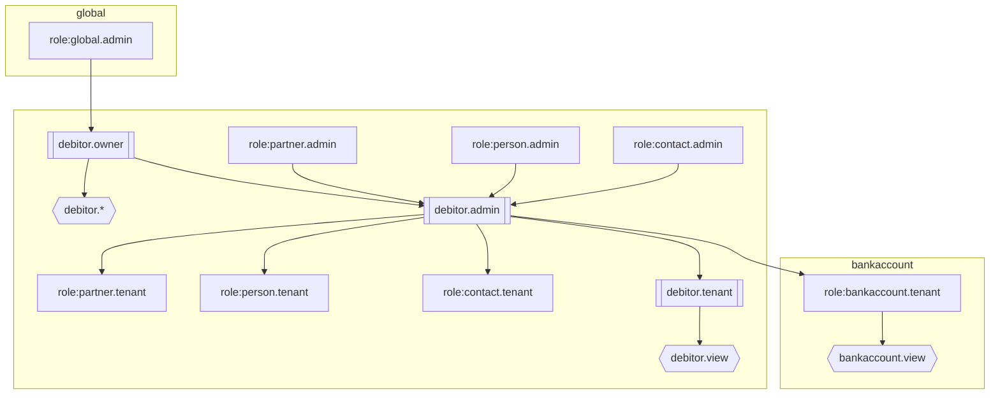

### hs_office_debitor RBAC Roles

```mermaid
flowchart TB;

subgraph bankaccount;

    %% oversimplified version for now
    %%   
    %% Beware: role:debitor.tenant should NOT be granted role:bankaccount.tenent
    %% because otherwise, later in the development,
    %% e.g. package admins could see the debitors bank account,
    %% except if we do NOT use the debitor in the hosting super module.

    role:bankaccount.tenant --> perm:bankaccount.view{{bankaccount.view}};
end;

subgraph debitor[" "];
direction TB;

    role:debitor.owner[[debitor.owner]]
    role:debitor.owner --> perm:debitor.*{{debitor.*}};

    role:debitor.admin[[debitor.admin]]
    %% super-roles
        role:debitor.owner --> role:debitor.admin;
        role:partner.admin --> role:debitor.admin;
        role:person.admin --> role:debitor.admin;
        role:contact.admin --> role:debitor.admin;
    %% sub-roles
        role:debitor.admin --> role:partner.tenant;
        role:debitor.admin --> role:person.tenant;
        role:debitor.admin --> role:contact.tenant;
        role:debitor.admin --> role:bankaccount.tenant;

    role:debitor.tenant[[debitor.tenant]]
        role:debitor.tenant --> perm:debitor.view{{debitor.view}};
    %% super-roles
        role:debitor.admin --> role:debitor.tenant;
    %% sub-roles
        
end;

subgraph global;
    role:global.admin --> role:debitor.owner;
end;
        

```
