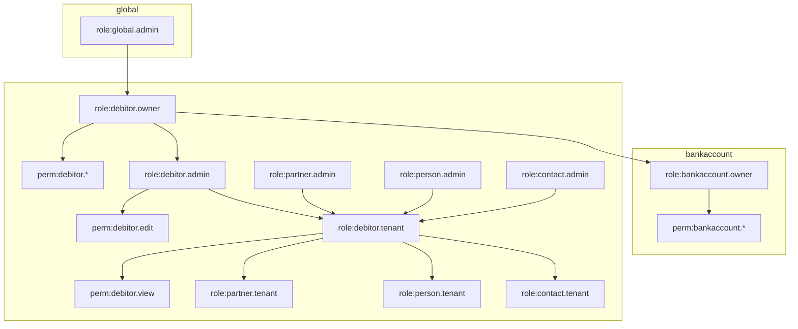

### hs_office_debitor RBAC Roles

```mermaid
flowchart TB;

subgraph bankaccount;
direction TB;

    %% oversimplified version for now
    %%   
    %% Beware: role:debitor.tenant should NOT be granted role:bankaccount.tenent
    %% because otherwise, later in the development,
    %% e.g. package admins could see the debitors bank account,
    %% except if we do NOT use the debitor in the hosting super module.

    %% role:bankaccount.owner        
    role:bankaccount.owner --> perm:bankaccount.*;
end;

subgraph debitor[" "];
direction TB;

    %% role:debitor.owner
    role:debitor.owner --> perm:debitor.*;
    role:debitor.owner --> role:bankaccount.owner;

    %% role:debitor.admin
    role:debitor.admin --> perm:debitor.edit;
    role:debitor.owner --> role:debitor.admin;

    %% role:debitor.tenant
        role:debitor.tenant --> perm:debitor.view;
    %% super-roles
        role:debitor.admin --> role:debitor.tenant;
        role:partner.admin --> role:debitor.tenant;
        role:person.admin --> role:debitor.tenant;
        role:contact.admin --> role:debitor.tenant;
    %% sub-roles
        role:debitor.tenant --> role:partner.tenant;
        role:debitor.tenant --> role:person.tenant;
        role:debitor.tenant --> role:contact.tenant;
end;

subgraph global;
direction TB;
    role:global.admin --> role:debitor.owner;
end;
        

```
