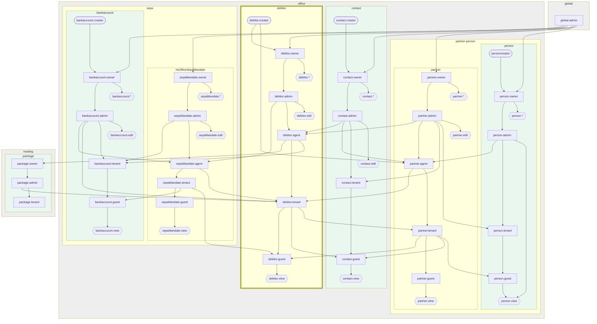

### hs_office_debitor RBAC Roles

```mermaid
flowchart TB

subgraph global
    style global fill:#eee
    
    role:global.admin[global.admin]    
end

subgraph office
    style office fill:#eee
    
    subgraph sepa
    
    subgraph bankaccount
        style bankaccount fill: #e9f7ef
        
        user:hsOfficeBankAccount.creator([bankaccount.creator])        
    
        role:hsOfficeBankAccount.owner[bankaccount.owner]
        %% permissions
            role:hsOfficeBankAccount.owner --> perm:hsOfficeBankAccount.*{{bankaccount.*}}
        %% incoming
            role:global.admin --> role:hsOfficeBankAccount.owner
            user:hsOfficeBankAccount.creator ---> role:hsOfficeBankAccount.owner
            
        role:hsOfficeBankAccount.admin[bankaccount.admin]
        %% permissions
            role:hsOfficeBankAccount.admin --> perm:hsOfficeBankAccount.edit{{bankaccount.edit}}
        %% incoming
            role:hsOfficeBankAccount.owner ---> role:hsOfficeBankAccount.admin         
        
        role:hsOfficeBankAccount.tenant[bankaccount.tenant]
        %% incoming
            role:hsOfficeBankAccount.admin ---> role:hsOfficeBankAccount.tenant
        
        role:hsOfficeBankAccount.guest[bankaccount.guest]
        %% permissions
            role:hsOfficeBankAccount.guest --> perm:hsOfficeBankAccount.view{{bankaccount.view}}
        %% incoming
            role:hsOfficeBankAccount.tenant ---> role:hsOfficeBankAccount.guest
    end
    
    subgraph hsOfficeSepaMandate
    end
    
    end
   
    subgraph contact
        style contact fill: #e9f7ef
        
        user:hsOfficeContact.creator([contact.creator])
    
        role:hsOfficeContact.owner[contact.owner]
        %% permissions
            role:hsOfficeContact.owner --> perm:hsOfficeContact.*{{contact.*}}
        %% incoming
            role:global.admin --> role:hsOfficeContact.owner
            user:hsOfficeContact.creator ---> role:hsOfficeContact.owner
            
        role:hsOfficeContact.admin[contact.admin]
        %% permissions
            role:hsOfficeContact.admin ---> perm:hsOfficeContact.edit{{contact.edit}}
        %% incoming
            role:hsOfficeContact.owner ---> role:hsOfficeContact.admin         
        
        role:hsOfficeContact.tenant[contact.tenant]
        %% incoming
            role:hsOfficeContact.admin ----> role:hsOfficeContact.tenant
        
        role:hsOfficeContact.guest[contact.guest]
        %% permissions
            role:hsOfficeContact.guest --> perm:hsOfficeContact.view{{contact.view}}
        %% incoming
            role:hsOfficeContact.tenant ---> role:hsOfficeContact.guest
    end
    
    subgraph partner-person
   
    subgraph person
        style person fill: #e9f7ef
        
        user:hsOfficePerson.creator([personcreator])
        
        role:hsOfficePerson.owner[person.owner]
        %% permissions
            role:hsOfficePerson.owner --> perm:hsOfficePerson.*{{person.*}}
        %% incoming
            user:hsOfficePerson.creator ---> role:hsOfficePerson.owner
            role:global.admin --> role:hsOfficePerson.owner
        
        role:hsOfficePerson.admin[person.admin]
        %% permissions
            role:hsOfficePerson.admin --> perm:hsOfficePerson.edit{{person.edit}}
        %% incoming
            role:hsOfficePerson.owner ---> role:hsOfficePerson.admin
        
        role:hsOfficePerson.tenant[person.tenant]
        %% incoming
            role:hsOfficePerson.admin -----> role:hsOfficePerson.tenant
        
        role:hsOfficePerson.guest[person.guest]
        %% permissions
            role:hsOfficePerson.guest --> perm:hsOfficePerson.edit{{person.view}}
        %% incoming
            role:hsOfficePerson.tenant ---> role:hsOfficePerson.guest
    end
    
    subgraph partner
    
       role:hsOfficePartner.owner[partner.owner]
       %% permissions
           role:hsOfficePartner.owner --> perm:hsOfficePartner.*{{partner.*}}
       %% incoming
           role:global.admin ---> role:hsOfficePartner.owner
      
       role:hsOfficePartner.admin[partner.admin]
       %% permissions
           role:hsOfficePartner.admin --> perm:hsOfficePartner.edit{{partner.edit}}
       %% incoming
           role:hsOfficePartner.owner ---> role:hsOfficePartner.admin
       %% outgoing
           role:hsOfficePartner.admin --> role:hsOfficePerson.tenant
           role:hsOfficePartner.admin --> role:hsOfficeContact.tenant
      
       role:hsOfficePartner.agent[partner.agent]
       %% incoming
           role:hsOfficePartner.admin --> role:hsOfficePartner.agent
           role:hsOfficePerson.admin --> role:hsOfficePartner.agent
           role:hsOfficeContact.admin --> role:hsOfficePartner.agent
      
       role:hsOfficePartner.tenant[partner.tenant]
       %% incoming
           role:hsOfficePartner.agent ---> role:hsOfficePartner.tenant
       %% outgoing   
           role:hsOfficePartner.tenant --> role:hsOfficePerson.guest
           role:hsOfficePartner.tenant --> role:hsOfficeContact.guest
    
       role:hsOfficePartner.guest[partner.guest]
       %% permissions
           role:hsOfficePartner.guest -->  perm:hsOfficePartner.view{{partner.view}}
       %% incoming
           role:hsOfficePartner.tenant ---> role:hsOfficePartner.guest
    end
    
    end
    
    subgraph debitor
        style debitor stroke-width:6px
    
        user:hsOfficeDebitor.creator([debitor.creator])
        %% created by role
            user:hsOfficeDebitor.creator --> role:hsOfficePartner.agent
    
        role:hsOfficeDebitor.owner[debitor.owner]
        %% permissions
            role:hsOfficeDebitor.owner --> perm:hsOfficeDebitor.*{{debitor.*}}
        %% incoming
            user:hsOfficeDebitor.creator --> role:hsOfficeDebitor.owner
            role:global.admin --> role:hsOfficeDebitor.owner
            
        role:hsOfficeDebitor.admin[debitor.admin]
        %% permissions
            role:hsOfficeDebitor.admin --> perm:hsOfficeDebitor.edit{{debitor.edit}}
        %% incoming
            role:hsOfficeDebitor.owner ---> role:hsOfficeDebitor.admin         
            
        role:hsOfficeDebitor.agent[debitor.agent]
        %% incoming
            role:hsOfficeDebitor.admin ---> role:hsOfficeDebitor.agent         
            role:hsOfficePartner.admin --> role:hsOfficeDebitor.agent
            role:hsOfficeContact.admin --> role:hsOfficeDebitor.agent
        %% outgoing
            role:hsOfficeDebitor.agent --> role:hsOfficeBankAccount.tenant
    
        role:hsOfficeDebitor.tenant[debitor.tenant]
        %% incoming
            role:hsOfficeDebitor.agent ---> role:hsOfficeDebitor.tenant
            role:hsOfficePartner.agent --> role:hsOfficeDebitor.tenant
            role:hsOfficeBankAccount.admin --> role:hsOfficeDebitor.tenant
        %% outgoing
            role:hsOfficeDebitor.tenant --> role:hsOfficePartner.tenant
            role:hsOfficeDebitor.tenant --> role:hsOfficeContact.guest
        
        role:hsOfficeDebitor.guest[debitor.guest]
        %% permissions
            role:hsOfficeDebitor.guest --> perm:hsOfficeDebitor.view{{debitor.view}}
        %% incoming
            role:hsOfficeDebitor.tenant --> role:hsOfficeDebitor.guest
    end
    
end

subgraph hsOfficeSepaMandate
                    
   role:hsOfficeSepaMandate.owner[sepaMandate.owner]
   %% permissions
       role:hsOfficeSepaMandate.owner --> perm:hsOfficeSepaMandate.*{{sepaMandate.*}}
   %% incoming
       role:global.admin ---> role:hsOfficeSepaMandate.owner
  
   role:hsOfficeSepaMandate.admin[sepaMandate.admin]
   %% permissions
       role:hsOfficeSepaMandate.admin --> perm:hsOfficeSepaMandate.edit{{sepaMandate.edit}}
   %% incoming
       role:hsOfficeSepaMandate.owner ---> role:hsOfficeSepaMandate.admin
  
   role:hsOfficeSepaMandate.agent[sepaMandate.agent]
   %% incoming
       role:hsOfficeSepaMandate.admin ---> role:hsOfficeSepaMandate.agent
       role:hsOfficeDebitor.admin --> role:hsOfficeSepaMandate.agent
       role:hsOfficeBankAccount.admin --> role:hsOfficeSepaMandate.agent
   %% outgoing
       role:hsOfficeSepaMandate.agent --> role:hsOfficeDebitor.tenant
       role:hsOfficeSepaMandate.admin --> role:hsOfficeBankAccount.tenant
  
   role:hsOfficeSepaMandate.tenant[sepaMandate.tenant]
   %% incoming
       role:hsOfficeSepaMandate.agent --> role:hsOfficeSepaMandate.tenant
   %% outgoing   
       role:hsOfficeSepaMandate.tenant --> role:hsOfficeDebitor.guest
       role:hsOfficeSepaMandate.tenant --> role:hsOfficeBankAccount.guest

   role:hsOfficeSepaMandate.guest[sepaMandate.guest]
   %% permissions
       role:hsOfficeSepaMandate.guest -->  perm:hsOfficeSepaMandate.view{{sepaMandate.view}}
   %% incoming
       role:hsOfficeSepaMandate.tenant --> role:hsOfficeSepaMandate.guest
end

subgraph hosting
    style hosting fill:#eee
    
    subgraph package
        style package fill: #e9f7ef
        
        role:package.owner[package.owner]
         --> role:package.admin[package.admin]
         --> role:package.tenant[package.tenant]
         
        role:hsOfficeDebitor.agent --> role:package.owner        
        role:package.admin --> role:hsOfficeDebitor.tenant
        role:hsOfficePartner.tenant --> role:hsOfficeDebitor.guest
    end
end


```

