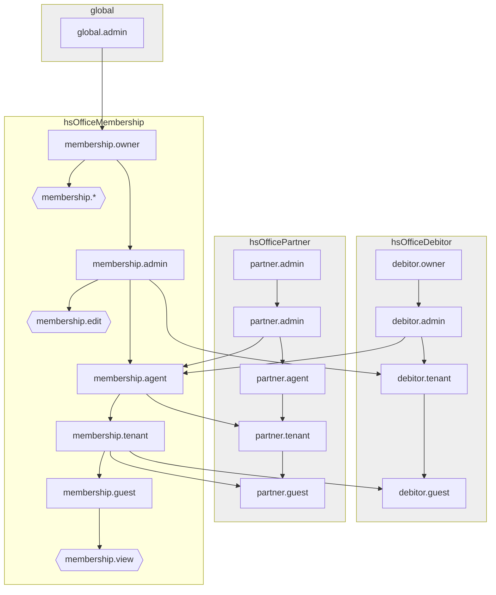

### hs_office_membership RBAC

```mermaid
flowchart TB

subgraph global
    style global fill:#eee
    
    role:global.admin[global.admin]    
end

subgraph hsOfficeDebitor
    direction TB
    style hsOfficeDebitor fill:#eee
    
    role:hsOfficeDebitor.owner[debitor.owner]    
    --> role:hsOfficeDebitor.admin[debitor.admin]    
    --> role:hsOfficeDebitor.tenant[debitor.tenant]    
    --> role:hsOfficeDebitor.guest[debitor.guest]    
end

subgraph hsOfficePartner
    direction TB
    style hsOfficePartner fill:#eee
    
    role:hsOfficePartner.owner[partner.admin]    
    --> role:hsOfficePartner.admin[partner.admin]    
    --> role:hsOfficePartner.agent[partner.agent]    
    --> role:hsOfficePartner.tenant[partner.tenant]    
    --> role:hsOfficePartner.guest[partner.guest]    
end

subgraph hsOfficeMembership
                    
   role:hsOfficeMembership.owner[membership.owner]
   %% permissions
       role:hsOfficeMembership.owner --> perm:hsOfficeMembership.*{{membership.*}}
   %% incoming
       role:global.admin ---> role:hsOfficeMembership.owner
  
   role:hsOfficeMembership.admin[membership.admin]
   %% permissions
       role:hsOfficeMembership.admin --> perm:hsOfficeMembership.edit{{membership.edit}}
   %% incoming
       role:hsOfficeMembership.owner ---> role:hsOfficeMembership.admin
  
   role:hsOfficeMembership.agent[membership.agent]
   %% incoming
       role:hsOfficeMembership.admin ---> role:hsOfficeMembership.agent
       role:hsOfficePartner.admin --> role:hsOfficeMembership.agent
       role:hsOfficeDebitor.admin --> role:hsOfficeMembership.agent
   %% outgoing
       role:hsOfficeMembership.agent --> role:hsOfficePartner.tenant
       role:hsOfficeMembership.admin --> role:hsOfficeDebitor.tenant
  
   role:hsOfficeMembership.tenant[membership.tenant]
   %% incoming
       role:hsOfficeMembership.agent --> role:hsOfficeMembership.tenant
   %% outgoing   
       role:hsOfficeMembership.tenant --> role:hsOfficePartner.guest
       role:hsOfficeMembership.tenant --> role:hsOfficeDebitor.guest

   role:hsOfficeMembership.guest[membership.guest]
   %% permissions
       role:hsOfficeMembership.guest -->  perm:hsOfficeMembership.view{{membership.view}}
   %% incoming
       role:hsOfficeMembership.tenant --> role:hsOfficeMembership.guest
end


```
