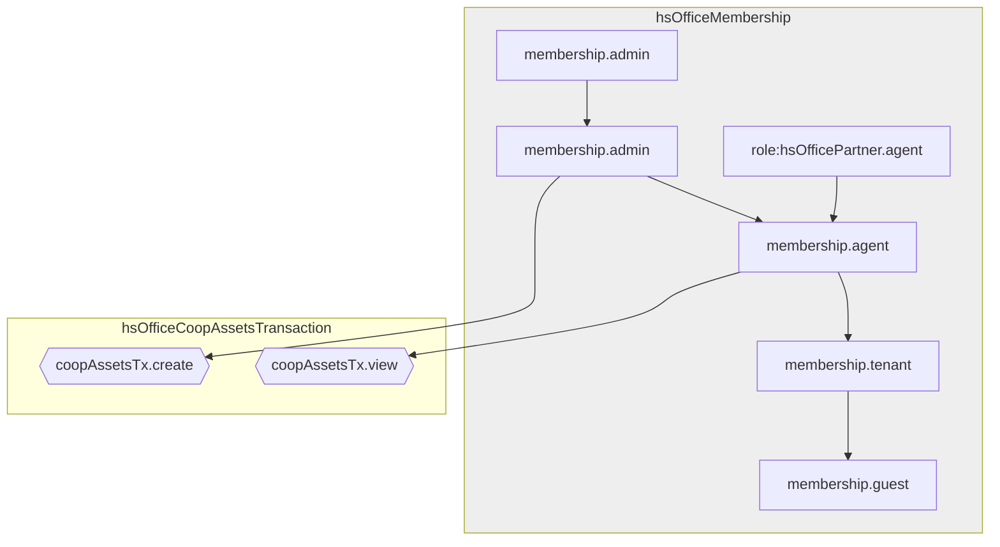

### hs_office_coopAssetsTransaction RBAC

```mermaid
flowchart TB

subgraph hsOfficeMembership
    direction TB
    style hsOfficeMembership fill:#eee
    
    role:hsOfficeMembership.owner[membership.admin]    
    --> role:hsOfficeMembership.admin[membership.admin]    
    --> role:hsOfficeMembership.agent[membership.agent]    
    --> role:hsOfficeMembership.tenant[membership.tenant]    
    --> role:hsOfficeMembership.guest[membership.guest]   
    
    role:hsOfficePartner.agent --> role:hsOfficeMembership.agent
end

subgraph hsOfficeCoopAssetsTransaction
                    
       role:hsOfficeMembership.admin
       --> perm:hsOfficeCoopAssetsTransaction.create{{coopAssetsTx.create}}
                    
       role:hsOfficeMembership.agent
        --> perm:hsOfficeCoopAssetsTransaction.view{{coopAssetsTx.view}}
end


```
