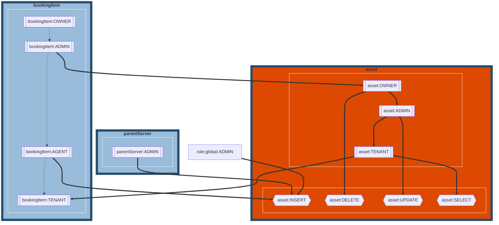

### rbac asset inCaseOf:MANAGED_WEBSPACE

This code generated was by RbacViewMermaidFlowchartGenerator, do not amend manually.

```mermaid
%%{init:{'flowchart':{'htmlLabels':false}}}%%
flowchart TB

subgraph asset["`**asset**`"]
    direction TB
    style asset fill:#dd4901,stroke:#274d6e,stroke-width:8px

    subgraph asset:roles[ ]
        style asset:roles fill:#dd4901,stroke:white

        role:asset:OWNER[[asset:OWNER]]
        role:asset:ADMIN[[asset:ADMIN]]
        role:asset:TENANT[[asset:TENANT]]
    end

    subgraph asset:permissions[ ]
        style asset:permissions fill:#dd4901,stroke:white

        perm:asset:INSERT{{asset:INSERT}}
        perm:asset:DELETE{{asset:DELETE}}
        perm:asset:UPDATE{{asset:UPDATE}}
        perm:asset:SELECT{{asset:SELECT}}
    end
end

subgraph bookingItem["`**bookingItem**`"]
    direction TB
    style bookingItem fill:#99bcdb,stroke:#274d6e,stroke-width:8px

    subgraph bookingItem:roles[ ]
        style bookingItem:roles fill:#99bcdb,stroke:white

        role:bookingItem:OWNER[[bookingItem:OWNER]]
        role:bookingItem:ADMIN[[bookingItem:ADMIN]]
        role:bookingItem:AGENT[[bookingItem:AGENT]]
        role:bookingItem:TENANT[[bookingItem:TENANT]]
    end
end

subgraph parentServer["`**parentServer**`"]
    direction TB
    style parentServer fill:#99bcdb,stroke:#274d6e,stroke-width:8px

    subgraph parentServer:roles[ ]
        style parentServer:roles fill:#99bcdb,stroke:white

        role:parentServer:ADMIN[[parentServer:ADMIN]]
    end
end

%% granting roles to roles
role:bookingItem:OWNER -.-> role:bookingItem:ADMIN
role:bookingItem:ADMIN -.-> role:bookingItem:AGENT
role:bookingItem:AGENT -.-> role:bookingItem:TENANT
role:bookingItem:ADMIN ==> role:asset:OWNER
role:asset:OWNER ==> role:asset:ADMIN
role:asset:ADMIN ==> role:asset:TENANT
role:asset:TENANT ==> role:bookingItem:TENANT

%% granting permissions to roles
role:bookingItem:AGENT ==> perm:asset:INSERT
role:parentServer:ADMIN ==> perm:asset:INSERT
role:asset:OWNER ==> perm:asset:DELETE
role:asset:ADMIN ==> perm:asset:UPDATE
role:asset:TENANT ==> perm:asset:SELECT
role:global:ADMIN ==> perm:asset:INSERT

```
